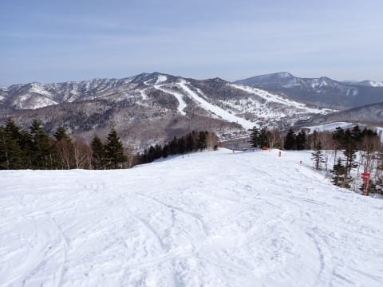

# 2024/3/30(土)の志賀高原焼額山スキー場は…晴天＆高温の春スキー．昼間はちょいと滑りが悪い雪になったけど，午後2時ごろからは滑りも復活！

📅 投稿日時: 2024-03-31 00:51:45

🏷️ カテゴリ: [2024スキー滑走日記](c453f687e8a0f05679e95831d0a02cd0c.md)

ということで．

本日も睡眠２時間ちょいで志賀高原へ

やってきました～！！

まず．

本日はいつもより30分早い朝8時からゴンドラ

スタートなので，8時前から焼額第1ゴンドラの

営業開始に並びますが…

学校の春休みなんだけど，さすがにこの時期に

スキーをやろうという人はもう少ないのか，

いつもより待っている人は少ないですね…

そして．いつも通りあさイチのゴンドラで

山頂へ向かいますが．

ファーストトラックのない本日は．

ゴンドラの上からコースを見ると．

通常営業開始のこの時間にシュプールが

全くついてません…！！

…が．

朝8時の山頂で気温が+3℃と．

あさイチからプラス気温（涙）

なので．

朝から雪は緩めながらも…

でも，すっきり晴天のいい感じの

天気です！！

バーンは緩めながらも，

板は走るし，あさイチのぴかぴかゲレンデは，

柔らかめながらも気持ちいいバーン

コンディションっ！！

朝から雪が全く締まっておらず，

ゆるゆるなのはちょいと残念だけど…

でも，あさイチはフラットなシマシマで．

緩めながらも楽しめるバーンですよ！！

ってなことで．

朝の4本ほどは，結構いい感じのシマシマ

バーンを楽しめました…！！

そして．

もうすぐ4月になろうというこの時期．

スキー客が一気に減ったのか．

ゴンドラも終日全く混む気配がなく…

団体さんが時々ドカッと入ることが

なければ，大体このくらいの待ち時間で，

ゴンドラもガラガラ！！

そして．すっきり晴天の日差しで緩んだバーンも，

滑っている人が少ないから午前中は緩む

気配が全く見られない感じで．

恐れていた黄砂もないし…

これ，思ってたよりかなりいいコンディション

なのでは…？？

いや…

結構いいよね！！

…と思っていたのもつかの間．

午前10時半までは何とか雪もフラットで

滑りやすかったけど．

その時間を超えると…

雪がたまり始めてきたというのもあり．

うーん．

雪が荒れ始めてきて…

11時には完全に，結構重い4月の雪に

なってきました（涙）

ただ

雪が柔らかい4月にしては，SGSコースなど

まだ数多くのコースをオープンしている

今日この頃．

オリンピックコースも雪のコンディションを

維持していて．

3月末と考えれば，今年も雪の量は

そこそこ残ってくれたかな…？？

とりあえず．

今日は朝から気温が高いわりに，

結構楽しいバーンコンディションが

続いてくれたけど…

昼前には，ゲレンデ下部の緩斜面では

板が引っかかて滑りがよくないバーンに

なっていっちゃいました（涙）

．

でも．

午後2時ごろには，気温がまた冷え始めたのか，

緩斜面の日差しが当たるバーンも，

多少凸凹は残るものの，冷えて

板の滑りが極めて良くなっていき．

午後は，多少バーン全体が凸凹したけど．

人も少ないし．

晴れたし．

やっぱり結構楽しめたかな…！

ちなみに，今日はリフトもゴンドラも，

終日すごいガラガラでした…

やはりラストのコースは，ところどころ

荒れてきてはいたものの．

でも，ひどいコブになることはなく．

営業開始が30分早かった本日ですが．

営業終了時間はいつも通りのゴンドラ16時，

リフト16時ぎりぎりで…

バーンにだれもおらず，

昼間も人が少なかったので

意外と荒れてないラスト1本を滑って，

16時過ぎにりあげたのでした…

いやー．

今日は黄砂予報でヤバいかと思ったけど，

12時から2時ごろにかけて，ちょっと緩斜面

で滑りが悪くなった以外，

夕方になったらまた板が滑るようになり，

思ったより楽しめた一日でした…！！

明日も黄砂がなく，板が滑る一日だといいな

## 💬 コメント一覧

### 💬 コメント by (レインボー76)
**タイトル**: Unknown
**投稿日**: 2024-04-01 13:51:47

月曜日の志賀高原情報

朝の蓮池+3℃。ヤケビは1&2ゴンドラとニ高のみの営業だけど、今日から全て8時00分スタート。

ニゴン→パノラマ→唐松といつものコース。硬い。しげぞうさんレッスンの練習と決めてるのに、硬さにムラもあって、思うにまかせない。

結局10時30分の終了まで硬いままで、最後のサウスはガタガタになっていました。

奥志賀に行った友人によると、ダウンヒルのニ壁はガタガタ、三高とエキスパはコロコロのじゃがいも畑だったそうです。良かった、行かなくて。

### 💬 コメント by (Skier_S)
**タイトル**: ＞レインボー76さま
**投稿日**: 2024-04-02 03:43:39

朝は久しぶりに硬かったんですね…

膝に悪い雪ですね（涙）

この時期は夜にしっかり固まって，営業開始に表面がちょっとだけゆるんで

エッジがかかる雪になるというのがワガママな理想ですね（笑）．

