# 2023/1/28(土)の志賀高原スキー場は…朝は非圧雪は脛パフだけど重めパウダー．天気は雪→曇り，時折晴れ間も

📅 投稿日時: 2023-01-29 00:21:59

🏷️ カテゴリ: [2023スキー滑走日記](cd943df30cfcc3d0896469e2ff98720cd.md)

ってなわけで．

今日も志賀高原を滑ってきたわけですが．

今日は，劇冷え雪降りの

根性のないスキーヤーふるい落としデー

になるかと思ったら．

気温は低かったけど，意外と天気は

穏やかだし．

ゲレンデはすいてるし．

結構楽しめた，トップシーズンの一日

でした！！←予想が外れたことを秘かに伝えている

まず，いつも通り8:30の焼額第1ゴンドラの

通常営業開始に並びますが…

今日も列はそんなに長くなく．

そんなに混まなさそうな予感…

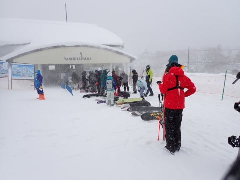

で．

8:30スタートのゴンドラに乗って山頂へ

行くと…

気温はー15℃と，劇冷え！！

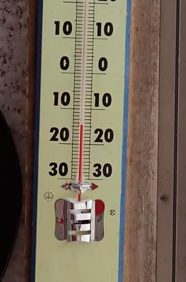

そして天気は…

晴れとまではいわないけど．

なんと，意外なことに，うっすら日も差す天気！

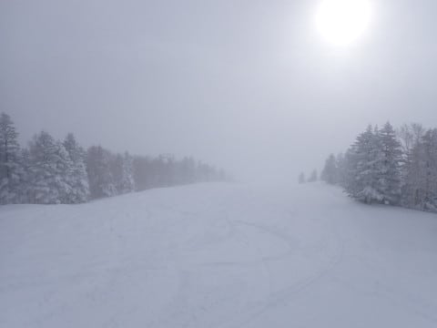

朝イチの圧雪バーンは，圧雪の上に

軽い新雪5㎝ほどの滑りやすいバーンですよ！

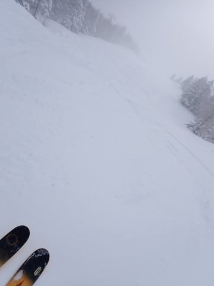

非圧雪バーンはパフパフパウダーのはず…

と，今シーズンまだ滑っていない本格

パウダーを求め，オリンピックコースへ

向かうと…

ををを！！

新雪が積もってそう…！！！

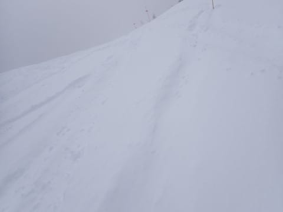

新雪の深さは，予想通り，深いところでは

40㎝程のひざパフパウダー！！

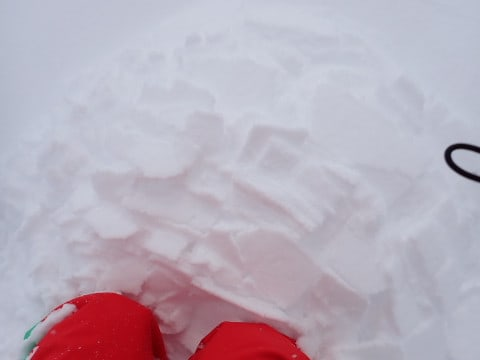

今シーズン初の，パフパフパウダー

いただきまーす！！

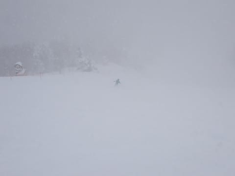

…と思ったら．

意外と重い…

新雪に突っ込むと結構ブレーキが

かかり，踏まれたところで加速して

新雪に突っ込んで減速する，

気持ちいいというより，ちょっと

手ごわいバーン（涙）

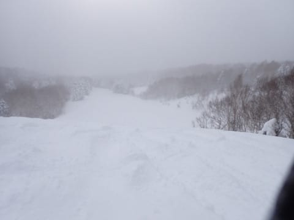

うーん．

惜しい…

転ばないようにバランスをとるのに

必死で，あんまり楽しくなかった…

ので．

圧雪バーンへ！

圧雪バーンは圧雪の上にうっすら軽い

雪で，滑りやすいよ！！

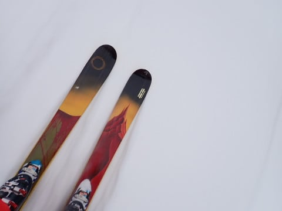

と，圧雪バーンを滑っていると…

朝イチは薄日も差してたけど．

やっぱり雪が降り始め．

「予想通り，今日はやっぱり根性のない

スキーヤーふるい落としデーになるのか？」

…と，思っていたところ．

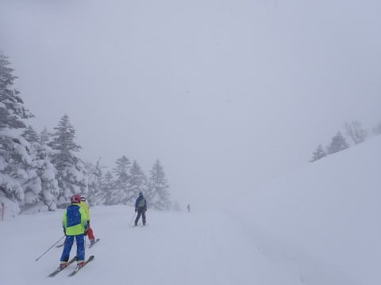

また，薄日が差し始め…

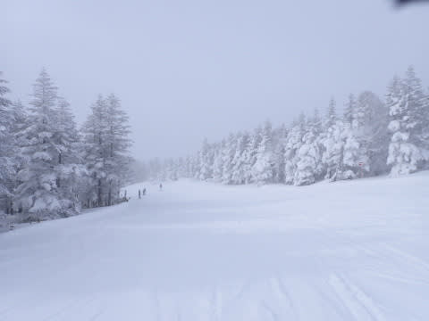

うっすら薄日の中を，軽いパウダーが

積もった圧雪バーンを滑れるという，

結構楽しい感じになってきたよ！！

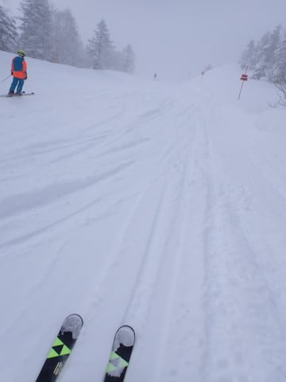

さすがにすっきり晴れはしなかったけど．

曇り～薄日が差す天気で，風もそんなに

強くない，予想より穏やかな天気で．

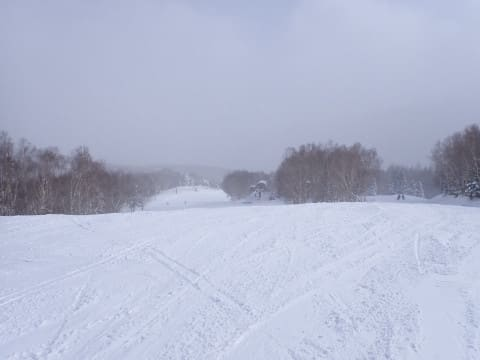

…時折，薄日が差す中に雪が舞ったり，

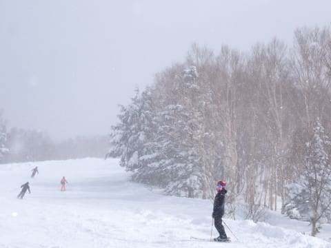

曇り空になったりはしたものの．

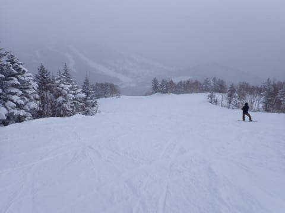

最高気温が-12℃くらいまでしか上がらなかった

割には，穏やかでそこまでひどく寒さを

感じない，思ったよりはいい天気！！

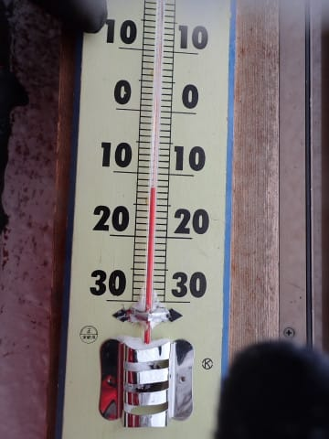

そして，終日雪質もよく…

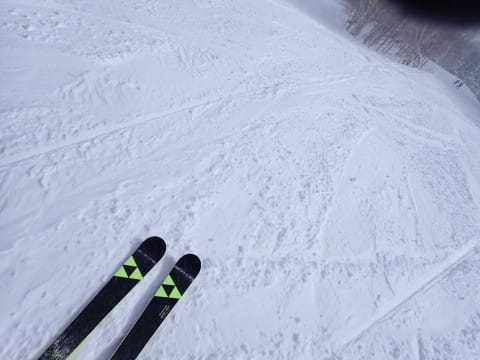

ゴンドラも，ゲートの外まで列がつくことなく，

終日こんな感じのガラガラ具合！！

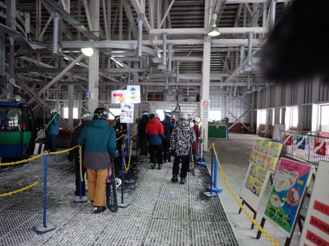

リフトもガラガラだし…

経営大丈夫か？？？

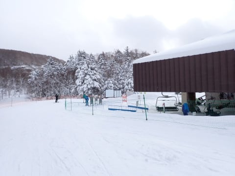

人が一番混んだ時のバーン状況でも

せいぜいこの程度だし…

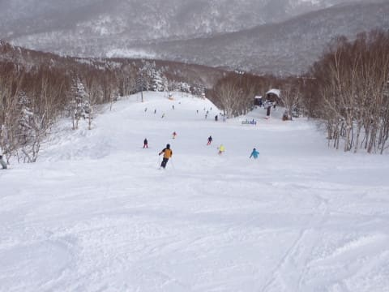

こんなガラガラで大丈夫なんだろうか？

…と，スキー場の経営が心配になるような

ガラガラバーン！！

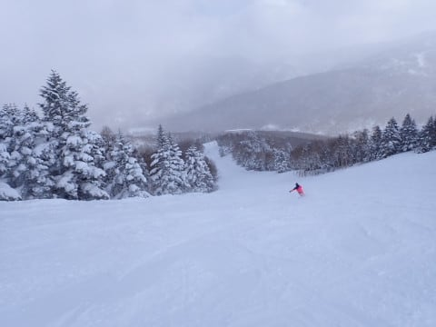

GSコースやオリンピックコースは昼頃には

ひどく荒れちゃったけど，

パノラマコースや唐松コースは予想に反して

雪が最後までそれほどあれなかったし…

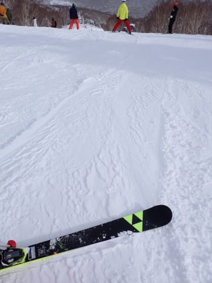

夕方になると，青空も時折顔を出してくるような，

恵まれた環境の中．

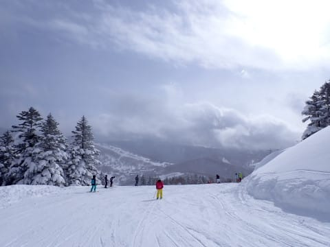

日が暮れる，16:15のラストの1本まで

滑り倒したのでした…

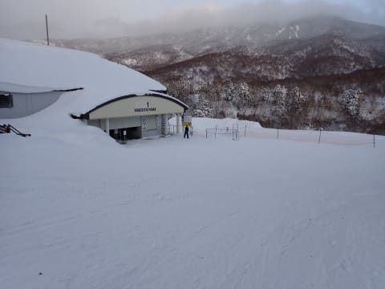

うん．

雪質もよかったし．

天気も意外と穏やかだったし．

終日雪降りの根性のないスキーヤー

ふるい落としデー

って予想したのは誰だ？？←自分だ

こんな日は…

当然のごとく．

お約束のナイターへ参戦！！！

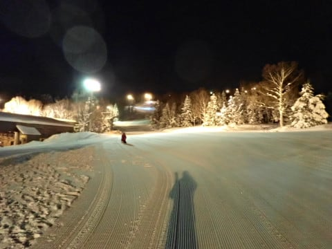

ふはははははは！

トップシーズン最高の柔らか雪質の，

誰も滑っていないシマシマバーンを

いただくのだ！！！

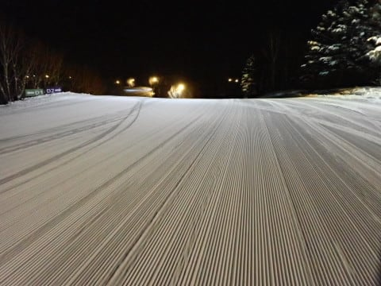

美味．

美味じゃ…

こんな美味極まりない柔らか極上

シマシマバーンを滑らないなんて．

人生の半分を損してるよ…！！

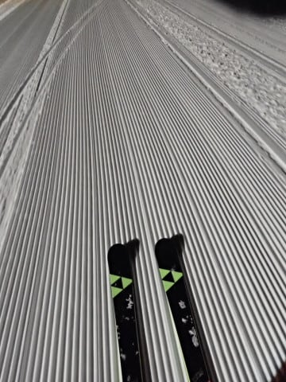

いやーー．

ホントになんでみんな，こんなに最高な

ナイターを滑らないんだろう…

もったいない！！

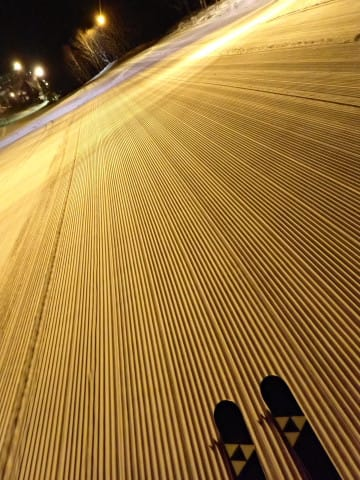

という，ガラガラ幸せ最高雪質バーンを

2時間，飛ばしたい放題で飛ばしまくり．

今日も朝イチからナイターラストまで，

ひたすら滑り続けたのでした…

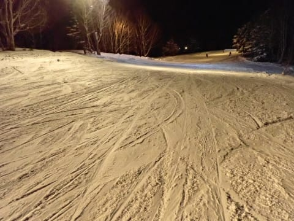

うむ．

よかった．

予想以上にいい一日だった…

明日は今日ほど冷えすぎないし．

雪もほとんど降らなさそうだし．

晴れるタイミングもありそうだし．

今日よりもっといい絶好のスキー日和に

なりそうな予感…！！
