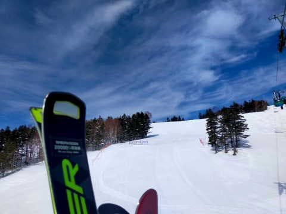

# 3月21日(火・祝)の志賀高原スキー場，特派員情報！…朝は良かったみたい！昼は気温が上がって緩んだけど…

📅 投稿日時: 2023-03-22 04:55:02

今日もスキーに行かず，一日PCの前で

仕事し続けたけど…

この時間になっても，やっつけるつもりの

3個の仕事のうち，2個しか終わらなかっ

たよ…(涙)

もう朝5時近いんですが？？

明日も8:30からあさイチ会議なんですが？？？

起きられるかな…(泣)

この私が休みの日にもスキーに行けないほど

なので，かなりクリティカルな状況で．

とてもBlogを更新しているどころじゃ

ないんですが．

でも，更新っ！！←ほとんど意地

どうやら，祭日の本日…というか，もう昨日か(泣)

21日も，いい感じの晴れで始まって…

あさイチの気温は-1℃と高めなものの．

一応マイナスなので，雪面はある程度

締まっていたみたいです…

うん．

見事なシマシマ！！！

うがーーー！！

気持ちよさそうなシマシマじゃないかっ！！！

…でも，コロコロがいっぱい出る雪だったようで．

朝の焼額は，山頂付近はコロコロ気味．

中腹からは適度に緩んで良かったみたいですね…

最高気温は+5℃を越え，日差しが

強かったので…

昼近くには，日当たりの良いバーンは

完全に雪が緩んでしまい，標高が低い

南斜面の唐松コースの一部，白樺下部は

滑りの悪い雪になっていったみたいですが…

ただ，寺小屋方面は午後2時になっても

雪はちょっとしっとりした程度で，

硬めで快適なバーンだったと報告が

ありました…

そして，祭日というのにゲレンデは

想像以上にガラガラだったようで…

みんなWBC見てたのかな？？

ってなことで．

今日…というか，昨日の志賀高原．

…意外と良かったみたいですね…

おかしい．

特派員にお願いしていたのは，

槍や爆弾が降り注ぐ写真

だったのに…

誰も槍や爆弾が降り注ぐ写真を送って

くれなかったのはなぜ…？？(涙)←そんなもの降らないから

とりあえず．

今後の志賀高原．

22日(水)までは晴れそうですが…

23日の午前中，昼前のどこかで液体が

空から落ち始めてきそう…

そして．

今の天気図だと．

そのまま液体が27日まで降り続けそうに

なってきたんですが！？？

私が行けない週末や祭日に天気がよくて．

なんとか私が滑りに行けそうな今週に

限って土日とも雨って…

どういうこと！？？？？

いや．

大丈夫．

私の普段の行いはすごいいいから．

予想を裏切って，この土日は

冷え冷えの最高パウダーになる

はずっ！！←いや，あなたの日ごろの行いが悪いから，

あなたの行くときに限って雨の予想なのでは？

でも．

ホントに今週末滑りに行けるのかな…
