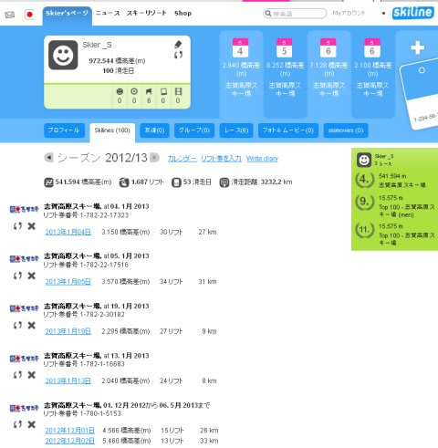
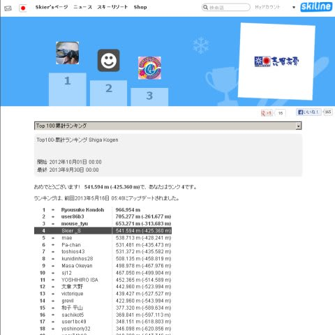

# 志賀のシーズン券も終わったので，今シーズンのSkilineを総括してみますか…

📅 投稿日時: 2013-06-08 04:10:12

今日もまたとんでもない時間にBlogを更新している今日この頃．

皆様いかがおすごしでしょうか．

えー．

スキーシーズンはまだ終わってませんが．

＃まだ終わってないんかい！←お約束の自己突っ込み

…志賀高原のシーズン券の利用期間は終わってしまっているので．

今シーズンのSkilineの結果でも，眺めてみましょうかいな…

えー．

こんな感じで．

滑走日数53日．

…

…志賀だけで，53日ですか…

…我ながら，アホですね～．

昨シーズンは47日だったので，結構増えたかな．

＃2シーズン分あわせた日数が，ちょうど100日って表示されてますね…

で．

シーズン滑走標高差，540kmですか．

となると．52日で540kmだから．

一日あたりの滑走標高差，10000m超えてますね…

…子連れで来て，それほど滑れない日も多かったのに．

むちゃくちゃ滑ったなぁ…

で．

滑走距離，3230km．

これって…

与那国から択捉島までの直線距離に匹敵ですね(笑）．

まぁ，ひとシーズンかけて，これは多いんだか少ないんだか…

…とりあえず．

1シーズンで板がへたるのも当たり前なのかも…

で．

昨シーズンは一日でどれだけ滑ったかの，「一日滑走標高差」のランキングしか

無かったですが．

今シーズンから始まった，「シーズン積算標高差」ランキング…

なんと．

4位でした…

…私より滑っている人が，まだ上に3人もいるんですね…

…上には上がいるものです…(感動)

でも．4位以下はわりと僅差だけど．

3位以上はなんだか突き抜けてますね．

トップの人なんて，私の2シーズン分を1シーズンで滑ってるんですが…

…どういう人たちなんだろう？？

＃とりあえず，人生の何かを捨てている人たちであることに

＃間違いないでしょう（笑）．

## 💬 コメント一覧

### 💬 コメント by (gokuraku skier)
**タイトル**: Unknown
**投稿日**: 2013-06-08 09:02:51

いや～滑りましたね！

それにしても１位の人は１日平均が16,115ｍで60日って、凄すぎますね。

### 💬 コメント by (Skier_S)
**タイトル**: gokuraku skierさま
**投稿日**: 2013-06-08 21:41:44

いやー．

滑りましたよ…

…って気でいるんですが．

まだまだ世の中には上がいることを知って，

「まだ滑りたりないか？」という

気になっています…

でも，シーズン志賀高原だけでこれ以上滑ることは

もうなさそうな気もしてます…

### 💬 コメント by (ゆうこ)
**タイトル**: 私も確認しました。
**投稿日**: 2013-06-09 22:58:22

私も久しぶりにSkiline確認してみました。

一日の標高差ランキング(女子)で41位に入っていました！ランキングに載れただけで嬉しいです。

Skilineにお友達機能があったので、Sさんに申請させていただきました。

もしよかったら承認してもらたら嬉しいです。

来シーズンは3月後半以降も滑りたいと思います。

今年は3月前半で結構息切れしてしまいました。

### 💬 コメント by (Skier_S)
**タイトル**: ゆうこさま
**投稿日**: 2013-06-10 00:45:49

ランキング41位ですか？？

結構滑ってますね～．

Skilineにお友達機能があったなんて…

とりあえず，承認させてもらいました～．

私も，息切れするくらい滑ってみたい…

いつも，息切れに達することなくシーズンが終わってしまい，

「まだ滑りたい病」の禁断症状に悩まされます…（笑）．

