# 2021/2/19の志賀高原特派員レポート…朝は雪が降ったけど，午後は晴れて冷え冷え一日でいい雪質！

📅 投稿日時: 2021-02-20 04:37:03

🏷️ カテゴリ: [日記](cc4b5682fb7b8b144980957a978653fb0.md)

えー．

本日19日の志賀高原特派員情報が送られて

来ていますが．

予想通り，志賀高原はいい一日だったようですね…

まず…今日は朝のうちは，

雪降りでスタートしたようですが…

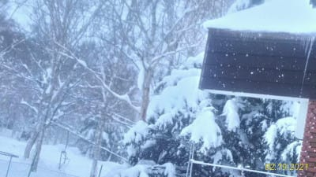

温度計写真はありませんが，朝イチの

焼額山頂の気温は-12℃，

そして，シマシマが隠れる程度の

うっすら積雪の朝だったようで．

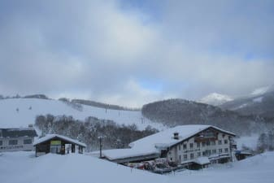

とはいえ，朝のうちから雪は

止んで，雲の合間に青空が見え

始めていて．

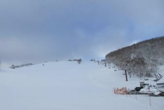

午前中は曇り空だったものの…

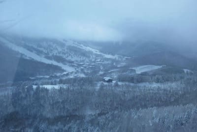

昼ごろには晴れてきました！

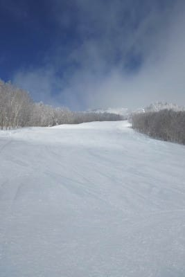

そして，昼過ぎには…すっきり晴れ！

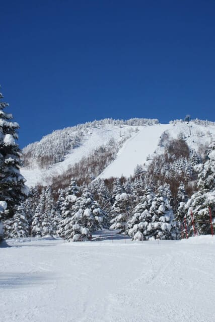

　朝は曇り．時折雪がぱらつく．

　（略）

　昼前から日差しも出て，午後はすっきり

　晴れそうで．

というのが予言レベルで的中した，

すっきり晴れになってきました！

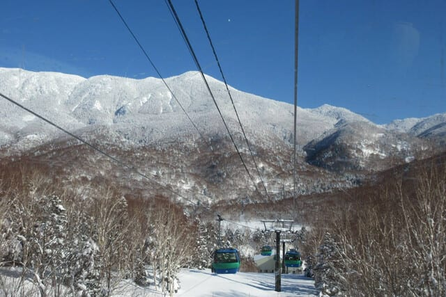

すっきり晴れてきたのに，気温は

昼間もそれほど上がらず…

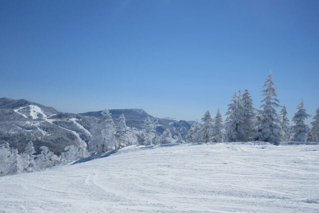

そして，ゲレンデは相変わらず無人状態ですね…

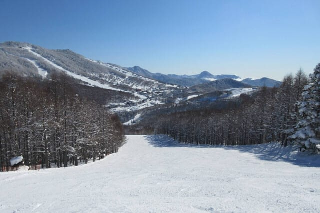

昼間も気温が上がらなかったので，

昨日まで積もった冷え冷え雪が

いい雪質のまま残り…

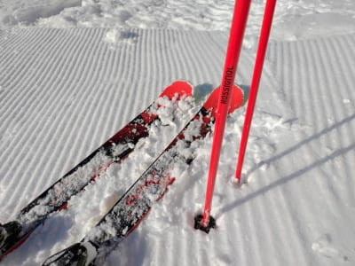

何と見事な，いい雪のフラットバーン！

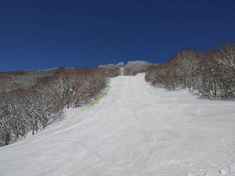

あぁ…こんなところを滑りたい…

一の瀬ファミリーはちょいとだけ

あれたみたいだけど．

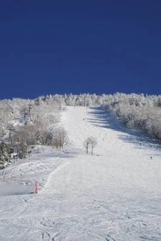

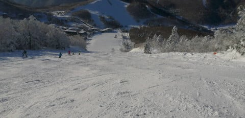

でも，焼額は終日いい雪のフラット

だったみたいです…！

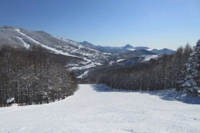

あ，奥志賀はピステンが故障した影響で．

まだピステンの修理が終わってないようで，

第2高速ペアリフト側のエキスパートコースは

観世非圧雪だったようで，ボコボコに

なっていたようです…

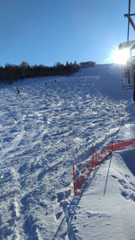

でも．

焼額は最後まで人が少なく，いい雪をキープし．

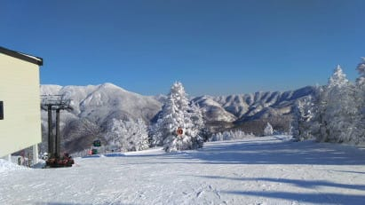

夕方いっぱいまで晴天の中を滑れた，

いい感じの一日だったようです…

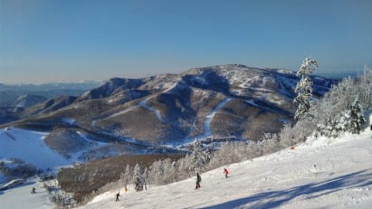

下地の硬いのも昨日までの冷え冷え雪で

隠れてくれて，いい雪質になったようで…

うーん．

うらやましい！

そして．

明日，明後日の週末も天気はいいみたいですね…

…でも，日曜は気温がかなり上がって春の雪に

なりそうですが…

でも，私の呪いで液体やミサイルが降らないだけ

マシだ

と思って，滑ってやってください…

## 💬 コメント一覧

### 💬 コメント by (レインボー73)
**タイトル**: Unknown
**投稿日**: 2021-02-20 16:28:56

土曜日の志賀高原情報

朝の湯田中ー７℃なのに、暖かい。一枚脱いだけど、結局ずっと暖かすぎました。新調したカッパの上衣は、次の寒波までお蔵入りです。

カラマツ２本のあと三高目指すも、12時30分から。

やむなく１ゴンへ。ぎょぎょ、三高からのルートまで並んでる。ヤケビを脱出せねば。

寺子屋へ瞬間移動。平日閉鎖のおかげもあって、やっぱり最高雪質。

東館からジャイアントへ。なんか今日のジャイアントは上手い人ばかり。雪もいい。西館のポール跡が硬くて最高だったとは、上級者の弁。私には西館の短いリフトが、勘違いバーンでした。

ヤケビに戻ったら、カラマツはまだ荒れていない。三高は平日閉鎖なので、きっといいはず。ここで基礎講習を受けて、30分前に終了。食事もとらずに楽しめました。

それにしても、混んでました。上手な人と滑ってると、楽しさも倍増です。

### 💬 コメント by (Skier_S)
**タイトル**: ＞レインボー73さま
**投稿日**: 2021-02-21 00:03:26

今日もレポートありがとうございます～！！

今日はヤケビ混んだようですね．

だんだんスキー場に人が戻ってきてくれるのはうれしいですが，

混雑はうれしくないという矛盾が…

でも，今日も楽しめた一日だったようですね(笑)

