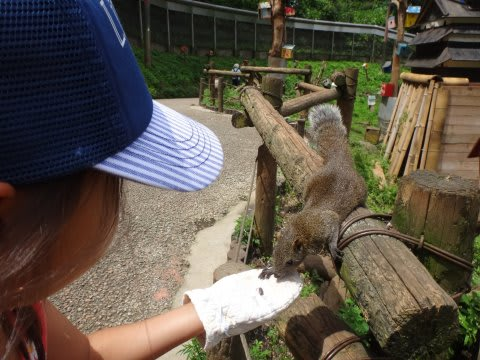
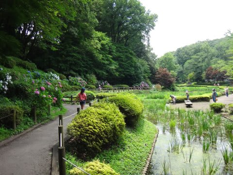
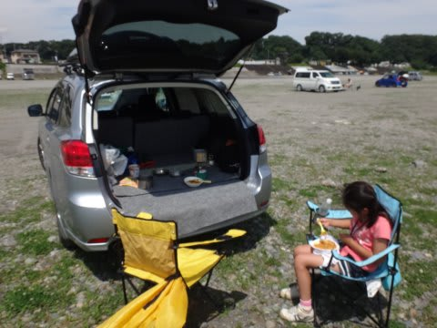
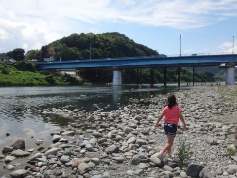
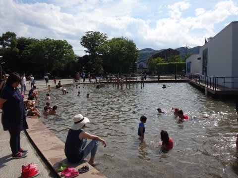
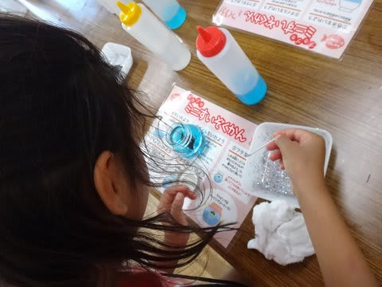
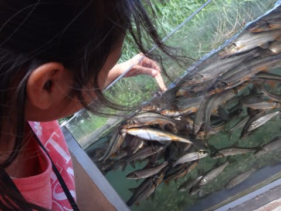

# ご無体継続中（涙）

📅 投稿日時: 2016-06-28 04:09:21

🏷️ カテゴリ: [日記](cc4b5682fb7b8b144980957a978653fb0.md)

えー．

「冬モード終了」の記事を書くと．

なんだかがっかりする人が多いらしい

今日この頃．

皆様いかがお過ごしでしょうか…

そして．

昨日帰国したばかりというのに．

今日もまた帰宅がすごく遅いような気がするのは，

気のせいだろうか…？？←気のせいじゃないと思う

ダメだ…

ダイビング記事を書くパワーが無い（涙）．

ということで．

冬モード終了宣言はしたものの．

夏モード開始はいったいいつになるのか，私にも

わからない状況だったりします（泣）．

とりあえず．

現地2泊，会議前日の深夜0時過ぎにホテルに到着し，

翌日は朝9時からの仕事が終わってホテルに戻ってきたのは

深夜11時半…

ホテルに戻っても翌日の準備があり，2日とも睡眠時間が

4時間取れないようなヘビーな状況で．

2日目の打ち合わせが終了後，そのまま休むことなく

空港へ移動，国内線1時間半+国際線10時間半のフライトを終え，

日曜の朝9時に帰宅した後．

「死ぬ．

　週末遊ばないと，死ぬ」

という，この海外出張の強烈なストレスを解消すべく．

シャワーをあびたら，そのまますぐ娘と一緒に…

動物と触れ合いに行ったり．

公園を散歩した後…

河原でお昼ご飯を作って食べて．

そのまま河原で遊んで…

さらに謎の施設で遊んで．

工作をしたり…

お魚と戯れたり，と．

結局，夜6時過ぎまで，車に乗って数か所

遊び歩いてしまったのが敗因か…←何に敗けたんだ？

とりあえず．

スキーシーズンが終わっても．

どれだけ忙しかろうが週末に遊ばないと死ぬ

という生活パターンは変わらない，Skier_Sなのでした…

## 💬 コメント一覧

### 💬 コメント by (KENKEN)
**タイトル**: ご無体？お疲れ様です
**投稿日**: 2016-06-28 22:39:36

毎回言ってますが夏モード楽しみにしています。

PVは減るようですが、冬モード以上に楽しみにしていますので

ペースを落としてでも更新を続けて下さい。

当方は7月後半(もう来月じゃないか)にいつもの海に訪問予定です。

いろいろあってかなり円高が進みましたね。

サーチャージ(燃料代）も安いし、Sさんは今年も海外でしょうか？

(当方の商売上はますます悲惨な状況です。)

### 💬 コメント by (Skier_S)
**タイトル**: KENKENさま
**投稿日**: 2016-06-29 00:03:05

お久しぶりです！

こちらの夏休みは…

無事取れるのかなぁ…

とりあえず，8月上旬に慶良間に

再訪予定です．

マイレージ航空券が取れず，

いつもの宿もとれなかったので

ちょっと心配…

とりあえず，我が家は8月まではダイビング

お預けです（涙）

### 💬 コメント by (いー)
**タイトル**: 地元だぁ～
**投稿日**: 2016-06-29 08:53:29

もしかして‼ 高◯橋⁉

実家の近所です

これからのシーズン場所取りに難儀しますよね

(*_*)

橋の下はいつも劇混み‼

少し上流の小倉橋がオススメです(^ω^) トイレもあります

### 💬 コメント by (KENKEN)
**タイトル**: 座間味楽しんできて下さい。
**投稿日**: 2016-06-29 22:24:43

星砂さんだめでしたか。

GWに泊まりましたがすでに夏休はかなり予約が入っているようでした。

マイレージ残念でしたね。我が家もフライト片道はマイルで予約できず優待券で仮押中です。

A○Aは特典航空券の座席が少なくて辟易してます。(同じ日のJ○Lは特典の空席があるのに・・・・・)

こればかりは運ですがお互いの日程で台風が来ないことを祈っています。

家族を置いて9月に座間味に行く予定ですが、こちらは台風が来そうな気がしてなりません。

### 💬 コメント by (Skier_S)
**タイトル**: いーさま
**投稿日**: 2016-06-30 01:32:41

そうです．

正解です！

…近場ですか（笑）

これまで3回ほど行って，そんなに混んでなかったので

安心していたのですが…

やっぱり，これからは混むんですね…（残念）．

きれいなトイレがある，恵まれた場所なので

重宝していたのですが．

今度は小倉橋に行ってみます…

情報ありがとうございました！

### 💬 コメント by (Skier_S)
**タイトル**: KENKENさま
**投稿日**: 2016-06-30 01:34:02

星砂さん，8月末まで全週末満室でした…

やっぱり人気のようです．

ANAのマイレージ特典，やっぱり座席少ないですよね（涙）．

お互い，台風が来ないように祈りましょう…

