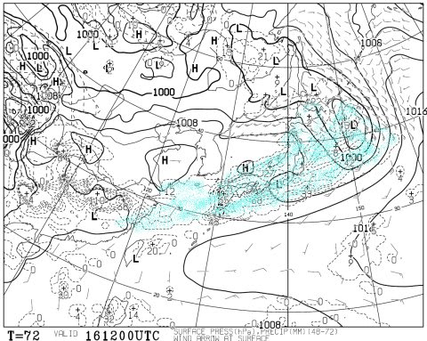
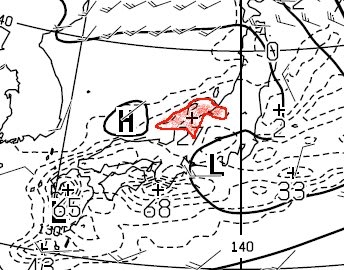
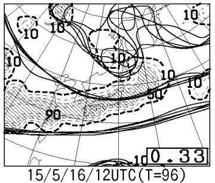
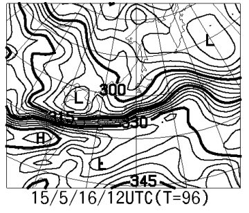
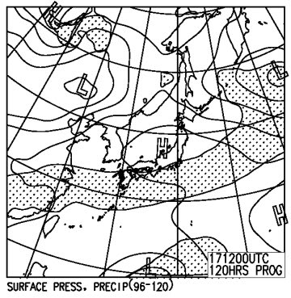

# まだ続いてるよ！今週末のかぐらの天気は…土曜はどしゃ降り雨だな（涙）．

📅 投稿日時: 2015-05-14 02:03:04

🏷️ カテゴリ: [スキー天気予想](c6554f5c3c106093b511a8daae23757e8.md)

えー．

ということで．

志賀高原のシーズンは終わってしまったわけですが．

＃今週末まで，渋峠だけ営業するようですが…

私がスキーに行く限りまだ続く，スキー天気予想．

…さて．

今週末の，かぐらの天気は，と．

…

…

…

ダメだ．

土曜は，どしゃ降りっぽい…（泣）．

16日，土曜の地上天気図は．

こんな感じで，降水が予想される水色で塗ったエリア．

日本をすっかり覆ってます（涙）．

日本近辺を拡大すると…

赤く囲った20mm以上の降水予想域．なんか，かぐら近辺まで

伸びてる気が…

ってことで．

この天気図のままなら．

16日は，雨．

それも，かなり本格的な雨が降ります（悲）

この予想が外れてほしいんですが…

この日の特定高度線の予想ばらつきはそれほど大きくなく．

スプレッドも0.33と比較的小さな値なので．

ほぼ確実に，土曜は雨です．

分かる人にはわかる，850hpaの相当温位を見ると…

あぁ．850hpaのかなりの傾圧帯が…

強烈な前線が発生してる感じ…

梅雨か，これは…？？？

って感じの天気図．

雨だ．

雨だよ…

でも．

日曜はこんな感じで．

雨が予想されている網掛けは，太平洋側にのみ

かかっていて．

日本海側は降らずに済みそうですね…

気温も平年並みかな．

ってことで．

まとめると．

土曜：前日から雨．朝は本格的雨．時折強く降ります…

　　気温は10℃近いけど，雨が降るので肌寒く感じるかな．

　　ただ，雨のピークは午前中．

　　…うまくいけば，昼頃には止むかも…

　　だとすると，午後は人も少なめで，雨で洗われて

　　雪もそこそこ滑って．意外とねらい目かも…？？？

日曜：曇が多めだけど…晴れたり曇ったり，かな．

　　気温は平年並み．日が射すと暑く感じるかな～．

　　前日のどしゃ降りの影響で，雪はかなり減りそうな予感…

　　午後は板に張り付く雪になり，コース全面コブコブになり．

　　コブ溝はかなりヤバ気な感じになるかも…

って感じかな～．

うむ．

私は土曜日帰りの予定なんで．

…雨に濡れながら滑ることになりそう…（涙）．

まぁ．

雨の方が．

雪が滑って，人も少なくて，いいのだ！！←ポジティブシンキングで自分をだまそうとしている
