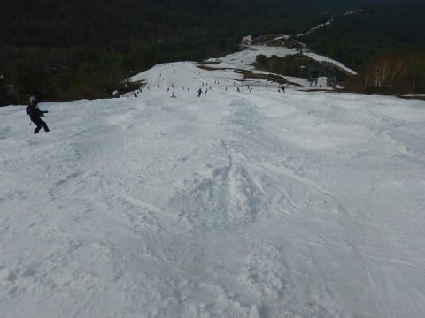
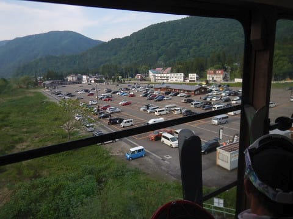

# 2019/5/26(日)，かぐらスキー場ファイナル，詳細レポート後半…午後はリフトはガラガラになったものの，全面コブ化，そしてコブ溝は所々土が…でも，最後までよくもった！

📅 投稿日時: 2019-05-30 02:46:58

🏷️ カテゴリ: [2019スキー滑走日記](c3e4496fc0fb7f9c17ff21214a35b1ace.md)

ということで．

昨日途中で力尽きてしまった

かぐらファイナルデーのレポート．

本日は後半戦です！

…ってな感じで．

午前中はそこそこ滑っている人も

多かったので．

…お昼ごろには，この時期の

かぐらのお約束．

春の全面コブ祭りが始まってきます…

そして．

雪が薄くなってきたこの時期の，

春の全面コブ祭りの帰結として…

コブが深くなってきたところは，

うーむ．

だんだん土が出てくる場所が

増えてきましたね…（涙）

とはいえ．

午後になると，結構リフトの待ち時間も

少なくなり．

時折飛び乗りになるほどだったので…

ゲレンデの人も減ったのか．

例年に比べると，コブの成長が

かなり遅いような気が…？？

午後2時ごろで，コブはこの程度．

いつもならもっと深い全面コブに

なってる気がするんですが…！？？

でも．

コブはそれほど深くないけど．

午後3時ごろになると．

雪が薄い部分．

横に並ぶ全てのコブラインの溝が，

底が抜けちゃう部分も出て

きちゃいました（涙）

…そして．

ゴンドラ降り場前，

パークの横の部分も．

コブじゃないのに，うっすら茶色くなり．

土が出始めて来ちゃったんですけど…（涙）

とはいえ．

コース上で土が出ているのはごくわずか．

午後3時でも，遠くからコースを見ると

まだ真っ白だし．

人も例年より少なかったからか，

コブもそれほど深くありませんね…！

ってわけで．

結構荒れて凸凹してきたものの．

いつもなら，リフト営業終了時間には

全面狂乱コブ斜面化してしまう

かぐらメインバーンも．

本日はこの程度の荒れ具合で済み．

ラストの15:45になっても．

例年に比べれば，まだまともに

滑れたゲレンデ状態でしたね～！

そして．

15:45のリフト終了時刻となり．

ついにかぐらファイナルデー，

ラストの1本になるわけですが…

この頃になると．

和田小屋から高速リフト乗り場に

向かう部分も，ちょっとヤバい感じに

なってきてます．

まぁ，遠目で見ると．

もう少しもちそうな感じは受けますが…

でも．

リフト前も結構雪が薄くなっていて．

うーん．気温が高かった本日．

一日だけで，結構雪が解けちゃった

感じですね（涙）

とはいえ．

今シーズン．

ファイナルデーまで，

比較的まともに滑れましたね～！

雪が少ない年は，最後は

つぶされて雪出しに使われる

パークも，今シーズンは最終日まで

無事残りましたし．

この土日の高温にもかかわらず．

よくこれだけ雪が残ってくれた

ものです…（感謝）

ってなことで．

ファイナルデーの高速リフト

営業も終了してしまったので．

今シーズンのかぐらメインバーン，

これにてシーズン終了です…

あとは，下山の遥かなる道が待って

います（涙）

下山のゴンドラは5～10分待ち（泣）

…とてもスキーに来たと思えない，

新緑に覆われた景色を見ながら，

10分間，ゴンドラに揺られると…

ゴンドラを降りたところで，

またキャリーサービスに

板とブーツを預けて．

次はみつまたへ登る

リフトに乗って…

このリフトを降りると…

今度はロープウェー乗り場に向かって，

みつまたを降りていくわけですね．

ここから先は，Pislabマットを滑って

降りると早いのですけど…

Pislabを滑りたくない私は，

向こうに見える，みつまた高速リフトまで

とぼとぼ歩いて…

下りリフトに乗車！

…Pislabを滑る人は，横のこのコースを

滑れば，下りリフトに乗らずに済みます…

そして．

下りリフトに揺られること数分．

リフトを降りても，

まだまだ帰路は続く．

次はロープウェー乗り場まで

100mほど歩きます…

そしてようやっと，

ロープウェー山頂駅に

到着！

ここで，キャリーサービスに預けた

板とブーツを受け取って．

ようやっとラストの乗り物，

ロープウェーに乗ることができます…

はぁ…

長い道のりだった…

ってなことで．

ようやっと下山！！

かぐらで下山ゴンドラに並んでから

ここまで．

遥かなる1時間10分の道のりでした…

ってな感じで．

ついに．

かぐらファイナルも終わって

しまったわけですが…

うーん．

コブ溝に多少土は出てきていたものの．

まだメインバーンは結構真っ白だったし．

次の週末，もう滑れないとは

まだ実感として信じられないのですが…

残念ながら，もうこれでかぐらも

営業終了のようです（涙）

今シーズンもGW以降，お世話になりました～．

また来シーズン！！

これで．残るは月山のみか…

## 💬 コメント一覧

### 💬 コメント by (naoちゃんねる)
**タイトル**: Unknown
**投稿日**: 2019-05-30 21:00:14

２回にわたる大作レポートお疲れ様でした😊

やはり先週の高温でかなり雪が溶けてしまったようですね…

渋峠が残ってくれればもしかしたらもう１回…と思っていましたが早々に月曜日に終了してしまいました😞

残るは月山ですか…雪たくさん残ってくれるといいですね😣

### 💬 コメント by (Skier_S)
**タイトル**: ＞naoちゃんねるさま
**投稿日**: 2019-05-31 00:11:11

先週の月・火の高温＆雨でやられちゃいましたね…

そして，残るは月山！

かぐら・志賀のGWは雪が多かったですが，

月山は例年並みのようで．

さらに最近高温が続くので．

７月第一週まで滑れると嬉しいんですが…

