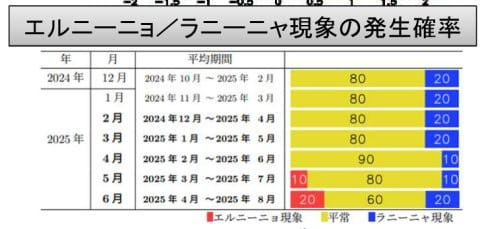
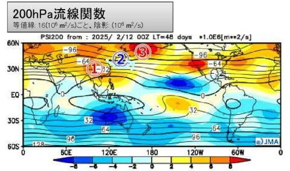

# 気象庁の3,4,5月の3か月予報が出たよ！…気温は平年並みかちょい高め．スキー場に雪は十分積もったので，春スキーはそこそこ行けそうな感じ

📅 投稿日時: 2025-02-26 02:09:31

🏷️ カテゴリ: [スキー天気予想](c6554f5c3c106093b511a8daae23757e8.md)

えー．

世間では3連休明けとなる本日．

私は昨日から仕事をしていて，3連休

明けという感じはないんだけど…

でも，連休明けのように眠かった．

ひたすら眠たかった…

どこかでどっさりまとめて寝ないと

ヤバそうな感じではあるけど．

この時期，ぐっすり寝られる休みを

取れる時間があれば滑りに行ってしまう

ので，休みを取って寝だめは不可能．

やっぱり昼間，面白くない会議の時に

寝るしかないですね…←何か違う

ってなことで．

本日25日火曜の志賀高原ですが…

ライブカメラを見ると，終日いい感じの

晴れだったようです…！！

（[焼額山スキー場ライブカメラ](https://www.princehotels.co.jp/ski/shiga/livecamera/)より）

気温はマイナスをキープしたものの，

かなり強い日差しで暑く感じるくらいだった

ようなので…

昼間の日差しで雪がだんだん解けて

いくのが，ライブカメラの降雪量の

目盛りで分かるほどでしたね．

（朝9時半では20cmだったのが，

14:46では10cmの目盛りに減ってる）

　

（[焼額山スキー場ライブカメラ](https://www.princehotels.co.jp/ski/shiga/livecamera/)より）

…しかし．暑いのは今日だけでなく．

このあと，27日あたりからさらに気温が上がり

ます…！（泣）

3月1日になると…

なんだこれは…？？？

赤い0℃線は津軽海峡くらいまで北上し，

水色の+3℃線が志賀高原より北にいっちゃい

ますよ…！！？？

これ，志賀光電でも最高気温+10℃近くまで

上がって，5月上旬並みの気温になるって

ことですけど？？？

そして，3月1日の地上天気図は…

なにこれ？？

太平洋高気圧に覆われた，8月ごろ

ですか…？？？

という感じの天気図．

おそらく，今週末は夏スキーかと思う

暑い日差しの日になりそう…

とても冬の天気図とは思えない（泣）

まぁ，液体が降るよりかはマシですけど．

ってなことで．

これだけ大量に雪が積もっているのに．

焼額山スキー場は，これから高温になることに

危機感をもっているのか…

今日のライブカメラを見てびっくりなのですが．

なんと．

焼額では，2月末というのに，いまだに

人工降雪を打ち続けてますよ！！！

（[焼額山スキー場ライブカメラ](https://www.princehotels.co.jp/ski/shiga/livecamera/)より）

いや…

ただでさえ雪が多い今年，この時期に

さらに人工雪を打つ必要性があるんだろうか…？？

という疑問をもちつつも．

これから先，異常気象レベルの高温だとかが

起きても，何があってもGWまで営業するんだ

という強い意志…というか，執念を感じますね…

（[焼額山スキー場ライブカメラ](https://www.princehotels.co.jp/ski/shiga/livecamera/)より）

いや…

おそらく多くのスキーヤーが．

今年，ホントに今更人工雪を打たないと，

GWまでもたない天気なのか…？？？

ということが気になるところと思うので．

毎月25日前後の火曜に公開される，

今月は本日発表されたばかりの，[気象庁の
3か月予報](https://www.sunny-spot.net/chart/FCXX93.pdf)をみてみましょう！！！

まず．

概要を見ると…

3，4，5月ともに，平年並みか平年より

気温が高くなる確率が40％ということで．

まぁおおむね平年並みかそれよりちょい

わずかに高いなるか…という感じの予想ですね．

まぁ，今の雪の量なら，異常高温にならなきゃ

平年並み以上に雪がもちそうだし．

冷え冷えにならないのはスキーヤーとしては

ちょっと惜しくもあるけど，

異常高温にはならなさそうな気配なので，

一安心かな…

で．

エルニーニョ・ラニーニャの傾向を見ると．

ラニーニャっぽい傾向は終わって，

夏に向かってエルニーニョが発生する

可能性もわずかに出てきたようです…

とはいえ，こちらもラニーニャでも

エルニーニョでもない，ほぼ平常の状態が

続く可能性が高そう．

とりあえず，3月の予報の詳細を見てみると．

200hPa流線関数は，②で示されるように

日本付近にわずかに水色に見える低気圧性

循環があり…

水色矢印のように，偏西風が日本付近で

南下するパターン．

なので，この偏西風の南下に対応して，

850hPa気温でも，北半球全域がほぼ平年より

高温のエリアに覆われる中，日本のちょうど

南側に，②で示すような，平年比で気温が

低いところが出現していて…

そのため，本州中央部では大体平年並みに

ってくれそう…という予想です！！

同じく4月の200hPa流線関数を見ても，

同じように日本付近には②の低気圧性

循環があって．

このため，4月も日本の南に②で示す

平年より低温の領域ができてます！

ホントに日本付近だけ，低温になっていて．

これが無ければかなり気温が上がって

ヤバかったのかも…

5月の200hPa流線関数を見ても，

3，4月よりは弱いとはいえ，日本の南に

②で示す低気圧性循環が生じており…

5月も，850hPaの気温は，北半球のほとんどが

平年以上の気温の中，日本の周りのみ②で示す，

平年並みかそれよりわずかに低めのエリアに

覆われていて．

本州中央はほぼ平年並みになりそう…！！

ということで．

まぁ，ほぼ平年並みに収まりそうな

3，4，5月でしたが…

実は今日，気象庁からは「[暖候期予報](https://www.sunny-spot.net/chart/FCXX94.pdf)」

というのも出ていて…

これは6-8月の予報になります．

概要を見ると…

この6，7，8月の夏の期間は，

平年より気温が高くなる確率が70％と，

かなり高温になりそうな予報になっちゃって

ます…（泣）

うーん．

詳細を見ると，6-8月は日本の南側の低気圧性

循環が消えて，偏西風の南への蛇行が無くなる

ようで…

また，昨年同様かなり暑い夏になりそうです（涙）

この6，7，8月の予想を見るにつけ．

3，4，5月までは平年並みでいてくれて

良かった…

と，胸をなでおろす，Skier_Sだったのでした…

## 💬 コメント一覧

### 💬 コメント by (レインボー77)
**タイトル**: Unknown
**投稿日**: 2025-02-26 20:19:15

水曜日の志賀高原情報

昨日は汗をかいて終了したので、今日は鎧を脱いで参戦。朝の蓮池の気温は、昨日-7℃で今日は-3℃なのに、朝から寒けが。結局私だけ、寒くて早めリタイア。

まずはニゴンからパノラマはファーストゲット5点。オリンピックはまっ平らだけど視界が効かなくて4点。GS最高5点。そのあとのGSは人が多すぎて3点。イーストはいつも完璧5点。奥志賀の老人保養所第三は4点。ダウンヒルはガタガタで人も多く2点。今日も昼前に終了しました。そのまま湯田中の箱山温泉を下見。食べ物が安くとっても気に入ったので、今夜は箱山で一杯と決めました。果して？

### 💬 コメント by (you160)
**タイトル**: Unknown
**投稿日**: 2025-02-27 00:19:57

どこかのブログの影響で、妻が10℃で雪が降れば良いのにと言い出しました…

### 💬 コメント by (Skier_S)
**タイトル**: 今週日曜はヤバい感じ
**投稿日**: 2025-02-27 01:25:09

＞レインボー77さま

今日の方が昨日より気温が高かったんですが，そこまで厚くなかった感じでしょうか．

箱山温泉，よさそうですね～！

＞you160さま

…完璧に洗脳されてますね．

いろんな意味で順調に毒されつつあります（笑）

