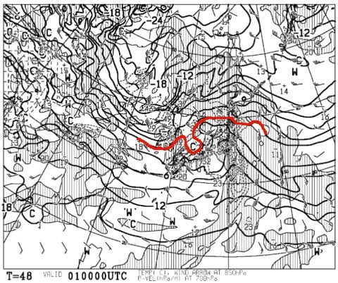

# ダメだ．4日以降も高温にやられそう（涙）…来週月・火の5，6日は超高温で2日間雨が降り続けるかも！？？

📅 投稿日時: 2018-02-28 02:56:01

えー．

昨日の記事ですが．

眠い中書いたので，何ヶ所か間違いが…（涙）．

朝9時の850hpa気温図，赤く塗る0℃線を間違えてるし．

さらに，地上天気図の拡大したもので，

10mm以上降水があるところを塗った…

と書いてますが．ここは20mm以上の降水が予想されている

所を塗ってます…

すみません（平謝り）

うーむ．やっぱり，眠い時に記事を書いちゃいけませんね！！

…と，書いた傍から，こんな時間に記事を書いている自分（涙）．

で．

今日の予想天気図を見ても．

やっぱり1日は荒れそうで…

そして，志賀高原には+6℃線が近づいてるので．

1日の日付が変わったあとくらいから，

やはり，雨＆強風南風になりそうですが．

ただ，最新の1日夜9時の地上天気図を見ると…

あら？？？

志賀高原は，ギリギリ水色に塗った降水域が

かかってないように見えますよ…？？

この，夜9時の天気図の降水域は．

朝9時～夜9時までの12時間の降水量予想を

示してるので．

これは．

もしかすると．

1日の朝までは雨が降るけど．

朝9時以降の昼間は雨が降らないかも…

…でも．逆に言えば．

1日夜に冷えたあとも，降水量が無いということで．

…すなわち，雨で融けたあとに固まった

ガチガチバーンになったあとに全く雪が降らず．

週末3日の土曜は，ガチガチアイスバーンの

ままということか…っ！！？？（恐怖）

とりあえず．

1日の朝が雨がひどくならないように．

そして，2日に冷え冷え雪がドサドサ降って

3日の週末までにゲレンデ状況が改善するように．

ひたすらひたすら，

冷え冷え降れ降れ踊り

を踊り続けるしかなさそうです…

それで，だ．

さらに恐ろしいことに．

4日以降，すごい気温が上がりそうで．

矢印で示した4～6日．

平年比8度くらい気温が高い日が3日間も

続きそうなんですが！？？？？

…うぎゃーーー！！

なんだ，これは！？？？

4，5，6日は，赤い0℃線ははるか北．

とても3月上旬とは思えない…

もう，これは，志賀高原でも気温+10℃レベルで，

GWより気温が高いかも！？？

そして．

4日は降水域が志賀に掛かってないけど．

…5，6日は降りそうなのね…

そう．液体が…（涙）．

日曜の4日，降らなさそうなのが

せめてもの救いだけど．

…これは，1日＆来週5，6日でかなり雪が解けそう…（激泣）．

そして，積雪の積み増しがなさそうとなると…

…

この春の営業はヤバいかも…

…

いや！！

大丈夫！！

5，6日を過ぎたら，きっと，

そのあと3月が終わるまでずっと，

気温が-20度クラスに冷え込み．

毎日1mくらい積もり続けるはずっ！←それだと，積雪20m超えるよ…

これは…

このGWまで無事営業できるよう，

ひたすら情熱的に，休むことなく．

踊るしかないっ！！

スキーヤーの激しい願いを込めた，

超ハイパー冷え冷え降れ降れ踊りをっ！！！！←どんな踊りだ…？？

## 💬 コメント一覧

### 💬 コメント by (はなげ親分)
**タイトル**: 5、6の液体
**投稿日**: 2018-02-28 09:53:30

私の平日スキーのときは、何かが起こる…

んっもう～!!

しかし、雨降りの平日に滑るなんて人は少ないだろうから、好きなラインで滑り放題と、お気楽に考えるようにしよ～っと♪

### 💬 コメント by (Goku)
**タイトル**: なんなら・・・
**投稿日**: 2018-02-28 23:06:25

はなげ親分様

なんなら例の『雪女』を送り込みましょうか！

雨が雪に変わるかもしれません（笑）

### 💬 コメント by (Skier_S)
**タイトル**: 3月に入った途端，ダメだ…（泣）．
**投稿日**: 2018-03-01 00:37:50

＞はなげ親分さま

日曜は気温が上がるものの，晴れるだけマシですが．

月，火曜はダメな感じです…

まるで梅雨のような天気図です（涙）．

雨降りの中，好きなライン取りたい放題の

貸し切りゲレンデをお楽しみください．

＞Gokuさま

その手があったか…！

…でも．

どんな手でも使っても，

雪にならないか真剣に考えてしまう

今日この頃です…

### 💬 コメント by (はなげ親分)
**タイトル**: ん～っ
**投稿日**: 2018-03-01 16:49:15

Goku様

雪女大明神に御出陣願うと意気に感じ魔力200%でのご活躍になるような気が…

全山運休は悲しすぎるので…

そうだ!!

私は雨の中滑るのが好きだったんだ～(泣)

### 💬 コメント by (Skier_S)
**タイトル**: はなげ親分さま
**投稿日**: 2018-03-02 01:58:56

そうだったんですか…

雨の中滑るのが好きだったんですね！

ガラガラで好きなライン取り放題ですから！

…私が10月のYetiでよく言ってるセリフですが．

3月の志賀高原では，寂しすぎて涙を誘いますね…（涙）．

