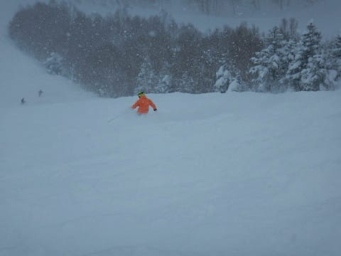
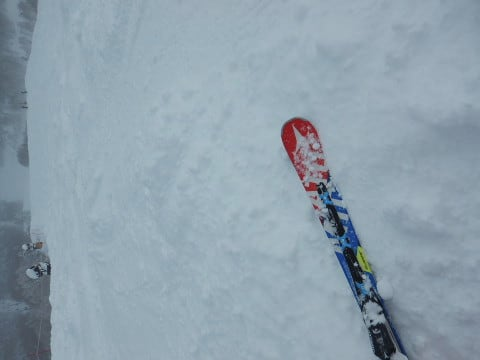

# 今更だけど，2019/1/6(日)の志賀高原，焼額山スキー場の詳細！…朝はブーツパフ，雪降りでゴンドラじゃないと辛い寒い一日．ガラガラだったよ

📅 投稿日時: 2019-01-09 03:39:54

えー．

昨日は死んでました．

深夜に帰宅後，倒れこむように寝てました．

…今日も咳が止まらないSkier_Sです．

風邪，完全に娘からうつされました（涙）．

この時期は風邪をひかないよう，すごい

注意しているのに…

ということで．

昨日は日曜の志賀高原の詳細レポートが

できなかったので．

今さらながら，日曜の志賀高原の状況をば…

の前に．

志賀高原．

深夜3時現在，降ってますよ～！！！

（[北信建設事務所HP](http://www.q0.ws302.smilestart.ne.jp/index.htm)より）

夜10時ごろから降り始めた感じですが．

今晩はかなり激しく降り続けて．

おそらく，明日の朝はかーーーなり深い

ディープパウダーになってそうです…

明日滑りに行く人は，太い板を持っていきましょう！

ってなことで．

一昨日，日曜の志賀高原の報告です．

まず，朝，宿の前に出ると．

昨晩からの積雪は，10cm弱かな…

うーむ．

4日の予想では，

　昨晩からの積雪は

　ほとんど無し．

　朝はピカピカ圧雪！

　もしかしたら，圧雪の上に積雪があるかもしれないけど．

　せいぜい1cmかな…

と書いたけど．

…ここは外したようだな…（涙）

ってなことで．

いつも通り，焼額第1ゴンドラの山頂へ繰り出しますが．

いつもの山頂温度計．

-11℃ですか…

　気温は低め．朝は-10℃以下．

って予想は当たってますね…

んで．

ゲレンデに出てみると．

うむ．

圧雪コースも，新雪が10cmほど乗って

ますね…！

冷え冷えの軽い雪なので，抵抗感なく

気持ちよく滑っていけます！

こんな日は．

新雪が積もった日の定番，朝イチの

オリンピックコースへ飛び込むのだ！

…うーむ．

でも，雪が積もり始めたのは朝方からのようで．

オリンピックコースも，積雪はせいぜい

ブーツパフ…

残念ながら，それほど深いパウダーじゃなくて．

完全底付きする斜面だけど．

でも，上に乗っている軽い雪を

蹴散らしながら滑っていくと．

結構気持ちいいかな！

で．

正月休み9連休の人も，最後の休みとなる

この日．

さすがに最終日まで滑ろうという人は

そんなに多くないのか．

いつもは混雑するGSコースも終日

それほど混まなかったし．

ゴンドラもガラガラ…

リフトも，終日ほぼ待ちなしの，

ガラガラでしたよ～！

…でも．

結構強い雪が降り．

風もそこそこあった午前中．

…凍死するかと思うほど寒く．

さらに，昼間の最高気温も-7℃までしか

上がらず，

　朝から雪が降り始め，昼間はずっと雪が

　舞い続けそう．

　昼も-6℃程度で，

　寒い一日．

という予想がほぼぴったり当たった感じで．

そのうえ，午前中はゲレンデの視界も悪め

だったので…

ちょいと辛い感じだったかな．

ただ，午後になると．

曇り空ながらも，ちょいと明るくなる

タイミングもあり…

午前中は凸凹が見にくかったバーンも，

ちゃんと見えるようになり．

さらに．

人が少なかった本日．

午後になっても，コース上は柔らかい雪が

残っているところもあり，

多少コースは荒れたものの．

終日雪は柔らかめで，ひどい凸凹に

ならなかったので，結構滑り良かったかな～．

ってな感じで．

午後も遅くなると，もう貸し切り状態の

無人バーンを…

日が暮れるリフトストップの時間まで．

思う存分，好き勝手かっ飛ばすことが

できたのでした…

…ってなことで．

9日中8日間滑った，シアワセな

正月期間は終わったわけですが．

6泊志賀高原に泊まったうち，

5日間ナイターに繰り出し．

さらに元日は早朝からナイターまで

滑り続け．

1月4日は一旦帰宅したものの．

帰宅して24時間後にまた志賀に出発するという．

かなり体力の限界にチャレンジした感じの

正月期間でした…

…しかし．

無理をすると風邪をひいたりしますので．

皆様におかれましては，余裕をもった日程で

スキーをされますよう，お勧めいたします…←お前が言っても説得力がない

## 💬 コメント一覧

### 💬 コメント by (yumi)
**タイトル**: 🎵～🎵
**投稿日**: 2019-01-09 09:08:12

🍑パウ🎵

### 💬 コメント by (若杉勲71)
**タイトル**: 志賀高原情報
**投稿日**: 2019-01-09 12:17:25

オリンピックは新雪60。息ができないうえ視界不良で、上手い人が次々こける中、ゆみりんさんはスイスイ行ってました。私はワックスが全く剥がしてなくて全然滑らず、悪戦苦闘の午前中でした。あんなこと初めて。

他人の板と交換して滑ってみたら、まさに夢の世界。道具の管理も腕のうちですね。

早く良くなるように祈っておきます。

### 💬 コメント by (Skier_S)
**タイトル**: 今日は積もったみたいですね…
**投稿日**: 2019-01-10 03:09:17

＞yumiさま

ああああ～いいなぁ～！！！

ディープパウダー滑りたい～！！

＞若杉さま

60cmですか！

それはすごい…

私も太い板で攻めたかった…

でも，ワックスが合わずに引っかかると，緩斜面で

苦労しそうですね．

このあと，10日夜～11日朝にちょっと降ったあとは，しばらく降らなさそうな感じです．

次の雪は16日ですかね～．

風邪はだいぶ良くなってきました．

