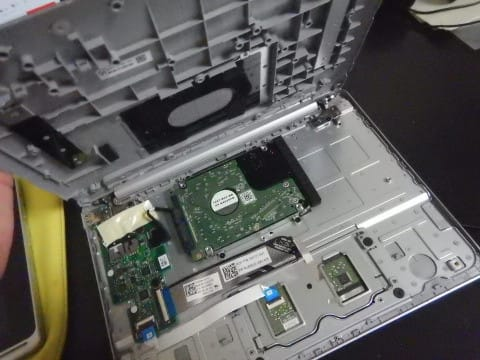
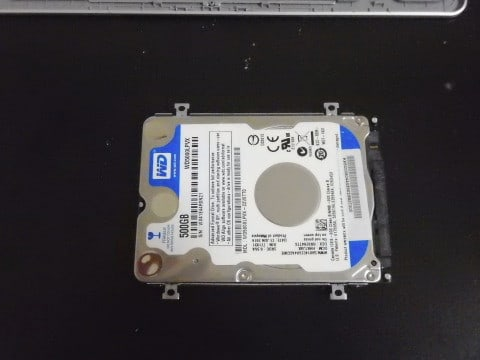

# ACERの2-in-1タブレット，Aspire switch　10を分解，SSD化してみる…その2

📅 投稿日時: 2018-10-18 01:47:20

えー．

今週末のオープンに向けて．

Yetiでは着々と準備が進んでいるようですね…

（[スノータウンYeti FB](https://www.facebook.com/YetiSnowtown/posts/1916945171728183)より引用）

今週は結構冷えたので，雪造りは順調な

ようですよ～！

この10月は，これからそんなに極端に気温は

上がらなさそうだし．

昨シーズンのように，

完全に雪が消えて営業中止

ということは，今シーズンは心配しなくても

よさそうな予感…

で．

このBlogの水曜恒例，天気予想はまだ始まってませんが．

とりあえず，天気図を読んでみると…

…ふむ．

今週末のYeti．

土曜は午前のうち，ちょっと雲が残るかもしれないけど．

基本的に土曜，日曜とも晴れそうです！

…ホントはちょっと曇ってくれた方が，雪が

融けなくて，板の滑りがいいので嬉しいんですが…

まぁ，雨よりはいい．

うん．[昨シーズンのように](e8fc9d43265678c803c9cde7d630b7725.md)，シーズンイン初日から

雨が降るよりは，ずっといい．

ということで．

あと3日後にシーズンインが迫ってますが．

本日は，ノートパソコンSSD化の記事の続きです．

では，どうぞ～！

-----

ってな感じで．

無事，ハードディスクを拝むことができたので．

では．

ハードディスクを外しましょうか…

この，矢印で示すネジ4本外せば．

ハードディスクは，あっさり外れます．

まだ，ケーブルはつながったままなので…

このケーブルを外しちゃいましょう．

ケーブルは，引っ張ればスコッと外れます．

ケーブルを外せば，ハードディスクが

完全に取り外せます…

ってなことで．

無事ハードディスクが外れたので．

次は，こいつ．

SSDを乗っける番ですね…

で．元から乗っていた2.5インチハードディスクは，

7mm厚．

次に乗っけるSSDも7mm厚なので，外寸は完全に

同じですね～．

とりあえず．

ハードディスクについていた，この固定金具．

こいつを取り外して…

SSDに取り付けます．

ここまでくれば．

もう，あとは固定金具がついたSSDに…

ケーブルを差し込んで．

元の位置にねじどめして…

そして，このコネクタをはめ込めば…

これでOK．

あとは，元通り蓋をするだけ！

ここで，まだSSDはフォーマットも何もされて

ませんが．

このマシンのシステムは本体側のeMMCに

入っていて，ハードディスクは単なる

データ用なので．

これでPCはeMMCのシステムから，

何の問題なく起動します…

でも．

まだフォーマットされておらず，SSDがシステムから

見えないので．

フォーマット＆領域確保を行いましょう…

コントロールパネルから，

「システムとセキュリティ」＞「管理ツール」＞「ハードディスクのパーティションの作成とフォーマット」

を選ぶと，こんな画面が出てきます．

ここで，フォーマットされていないSSDは

ディスク1として見えてますが．

「不明のディスク」

と表示されます．

だもんで．

ディスク1の上で右クリックして．

表示されるメニューから

「ディスクの初期化」を選びましょう…

すると．

「MBR」か「GPT」を選べと出てきますが．

Windows8.1のこのマシンは，普通はGPTを使っているので．

まぁ，ここはGPTを選んでおきましょう…

ここでフォーマットが完了すると．

矢印部分の表示が

「不明のディスク」から「ベーシック」に

変わります．

ただ，まだWindowsから使えるようになっていないので．

右側は，「未割り当て」となっています．

だもんで．次に．

フォーマット済みのSSDを，Windowsで使えるように

領域を確保する作業をやります…

「未割り当て」となって網掛けになっている部分で

右クリックして．

「新しいシンプルボリューム」を選択！

すると，ディスクの空き領域のうち，どれだけを

Windowsの領域として確保するか聞いてくるので．

もう，これはディスクのすべてを惜しげもなく割り当てて

やりましょう…

「最大ディスク領域」

で示されている数字と，

「シンプルボリュームサイズ」

が一致していることを確認して，次へ！

そうすると，この領域を何ドライブにするか

聞いてくるので．

元のハードディスクと同じ，Dドライブを割り当てて

やります．

割り当てる領域を論理フォーマットする必要が

あるので．

NTFSでクイックフォーマットしてやりましょう．

そうすると，こういう表示が出てきて…

はい．

SSDの全領域が，Dドライブとして認識されました～！

エクスプローラーからも，ちゃんとDドライブで

見えるようになってますね…

ってな感じで．

これで無事，SSDのインストール，完了です！

…が．

この話．

まだ続く…

## 💬 コメント一覧

### 💬 コメント by (ちば乃木)
**タイトル**: Unknown
**投稿日**: 2018-10-19 00:25:50

これを

Twで紹介できるようにしていただけないか？

設定で変更できるのでは。

### 💬 コメント by (Skier_S)
**タイトル**: ちば乃木さま
**投稿日**: 2018-10-19 00:50:49

コメントありがとうございます．

…すみません．Twっていうのは何でしょうか…？？

ツイッターでしょうか？？

Twが何かわからないのですが，教えていただければ

対応できるかもしれません…

