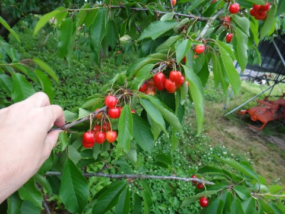
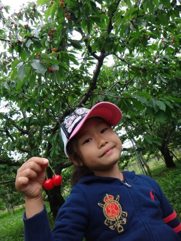
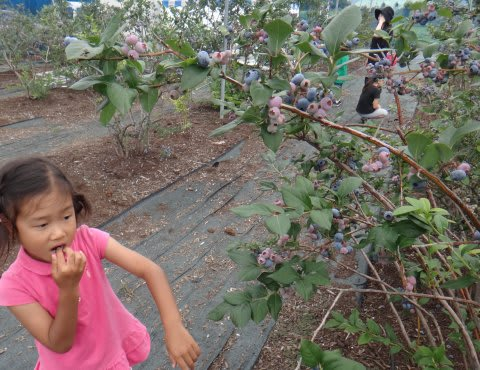
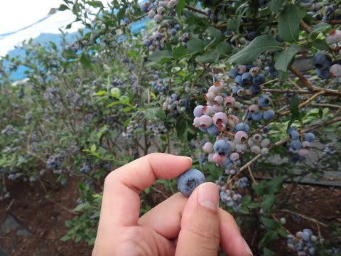
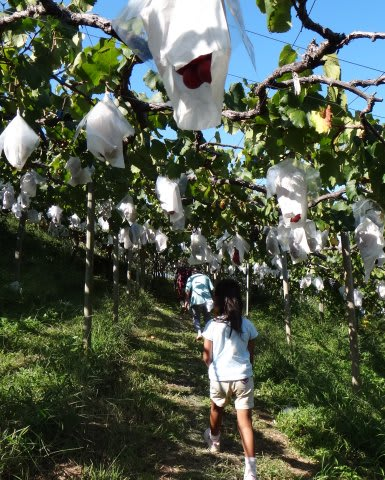

# 先週末はぶどう狩りに行ってきたんだけど…

📅 投稿日時: 2013-09-27 02:08:35

🏷️ カテゴリ: [日記](cc4b5682fb7b8b144980957a978653fb0.md)

えー．

今年．

6月に月山に行ったついでに，定番のさくらんぼ狩りに行き…

そして，7月にはブルーベリー狩りに行き…

んで．

この9月の3連休．

今の時期にピークを迎える，ぶどう狩りってやつに

初めて行ってみたわけだけども．

ぶどう狩りは，さくらんぼ狩りやブルーベリー狩りとちょいと

違うシステムで．

基本的には現地で食べるのではなく，採った分を計量してお買い上げ，

それをお持ち帰り…ってのが基本パターンなんですね～．

基本的に，さくらんぼ狩りやブルーベリー狩りは食べ放題．

さくらんぼ狩りは1000円ほど．

ブルーベリー狩りは500円ほどで，

ひたすら木からちぎっては食べることができます．

ぶどう狩りの食べ放題もありますが…

なんと，1500～2000円！！！！！

ぶどうってスーパーでは一房300円とか，高級品種でも800円くらいですよね．

で，食べ放題って言っても，2房もたべればもうおなかいっぱい…

…コストパフォーマンスが…

そして．

2房も食べればおなかいっぱいってことは．

果物狩りの醍醐味である，果物を摘む作業も．

わずか2回しかできない！

…ってことで．

結局はただ屋外でぶどう食べてるだけ…って感じ．

木からちぎっては食べ，ちぎっては食べ…

ってできるブルーベリー狩りやさくらんぼ狩りの

醍醐味はないですね～

うーむ．

ぶどう狩り．

一回やってみて，まぁ面白かったけど．

やっぱりイチゴ狩りとかさくらんぼ狩りのほうが

面白かったな～
