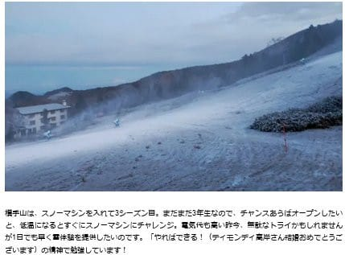
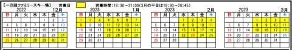

# 志賀高原中央エリアの2023シーズンのスキー場リフト営業情報が出てたよ！

📅 投稿日時: 2022-10-26 02:54:38

どうやら．

10月23日の記事で予想した通り，

本日はかなり冷え込んで…

横手山でも積雪があり，人工降雪機が

稼働していたようです…！

（[横手山ホームページ](https://yokoteyama2307.com/news/18542/)より）

まだ，明日…

ってか，日付が変わって今日ですね．

26日の朝までは冷えるので．

今朝までは，人工降雪が打てそうだけど…

（[横手山ホームページ](https://yokoteyama2307.com/news/18542/)より）

このあと，雪が解けずに11月3日に

無事オープンできるのか…？？

というところを予測すると．

…残念ながら，11月2日は気温が上がり，

さらに雨が降りそうなので…

せっかくの雪も全部融けちゃいそう…

うーむ．

この予想は外れてほしいと願いながらも．

やっぱりまだ人工降雪を打つのは早いよな…

…と思う今日この頃．

皆様いかがお過ごしでしょうか（ここまで時候の挨拶）

ってなことで，本題へ…

先日，志賀高原中央エリアのホームページを

見たら．

2023シーズンの志賀高原中央エリアの

営業案内が，ホームページで公開されて

ました～！

（[志賀高原中央エリアホームページ，リフト営業案内ページ](https://shigakogen.co.jp/wp-content/uploads/2022/10/2022-23%E3%83%AA%E3%83%95%E3%83%88%E5%96%B6%E6%A5%AD%E4%BA%88%E5%AE%9A%E8%A1%A8.pdf)より．以下同）

この営業案内を見ると…

まぁ，基本的にはこれまでと大きく

変わっておらず．

まず，一の瀬エリアを見ると…

GWまで営業するのは一の瀬クワッド，

ダイヤモンドの2本のみ．

タンネと一の瀬ペアは4月2日で終了．

…そして，山の神は今シーズンも

営業終了日は空欄です…

うーん．

山ノ神が終わっちゃうと，焼額・奥志賀と

一の瀬が行き来できなくなっちゃうので，

不便になるんですが…

最近，中央エリアは4月に入ると山の神の

リフトを停めちゃうので．

昨シーズンから焼額も，

「一の瀬と行き来できないなら，第2高速は

　営業しない！！」

と割り切ったのか．

これまでGWまで営業していた第2高速を

4月になったらクローズするという

残念なことになっちゃいました（泣）

今シーズンも，4月になったら焼額と

一の瀬エリアはスキー履いたまま

行き来できなくなっちゃうのかなぁ…

そうだとすると，GWでも広いエリアを

スキーで行き来できる志賀高原の魅力が

無くなって，かなり残念な感じ…

そして．

昨シーズンは営業しなかった，

一の瀬ファミリーの第3クワッド．

今シーズンも，団体予約が無ければ

動かないようです（涙）

うーーーん．

去年は週末は一の瀬クワッドがかなり

混んだのに，それでも動かないのかな…

これも残念…

そして，一の瀬エリア以外を見ると…

こちらもGWまで営業するのは，

高天ヶ原クワッドと寺小屋で，

これまでと変わらずですね．

それ以外は，昨シーズンの3月末から

ちょっと伸びて，4月第1週の週末，

4月2日まで営業してくれるようですね…

ただ．ここも，

蓮池トリプルが…

なんと．

公式に，年末年始＆土日のみ営業と

アナウンスされちゃいました…

これ，ジャイアントから蓮池・丸池・

サンバレーエリアに行くとき．

蓮池リフトに乗って移動できないという

ことですね（泣）

だとすると．

丸池・サンバレーエリアに行くには

蓮池リフト乗り場から丸池方向へ

歩いてちょっと登るか，

山の駅から蓮池まで歩くかしかないわけで…

…これ，今シーズンの平日．

丸池・サンバレーはゴーストタウン化して

誰も滑ってないんじゃななかろうか…？？

うーん．

いろいろ残念な感じ…

ただ．

オープンに関しては，一の瀬クワッドと

高天ヶ原のトリプルはいつもより1週間早い

11月26日オープンを目指すようです！！

それ以外のリフトは，だいたい12月17日

オープン予定と，例年通りの予定です…

ただ，昨シーズンも11月中のオープンを

目指したけど，人工降雪が間に合わず，

結局12月のオープンになったし．

ホントに11月にオープンできるかな？？

で．

ナイター営業の案内も出てましたが…

一の瀬ファミリーは，

12月25日から1月8日までは毎日，

それ以降3月18日は水～土曜の

ナイター営業となるようです…

このご時世で，平日でもナイター営業して

くれるのは，なかなかすごいことですね．

ただ…

ファミリースキー場以外はナイター営業が

昨シーズンよりもさらに縮小して．

ダイヤと高天ヶ原は，12月29日から1月2日

までの5日間のみ（泣）

さらに，丸池とサンバレーは…

大晦日から1月2日までの3日のみに

減りました（泣）

あぁ…昨シーズンはサンバレーが

成人の日の3連休もやってくれたのに．

サンバレーナイター，好きなのに…

わずか3日だけの営業になっちゃったとは，

残念…

さらに．

リフトの営業期間情報だけじゃなく，

中央エリア限定券のお値段も出てたので，

見てみると…

ふむ．

トップシーズンの一日券が5500円ですか…

焼額限定一日券の6000円より安い！！

（焼額限定一日券は，プリンス会員なら

　5500円になりますが）

で，ナイター券は…

一の瀬で2500円ですか！！

ペアリフト1本で2500円か…（涙）

ってな感じで．

基本的には，リフト営業期間は

大きく変わってないけど．

蓮池が休日のみ営業になっちゃったとか，

一の瀬第3クワッドが団体さんがいないと

営業しなくなっちゃったとか，

ナイター営業が減っちゃったとか…

ちょっとずつ残念なところが増えて

いっているのが，惜しい…

…でも．

この営業予定も，雪が降らなきゃ

もっと短くなっちゃうこともあるわけで．

…とりあえず，少なくともこの営業予定

期間はちゃんと営業してもらえるよう，

11月末からGWにかけて，たっぷり雪が

積もってくれるように祈って，

シーズンインまで，冷え冷え踊りを

踊っておきましょう…

## 💬 コメント一覧

### 💬 コメント by (副院長)
**タイトル**: Unknown
**投稿日**: 2022-10-26 08:45:27

お疲れ様です。いよいよシーズン始まりましたね、僕はまだまだですが。で、蓮池平日止まりましたかぁ。ジャイアントのリフトが低速リフトになり、蓮池止まれば、サンバレー丸池は車移動のところですね、脳内距離としては熊の湯、横手と同じ扱いになりますね。残念です。

終了時間は少し伸びたのでしょうか？

### 💬 コメント by (西舘)
**タイトル**: Unknown
**投稿日**: 2022-10-26 10:10:05

我が「西舘」の営業が伸びたことは嬉しい限りです。更に言えば、このことを知っている人はほとんどいないけど、2シーズン前にはフーディの営業が8時50分からだったのが今シーズンも8時40分からに戻りました。（しかも腹立たしいことに、リフトの勝手な判断で木の板に手書きで8時50分からと書かれていた）

一の瀬第3クワッドリフトは団体様御予約「等」の「等」にかすかな望みを託したい。（よく裏切られることほ周知の事実）

腹立たしいことは数多いのに今シーズンも通い詰めるんだよね…

### 💬 コメント by (スシネコ)
**タイトル**: Unknown
**投稿日**: 2022-10-26 13:00:19

やはり蓮池やナイターは縮小になりましたか。光熱費が高騰しているので、コスト削減をやらざるを得ないということでしょうか。

ゴンドラやリフトが動いていても、減速や間引きが通常運転にならなければ良いのですけど（いやな予感が）。

まぁ、志賀高原が存在しているだけで有難いので、その時その時で楽しく滑りたいと思っています。

### 💬 コメント by (西舘（ごめんなさい場所お借りします）)
**タイトル**: Unknown
**投稿日**: 2022-10-26 18:06:46

【スシネコさま】

今月初旬に業務連絡したので読んで頂きたいです。

私的利用して申し訳ございません。

### 💬 コメント by (Skier_S)
**タイトル**: 西舘は営業伸びてたんだ…
**投稿日**: 2022-10-27 02:56:59

＞副院長さま

平日の蓮池，ついに止まりました…

ホントに，ジャイアントは低速だし，蓮池も止まったら…

誰かが言ってたけど，これで志賀の湯のレストランが無かったら

誰も丸池・サンバレーに行かなくなる気が…

＞西舘さま

あ，西舘の営業が伸びたのは気づきませんでした…！

営業開始ちょっと早くなったんですね．

でも，一の瀬第3クワッド，せめて正月とか3連休とか，混むときは運転してほしいですよね…

＞スシネコさま

光熱費も人件費も上がっているので，値上げだけじゃ吸収できないんでしょうね…

焼額は今のところ営業縮小の話は聞かないけど，ゴンドラの運転速度が

すごい遅くなったりしないことを祈るばかり…

ってか，焼額のナイターの案内が出ないんですけど，今シーズン

焼額はナイターやってくれるのかな…

ちょっと心配．

