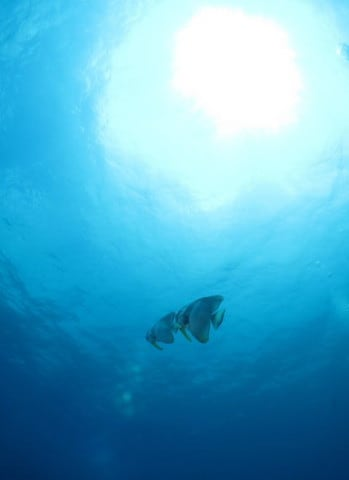
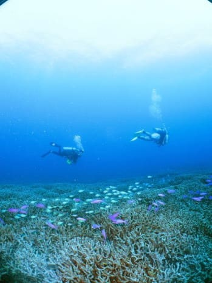

# 2010年7月，2歳の子連れで座間味でダイビング！その14…午前のダイビングは，満足の一本！

📅 投稿日時: 2021-10-15 03:52:23

えー．

振り返ってみると．

昨シーズンの滑り収めが[6月13日の
月山](ef1f0d7a31674a34546de0d955ece99b0.md)だったので．

…早くも最後に滑ってから，4か月を

過ぎていることに気づきました…

ここ数年，コロナ影響の昨年を除くと，

滑り収めから初滑りまでのオフシーズンが

大体4か月以下だったので．

…滑ってない期間が4か月を超えると，

「スキー，もう忘れちゃってんるじゃないか？？」

と心配になっている，Skier_Sです．

…シーズン始め，スキー板の前後間違えて

履いたりしないかな？

まぁ，昨シーズンもYetiの営業開始が

10月末だったのもあり，

オフシーズンが4か月＋10日と，

私にしては記録的な長さのシーズンオフ

だったわけですが．

それでも，昨シーズンのシーズンインの時に，

ストックと間違えてスキー板を手に持ったり，

帽子と間違えてスキーブーツを頭にかぶって

しまうような勘違いをすることなく，

普通に滑ることができたので．

今シーズンインの時も，スキーの滑り方を

忘れることなく，普通に滑れるんじゃ

ないかな…

しかし．今シーズン．

10月29日がYetiオープンで，私の初滑りが

10月30日の土曜だとすると…

ここ数年では記録的に長い，4か月半を超える

オフシーズンになっちゃいますね…！！！

うーん．

ホントに滑り方忘れてないか，心配…

もし，Yetiオープンの週末の10月30日に，

スキー板と間違えてダイビングフィンを

履いて滑っている人がいたら．

…それは私かもしれません…←そんな人いないから

ってなことで．

スキーのことを思い出さなきゃ…

と思っていながら．

今日もダイビング日記です～！

ーーー

1本目のダイビングを終えて，妻が

10時過ぎに戻ってきたので…

娘の子守りを妻にタッチして，

2本目からは私がダイビングに

行く番です！

ってなことで．

娘を妻に託したあと，港で

ボートに乗り込みますが…

向かったポイントは，「安室漁礁」．

このポイントは，こんな感じの漁礁の先に…

見事な枝珊瑚が広がるポイントです！

昨日の失敗に懲りた私は，

このダイビングでは問題があった

16Gの大容量SDカードは使わず，

これまでに実績のある2GBの

カードを挿して出動．

ただ，この2GBのカード．

書き込み速度が遅いので，

ハイビジョン動画撮影が出来ません（涙）

ということで，これからのダイビング，

せっかくのハイビジョン動画は撮影できず…

しかし，そろそろこのカメラにも慣れて

きたので，

「空に向けてシャッター半押し，

　その後アングル決めてから全押し」

の技で，海をブルーにする技をコンス

タントに使い，そこそこの海の色の

写真を撮れるようになってきました…

うーーん．でも，全体的にコントラストが足りないしまりのない

画像だし，画面の左下にひどいゴーストが…

あと，海の色ももう少し濃いブルーに出て欲しい…

ちょっと色相が紫側に回ってるかな？

時々カメラのスイッチをOn/Offしてみて，写真が消えてないかも

ちゃんと確認．

今回は消えてないようです．

安定して写真が撮れるようになってくると，

これまでのダイビングと違ってやっと海を

落ち着いて見られるようになってきます．

これまで，カメラに振り回されて落胆して

ばかりで，落ち着いて海を見ている暇が

無かったことを改めて知った…

いやー．

珊瑚が見事一面に広がってますね．

しかし．

さすがドームレンズ，

フィッシュアイ画角のため，

これまでよりさらに魚に近づかないと

まともな写真が撮れません…

これでも，魚まで30cmくらいまで

寄ったかな？

ってなことで．

サンゴもきれいだったし．

魚もいっぱいいたし．

満足してExit！

…今回は写真もまぁまぁきれいに撮れた

みたいだし．

昨日のリベンジはできたな…

うむ．

余は満足であったぞよ…←あなた，いったい何様？

と，満足感に浸りながら，午前の

ダイビングを終えたのでした…

