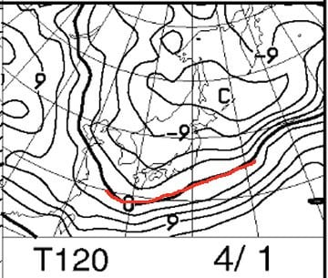

# LEVORG2.0GT-S & YOKOHAMAスタッドレスiG5+で雪道を走ってみた，その2…雪道を攻めてみたけど，かなり安心して雪道を走れるよ！

📅 投稿日時: 2019-03-29 01:36:02

🏷️ カテゴリ: [車](cba0e8330b3f2ded7c1addfacc75d4547.md)

本日も．

志賀高原は朝はかなりいい感じに冷え込んで，

10～20cmの新雪が積もり．

そして，午後には天気も回復してきて．

もうすぐ4月と思えない，いいコンディション

だったようですね…

（[奥志賀高原FB](https://www.facebook.com/okushiga.kogen/posts/1233717763445196?__xts__[0]=68.ARBIq2H7A5y54IZZDrDukIDA5lpyOUv49VPZBpJOgkuI2SvqeMrGV0Cos0afzd8VyIJamhVMrCzvR4y39NXKGrL6tz0TcT2qTMni1QXkmntST0ljQ40kGzAuJkBNsCdUA8nYCH7NaW8Oh5uyP3ow3FSp_ST4xKE5qeNBd3gBuuhD8yhnFI98-tSR3xcdaM95NzmjxZpl4Qei0NW5KFtN__y2XwDVViGlQo7KeYglmRL3hUn8JGKVLIbjm8qoPDn6Df0-OQJeQKwyMzVRXqAKz4NDcjVxvoQNCg_kr6PMTY4RvOPNybzgd2YfNO5tubdWwSOxES1Y6AG28L3Wze8Ry59sKA&__tn__=-R)より）

あぁ…うらやましぃ…

そして．

この土日は終日雪が降り続けそうで．

というか．

土曜はギリギリ雪か…？？

というものが降りそうな感じで．

微妙な天気だけど．

来週1日の月曜は冷え冷え雪が降りそうで．

そして，さらに2，3日の火，水曜と晴れなのに

冷え冷えで．

いい感じになりそう…

火曜は雪が降った後の晴れなので，

とても4月と思えない最高の日になるのでは…？？

あぁ…

平日スキーに行きたい…（無理だけど）

ってことで．

本題へ．

とりあえず，[前回](e6f7651b78e9e387539985f8c643b81c8.md)はいろいろ難しいことを書きましたが．

簡単に言えば，フロントトルク配分が多いBRレガシィ2.5L NAと．

リアトルク配分が多いレヴォーグ2.0で．

（レヴォーグも1.6はフロントトルク配分が多いタイプだけど)

雪道の走りは，どう変わるのか…というのが，

ものすごい興味があったところなわけで．

果たして，違いがあるのか否か？？

スタッドレスを履いてから，

かれこれ1.4万km近く走ってみての

VMGレヴォーグ＋YOKOHAMA iG5+での

雪道インプレッションをば…

まず．

雪道を普通に走っている分には．

何の苦もなく，普通に志賀高原の登り坂を

すいすい登っていきます．

他の車がスタックしていようが．

ツルツル滑って登れなくなっていようが．

その横を，まったく何の問題もなく

走っていけますので．

安心感はバツグン．

ツルツル路面で坂を登れなくなった

2WD車を見て．

「スバル車なら苦労しなくて済むんだけどなぁ…」

と思ってしまいます．

（滑って登れなくなった車を押しているところを，

　横目に見つつ抜いていく2台のレヴォーグ．

　自分の車も含め，たまたまレヴォーグ3台で

　連なって走行中(笑)）

そして．

すごいのは．

このLEVORG．

雪がかなり積もった駐車場とかでも．

驚くべき脱出能力を誇ります…！

あるドカ雪が降った日．

朝，宿の駐車場に出て…

「車，完全に埋もれてるんですけど（涙）」

運転席ドアにたどり着けるのか？？

これ？？？

とりあえず，発掘開始して…

ここまで雪をどけました．

一見，かなり雪をどかしている

ように見えますが．

運転席側は，運転席ドアより後ろは

雪に埋もれたままだし．

助手席側に至っては，フロントタイヤが

見えるようになるまで雪をどかしただけで．

フロントドアも発掘しきってません…

そして，車の前もバンパー下が

見えるかどうか…という程度しか

どかしていません．

これでも．

出せる．

レヴォーグなら，一発で

脱出できるのだ！

特に苦労もなく．

まったくスリップする気配もなく．

無事脱出成功！！

いやーーー．

素晴らしい脱出能力だ…

で．

肝心の，雪道を攻めた時の挙動ですが…

おとなしく，ゆっくり走っている分には，

コーナーもまるでアスファルト路面を

走っているかのごとく．

雪道だから，という何の違和感もなく

曲がっていけます．

そして．

雪道の上で，アクセルを踏み込んで

2Lターボのパワーを発揮させると…

ストレートで一瞬テールを振ります．

まっすぐでも，一瞬テールが左右に流れます．

うおおお！

フロントトルク配分が多いBRレガシィでは，

こんな挙動は無かった！

さすが，リアトルク配分が多いだけあって，

FRっぽい！！

昔，FRの某車でダートジムカーナを走った時に．

ぬかるんだマッドコンディションに対して，

スタートダッシュのアクセルが強すぎ，

1コーナーに入る前のストレートでスピンした

という嫌な思い出がよみがえりますが…

（スタートから一つもコーナーをクリアする

　ことなく，ストレートでスピンした奴…

　という忌まわしきレッテルがそのあといつまでも

　ついて回った（涙））

ただ，テールを振り始めた後すぐにVSCが

効いて．

テールの振れは抑えられて．

スピンモードに入ることは無いので，

ご安心を．

この車，どうも電子制御が早くに介在しすぎ

無いように作ってあるようで．

テールを全く降らない…

という超安全側で制御しておらず．

ある程度楽しめる（？）ように

制御が介在する感じ．

そして．

雪道のコーナリングですが．

良く曲がる．

良く曲がるわ…

この車．

言うまでもないですが．

雪道のコーナーは，ブレーキングしながら

入ってはコントロールできないので．

コーナーはアクセルを踏みながら

曲がりましょう．

（コーナー手前で十分なブレーキングを忘れずに！）

ステアリングを切り，アクセルを

入れていくと．

面白いくらい曲がります．

アクセルの量が少なく，タイヤがほとんど

滑ってないうちは，リアトルク配分の多さは

全く分からず．

フロントタイヤが向いている方向に，

グイグイフロントが切れ込んで行くように

曲がっていきます…

そして．

そこから，さらにガンガンアクセルを入れていくと．

最初一瞬，ごくわずかにリアが外に流れますが．

その後，VSCとF/Rトルク配分のコントロールが

効くのか．

リアだけ流れるのではなく，フロント・リアが

揃って流れていくモードに入ります．

フロント，リアが揃って流れながらも，

ヨー角速度は保っていて．

車は外に流れながらも，頭の向きは

変えていく…

という感じ．

ちょいと残念ながら．

FR車のような，アクセルを入れると

テールだけがザーッと流れ続ける…という

モードに入らないので．

アクセルONでクイックに向きを変えるような

技は使えません．

まぁ，アクセルON/OFFでテールの

流れをコントロールして向きを変えられる

ような車は．

失敗すると，「あ！」と思った瞬間，

テールが流れすぎてスピンに入って，

かなり危険なので．

そういう意味では，コーナーでアクセルを

ガンガン踏んでも，テールが流れすぎて

スピンに入る心配は全く無い，安全な車です．

というか，雪の積もった，人のいない駐車場で．

アクセルONでスピンに入れてみようと，

フェイントを入れたり，ブレーキングの

フロント荷重からアクセルONなど，

いろいろチャレンジしてみましたが．

…無理でした．

アクセルONの状態では．

どうやっても，一定のスリップアングルを

キープした，安定した定常円旋回的な

動きしかせず．

そこからアクセルをぐっと踏み込んでも，

ラフにアクセルONした瞬間だけ，

ほんのちょっとリアが出るけど．

そのあとは，定常円旋回の旋回半径が

大きくなっていく…

というだけで．

びっくりするような予想外の

動きだとか，トリッキーな動きを

しない，

すごい安全な車

だなぁ…と思いました．

ってなことで．

フロントトルク配分が多いBRレガシィの2.5L NA車と．

リアトルク配分が多い，VMGレヴォーグの2.0L車では．

結構違いがあるのでは？？

と，期待してましたが．

アクセルを踏み込んだ瞬間に一瞬だけテールが出る…

ということ以外．

後はVSCやらトルクコントロールの制御が入るので．

FRっぽさは全く無く．

両者とも，概ね同じ挙動だな…

というのが，私の感想でしょうか．

だもんで．

BRレガシィと同じく．

車がアウト側に流れて膨らんでいく余裕さえ

見ておけば．

コーナーでびっくりするくらいアクセルを踏んでも，

フロントだけが逃げる・リアだけが逃げると

いうことは無く．

ヨー角速度を保って，車が向きを変え

ていってくれるので．

かなりのスピードで雪道を曲がっていけます．

（普通の道ではそんな運転をしてはいけません！！

　…と，言っておく）

とりあえず．

レヴォーグ2.0GT-S + YOKOHAMA iG-5PLUSの

スタッドレスの組み合わせ．

雪道でかなり速く走れるし．

車が雪に埋もれても脱出できるし．

ツルツル滑って登り坂を走れない

なんてこともないし．

私にとっては，安心して雪道を走れる，

スキーのための最高のパートナーです…

## 💬 コメント一覧

### 💬 コメント by (ホンダ)
**タイトル**: Unknown
**投稿日**: 2019-03-29 20:11:26

今日のヤケビは？朝イチは少し日がさしてましたがその後は１日雲ってました。３月の最終日とは思えないコンディションでした。夕方少し雪降ってましたがすぐやんでしまいました。今日はロイヤルファミリーデーでした。明日はどうでしょうか？早朝お待ちしてますよー。

### 💬 コメント by (いか)
**タイトル**: Unknown
**投稿日**: 2019-03-29 20:22:05

さすが、いろいろ試していらっしゃいますね〜

私は雪道、安全第一です(笑)

右折しながらの発進で滑りかけたくらいですね、、、

### 💬 コメント by (かず)
**タイトル**: Unknown
**投稿日**: 2019-03-29 21:09:26

膝は固定されてると不思議と全く痛くないです　期待していた残パウダー超重で今日は休憩が多かったです　明日の雨時間ずれました?

### 💬 コメント by (なるなる)
**タイトル**: Unknown
**投稿日**: 2019-03-29 22:23:29

前回のマニアックな記事から、メチャメチャ違うよ!という展開を期待していたのですが…w

私、レガシィ→インプ→レヴォーグと乗り継いできて、VTD→ACT-4→VTDと、一度、ACT-4を

はさんでいるのですが、どちらでも、安定して雪道走れるし、違いが解りませんでした。

まぁ、雪道を攻めるなんて怖いこと出来ないからなのかなと思っていました。

私の思う、レヴォーグ2.0にして雪道で良かったのは、S#モードの2速。なんか志賀高原の降りで、

絶妙にエンジンブレーキが効いてくれると思います。

### 💬 コメント by (Skier_S)
**タイトル**: 土曜は昼間は降らなさそう
**投稿日**: 2019-03-29 23:49:32

＞ホンダさま

ええええ！？？

また平日スキーですか！？？

うらやましすぎます…

明日は何とか昼間は降らずにもちそうです．

ただ，この時間に家に帰ってきたところなので，

早朝ではなく通常営業から参戦です(笑)．

＞いかさま

私は雪道が大好きなので，ついつい遊んでしまいます…

普通のアスファルトじゃ，ドリフトごっこできませんから(笑)．

＞かずさま

明日は昼間は降らなさそうで．

降ったとしても夕方からです．

昼間は，雪が多少は緩んでおもくなりそうですが．

この時期としては，まだマシな感じのゲレンデかと．

来週の月・火が最高になりそうです．

＞なるなるさま

私も，かなり違うことを期待したのですが…

アクセルONの瞬間以外，ほぼ変わらずでした．

で．

確かにS#にすると，変速ステップが細かくなるので，

雪道の下りにはいいですね！

### 💬 コメント by (しんちゃん)
**タイトル**: Unknown
**投稿日**: 2019-03-31 11:20:54

スキー試乗レポートと同じぐらい、クルマの挙動がわかるレポートで、楽しく拝見致しました。

レヴォーグ2.0、凄いトルクフルで雪道での運転が楽しさが、助手席側でも伝わるクルマでしたよ！

スタック中のクルマを抜き去るときの4WD車に乗ってるという安心感と優越感はたまらないですね。

