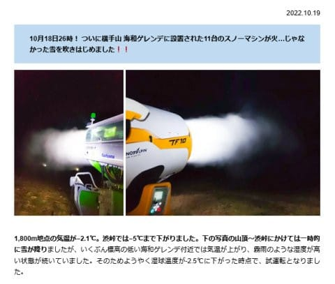
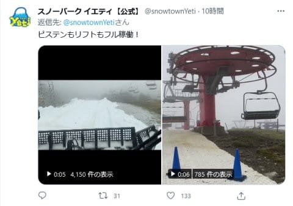
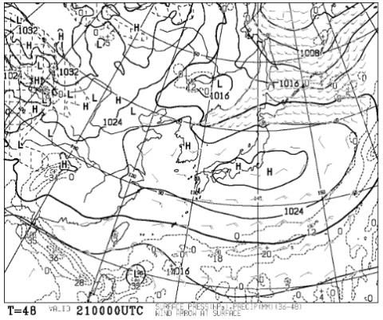
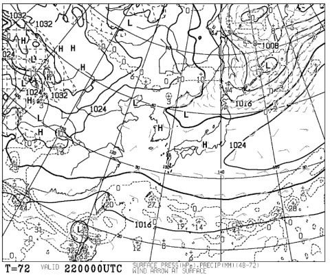
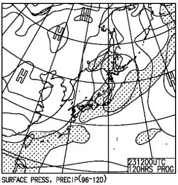
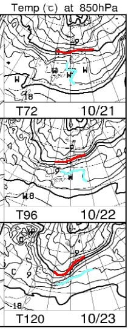

# 明日21日はイエティの2022/2023シーズンスタート！…金，土曜日は晴れそう．日曜は…曇り時々雨かな？

📅 投稿日時: 2022-10-20 02:13:36

🏷️ カテゴリ: [日記](cc4b5682fb7b8b144980957a978653fb0.md)

えー．

本日…っていうか，もう日付は変わって

昨日19日の水曜日．

志賀高原は朝にかけて気温がかなり

冷え込み，雪がうっすら積もったようで…

渋峠では-5℃まで下がって，

横手山の人工降雪機が動き始めたようです！

（[横手山ホームページ](https://yokoteyama2307.com/news/18482/)より）

この見出しを見て．

いや…人工降雪機が火を噴いたらあかんやろ…

と思いながらも．

しかし．人工降雪機のあの形を見るにつけ．

あれに水のかわりに燃料を入れて，

火を点けたら面白そうだな…

と，考えている人は実は多いんじゃないかな～…

と思ってたりするんですが．

…そして．

イエティでも圧雪車でのコース整備が

始まったようです！！

（[スノーパークイエティTwitter](https://twitter.com/snowtownYeti/status/1582596704964341760)より）

ついに明日，21日の金曜にはオープン

ですからね～！

ってなことで．

ついにオープンとなる

今週金，土，日のイエティの天気を見てみる

わけですが．

オープン日，21日の金曜の地上天気図は…

完全に高気圧に覆われ，降水域も本州には

全くかかっていないので．

すっきり晴れの一日になりそう！

そして，22日の土曜日は…

大きな高気圧は東に抜けますが．

まだ，高気圧の勢力が残っていて．

おそらくこの日も天気は良さそう…

ただ，23日日曜は．

うーん．夜9時の天気図では，

低気圧が通過して本州は降水域に

覆われます…

でも，実はこの図を拡大すると，ちょうど

静岡東部から関東南部にかけて，

降水域がかかってないので．

ほとんど降らないか，降ってもひどい

降りにはならなさそう…！！

で．

この3日間の850hpa気温を見ると．

まぁ，この時期ですから．

3日とも赤い0℃線ははるか北海道の

あたり．

イエティの近辺には，水色の+9℃線が

かかっているので…

最高気温は+10℃を上回って，

日が射す金・土はちょっと暑さを感じる

くらいかも？

ってなことで．

この週末のイエティの天気は…

21日（金）朝から晴れ！終日晴れ！

　日差しが強く，暑く感じるくらい．

　雪はかなり緩みそう…

22日（土）この日も終日晴れ！

　同じくこの日も日差しが続き，

　暑さを感じるくらい．

　雪の滑りはあんまりよくないかも…

23日（日）朝のうちは晴れるかも？

　じき曇ってきて，午後は曇り空．

　夕方あたり，もしかするとパラパラ

　雨がぱらつくタイミングがあるかも？

　日が射すと暖かさを感じるけど，

　日が陰るとちょっと肌寒い

って感じでしょうか．

ってなことで．

ついにオープンするイエティですが．

おそらく，志賀高原常連のうち何人かは，

オープン日に滑りに行くはず…

そして私は土曜は残念ながら予定があり．

日曜に今シーズンの初滑りを行う

予定です～！
