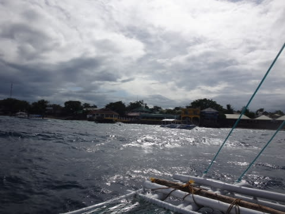
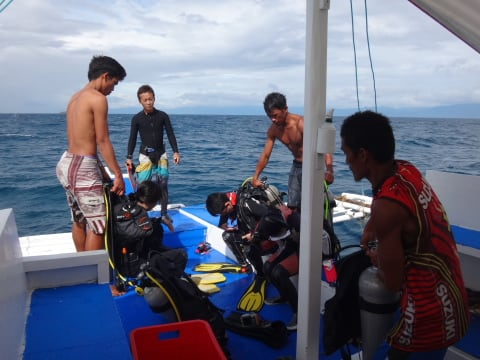
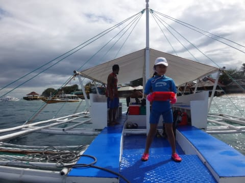
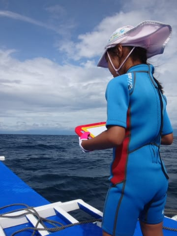

# 2015年8月　子連れでモアルボアルでダイビングその12…2日目，午前のダイビングへ出発！

📅 投稿日時: 2016-07-07 02:35:34

🏷️ カテゴリ: [ダイビング日記](ce3a7a8d424d112fce83ee85c81a0e344.md)

ということで．

今日はまだ早めの時間に帰ってこれたので．

モアルボアル日記の続き，Go！

--

ってことで．

2日目の午前のダイビングに出発したわけですが…

出発した後．

…船は3分も走らずに，止まりました…

なんと．

1本目のポイントは，すぐホテルの目の前．

ショップから3分も離れていないところなんです…

そう．

ここは．

モアルボアル名物，イワシポイント．

ついにやってきましたよ～！！

モアルボアルに来た最大の理由，イワシの巨大群れ

が見られるポイントにっ！

実はこのイワシポイントは，こんなショップ＆ホテルの

目と鼻の先だったんですね～！

昨日は波が高く，エントリーが難しかったので，

このポイントには入れませんでしたが．

…今日は，波もちょっと収まったので．

ようやっとショップ目の前の，このポイントに

エントリーできます…！！

では，イワシを攻略…っ！！

…

と，行きたいところですが．

せっかくここまで来て，イワシの群れを攻略

したいところなのですが．

…昨日，私が2本潜り．

妻は1本しか潜っていないので．

なんと．

大変残念なことに．

…今日の1本目を潜る権利は，妻にあるんですね～（涙）（涙）（涙）．

ということで．

潜りに行くダイバー一群（含む妻）を見送ったあとは…

私は娘と二人で，船の上でお留守番．

うーむ．

せっかくなので，娘を泳がせたいところではあるが．

何とかぎりぎり潜れる波の高さになったというものの．

泳ぐには，ちょいと波が高すぎるかな～…

ってことで．

海には入らず，船の上でお絵かきして過ごす娘．

うーむ．

ちと残念…

…みんな，イワシの群れ見れてるのかな～？？
