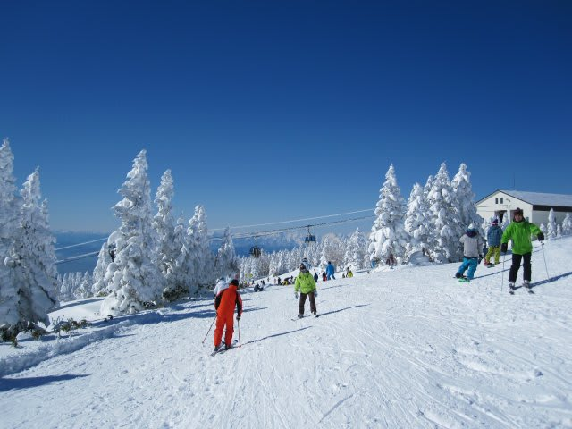
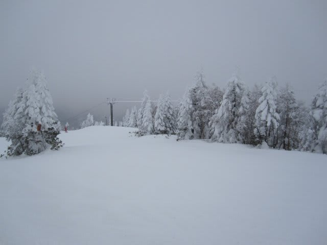

# 1月8，9日志賀速報

📅 投稿日時: 2011-01-10 03:05:23

寒かったよ～！！！

8日は晴れ，

9日は曇りのち雪．夕方から激しくなってきました．

今頃積もってるんじゃないかな～

明日の朝は，パウダーだろうなぁ…

最低気温はマイナス12～13度．最高気温もマイナス10度前後．

8日は，積もったばかりの雪が圧雪されたやわらかい雪で，

昼ごろには結構荒れちゃったけど，9日は冷えて締まった

最高のいい雪で，夕方までそれほどでこぼこになることなく，

トップスピードで滑り続けられるシーズンベストの雪質．

混雑はぼちぼち．

焼額第ゴンドラが最高10分待ちになったけど，それ以外

はほとんど待ちなし．

とりあえず，状況としては恵まれた2日間でしたね～
