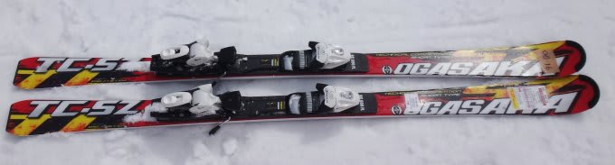
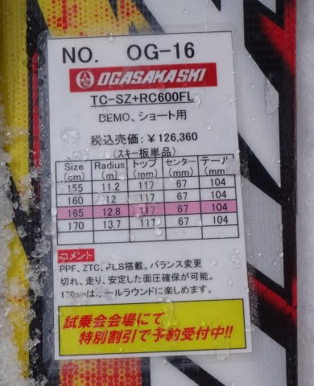
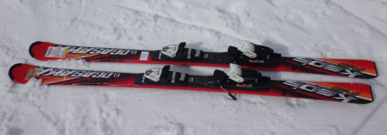
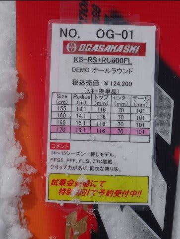

# まだまだ続く！2015シーズンモデルのスキー試乗レポート第5回…OGASAKA編

📅 投稿日時: 2014-03-26 01:05:14

えー．

まだまだ，2014/2015シーズンのスキー板の試乗インプレッション，

続きます．

今回はオガサカ編．

では，どうぞ～

--

○OGASAKA TC-SZ + RC600FL 165cm

基礎小回り．

[去年のTC-SG](e3bca2443dadf8bd66789f7d918663b25.md)は，技術選トップ向けの，フルマニュアル操作を求める

かなりしっかりと硬い板だったけど…

今年のTC-SZはかなり変わりましたね．

オートマチック性がかなり強い板になりました．

エッジに乗って切っていける板です．

ゲレンデで滑るのに扱いやすいレベルのフレックスになり，

たわまない硬さというより，たわんだ後の返りがしっかり返ってくる

感じの硬さになりました．

たわみの量もコントロールしやすく．

たわませた後の返りもちょうどいい感じ．

小回りスペシャルではなく，ハイスピードでも中回りまで問題なくいけます．

っていうか，その気になれば大回りまで行ける…

かなりオールラウンドかも．

板はセンター荷重で，エッジのトップとテールがしっかり効く，

グリップのしっかりした板です．

基本的に，板を動かすと強烈な旋回力が出たTC-SGと違って．

エッジに乗って切っていけば回ってくる，楽な板になった感じですが．

でも，OGASAKAらしく，ずらしのコントロール性もいい！

去年は，ゲレンデ履きの小回り用は，TC-SGよりTriunSの方が

いいかな？と思ったけど．

今年は，TC-SZはゲレンデ履きに行けますね．

小回り用だけど，そこそこのロングまでは十分行けるし．

去年のKeo's MDみたいな，オールラウンドとして行けるかも．

いやー．いいよ．この板．

もう一つ強いRC600GRプレートもあるけど．

自分にはRC600FLプレートでも十分満足でした．

OGASAKA Keo's RS + RC600FL 170cm

基礎オールラウンド．

Keo'sシリーズの，今年の一押しらしいけど…

あれ？去年のMDより，ちょっとマイルドに感じる…

ゲレンデが硬いからかな？

FMプレートより強い，RCプレート付きなんだけど…

エッジグリップはちょっとマイルド目．

アイスバーンだったってのもあるかもしれませんが，

ガッツリグリップして切れていく感じではないです．

ミドルスピードで，中回りくらいがちょうどいい感じかな．

返りもそんなに早くなく，強くもない．

去年のMDのビンビンした返りはなく，優しく感じます…．

でも，そこはさすがオガサカで，ずらしのコントロールは抜群にいい．

板に任せず，自分で板を動かしていくといい感じ．

狙ったところに軽快に思い通りに動かせます．

検定とかの低速～中速でしっかり演技しようとするにはよさげ．

トップスピードで，ガッツリグリップさせて，オートマチックに

ギンギンに切っていく強い板ではないですね～．

TC-SZをグリップ重視のオートマチックにしたから，Keo'sは今度は

コントロール重視で来たのかな？

TC-SZを履くほどではないような，脚力があまりない人や，そんなに

スピードを出さない人が，ゲレンデで履くにちょうどいい感じかな．

## 💬 コメント一覧

### 💬 コメント by (ひろりん)
**タイトル**: TC-SZって・・・
**投稿日**: 2014-03-27 15:23:21

今、サブで使用中の切れ上がろうとするX-KARTと違ってTC-SZってグリップ小回り板なのに下に落としやすい？TC-SVっぽいと感じました。TC-SGは膝を壊しそうな感じだったし。。。

KEO'S RSはラクですね。限界は高くないけど疲れない感じ？

自分のKS GP-01に似た乗り味でした。

### 💬 コメント by (Skier_S)
**タイトル**: ひろりんさま
**投稿日**: 2014-03-27 23:29:44

TC-SZは，確かにTC-SVのころに戻った感じですよね…

X-KARTみたいにどうしようもなく回っていく板ではなく，

かなりの操作性があるところがさすがOGASAKAです．

KEO's RSは，かなりマイルドになった感じですね…．

疲れないかと思いますが，刺激もないかも（笑）．

とりあえず，今シーズンのOGASAKAは，

TC-SZがやっぱりいい感じですよね～

