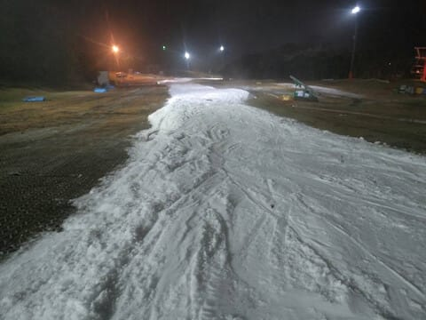

# 10月20日，2023/2024シーズンオープンのYetiの特派員情報…そして私は明日土曜初すべり！

📅 投稿日時: 2023-10-21 01:10:40

🏷️ カテゴリ: [日記](cc4b5682fb7b8b144980957a978653fb0.md)

この一週間，ヘビーだった…（涙）

今週は長く寝すぎないよう，

椅子や床で寝る日々が続いていましたが，

昨日は久しぶりに布団で寝ました…

いや．

昨日は朝4時に寝て6時に起きて家を出て，

深夜12時半ごろ帰宅して…

そのまま倒れたように寝てました．

ダメでした．

起きてられませんでした…

だもんで，昨日はBlog更新できなかったけど．

7時間寝れたので，ちょっと復活！

でも今日も帰宅12時過ぎ…（泣）

でも．

平日に無理したおかげで，←自分で無理って言ってるよ

週末は1日なら何とかスキーに行けそう！

…いや．

かなり厳しいんですが…

なんとか行けそう．

ってなことで．

明日はイエティに行きます～！！！

で．今日オープンだったイエティ．

早速数多くの特派員が行ったようで，

いろいろ写真が送られてきました～！！

イエティオープン日の本日．

朝は晴れてたみたいですね～．

そして，朝はいつも通りオープンイベント，

仮装の人の滑走があったようですが…

コース自体はオープン時恒例の紐ゲレンデ

ですが．

あさイチはきれいに圧雪されたコース！

午前中は，11時ごろまでちょっとリフト待ちが

長かったみたいです．

ただ，昼頃になるとコースもすいてきた

みたいで…

リフト待ちも短くなったようですが．

その代わり，昼には結構コースは荒れて

きたみたいで．

さらにはだんだん雲も増えていき…

午後はちょっとガスっぽかったとのこと．

そして…

夕方には，一部ゲレンデが途切れたところも

あったようです（涙）

で．

初日からナイター営業もあるわけですが．

ナイターも最初はガスっぽい感じだった

ところ…

だんだん晴れていき，すっきり見えるように

なってきたようですが．

ただ，ゲレンデはすぐに結構荒れて．

雪がちょっと薄いのか，穴が開いた

所もあったようです…

まぁ，平日だったということもあり．

リフト自体はガラガラだったみたいです～！

ってなことで．

無事オープンを迎えたイエティですが…

菅平の様子を見に行った特派員によれば，

菅平は水曜の時点でこんな感じだった

みたいです．

うーん．

これはオープンまでまだまだかかりそう…

ってなことで．

私は明日，今シーズンインしてきます～！

…って．

もう夜中1時過ぎてる…

今からスキーの準備しないといけない

んだけど…

また睡眠時間が取れない（涙）

とりあえず．

また帰ってきたらレポートします～！！
