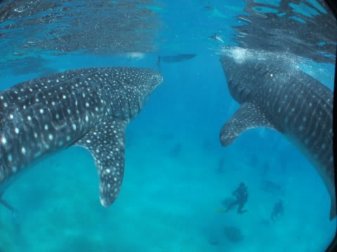

# 2013年11月　フィリピン・オスロブ　子連れでジンベエを見るぞっ！　その7

📅 投稿日時: 2014-07-14 01:36:29

ってことで．

ダイビング日記より車のネタの方が

ウケがいい今日この頃．

っつーか，このブログで，一番ページビューが

多いのは車関係の記事なんですが…．

あえて言います．

このブログ，

ダイビングブログでも，

車ブログでもありません．

スキーヤーブログですから～っ！

…と，今更ながら主張してみたい今日この頃，

皆様におかれましては変わらずお過ごしのことと

お慶び申し上げます．

って書いた直後に，

ダイビング日記を続ける自己矛盾…

ってことで．

ダイビング日記，続きます…

----

あの影は…

あの影は…っ！！

じ，ジンベエ様だっ！！！！！

それも…

こっちに近づいてくるっ！

え？

モロにこっちに来てませんか？

ぶ，ぶつかる～っ！！

魚眼レンズからはみ出すっ！

近いっ！

うはーーーー！

近かったっ！！

デカかった…っ！！

モルジブで見たやつより，ふた回りくらい

デカかった…っ！！

いきなり，こんなに近づけるなんて，

超ラッキーっ！！

と，思ったら…

またこっちにやってきてるんですがっ！？？

これも…

近い！

エントリーから5分で，こんなに立て続けに

接近できて，いいのかっ！？？

なんだ～！この海はっ！

すごい～！！！

…次々来るよ！

つぎつぎとっ！

…っていうより．

あれ？

向こうに，別の1頭のしっぽが見えてる？

もう1個体いる…？？

2頭いるの？

いや．

2頭だけじゃなく．

まだ別に，もう1個体いるっ…！

え？

計，3個体？

な，なんだ，これはっ！

なんだ～っ！！！！

これはっ！！

…とりあえず．

エントリーからわずか5分でわかったのは．

この海は．

普通じゃありえない写真が．

つぎつぎと撮れてしまう…

わけのわからん海だってことだけは，

いやというほど分かった！！

## 💬 コメント一覧

### 💬 コメント by (マルハバ)
**タイトル**: ジンベエ様・・
**投稿日**: 2014-07-14 08:41:02

お待ちしておりました（笑）

オスロブ・・・

実は、知りませんでした

十数年前ウチでリロアンに行ったころは

「あわよくば・・ジンベエ」くらいだったのですが

今はこんなところができたんですね～（汗）

ビックリです。

### 💬 コメント by (Skier_S)
**タイトル**: マルハバさま
**投稿日**: 2014-07-15 00:41:47

2年くらい前…いや，もう3年前になるんですかね．

そのころにスタートしたらしいので，

知らない人がほとんどかと…

なんだか，オキアミ漁をしていたらジンベエが

寄ってきたので，逆に餌付けを始めた

とかいうことらしいんですが…

ジンベエを見たい！ってのが

目的であれば，これ以上はないものが

見れると思います！！

