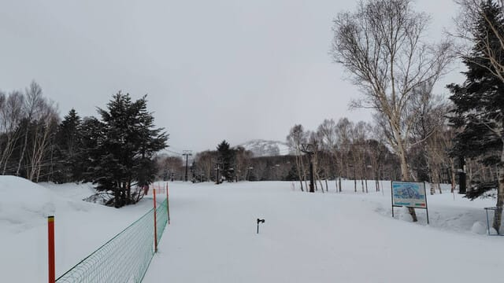
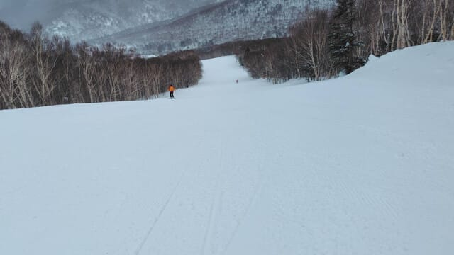
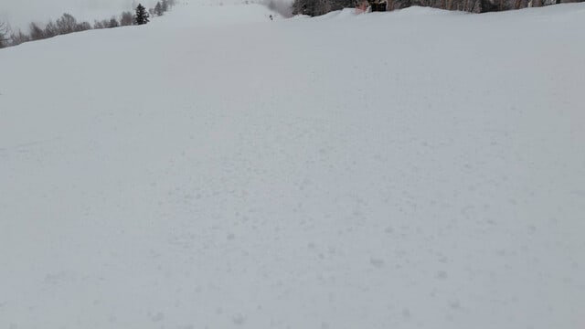
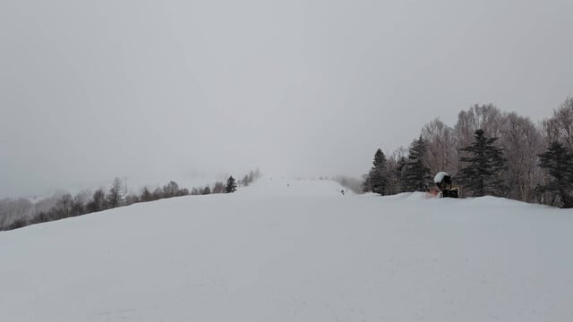
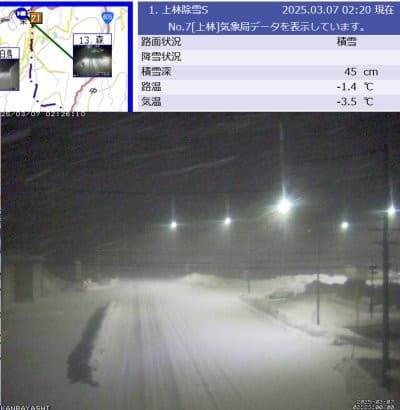
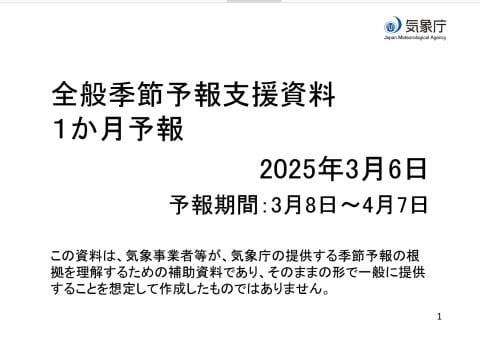
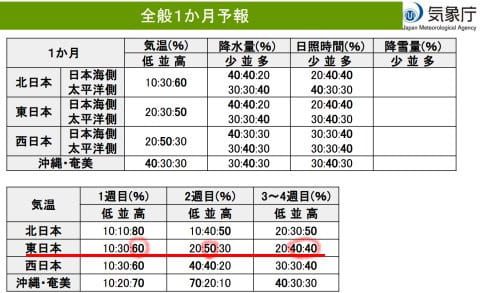
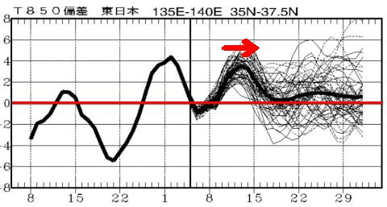

# 3月6日の志賀高原スキー場特派員によると，そんなに雪は積もらずゲレンデはガチガチ（泣）そしてこれからしばらく気温が上がるけど，その後平年並み

📅 投稿日時: 2025-03-07 03:26:23

えー．

先週スキー板の手入れをしていて．

今シーズンから履き始めた，185cmの

FISCHER RC4 RCの滑走面が，早くも

かなり波打ってきて…

アイロンを当てると，ビンディングの

下の部分がかなりコンケープになっている

ことに気づいてしまった今日この頃．

皆様いかがお過ごしでしょうか（時候の挨拶）

うーん．

昨シーズンまでメイン機として使っていた

’21モデルのFISCHER RCが，3シーズン

経ってもヘタる気配がなく．

FISCHERの板って頑丈だなぁ…

と思っていたけど．

あまりにも’21モデルのメイン機が長持ち

しすぎるので，バックアップ器として

買った'19のFISCHER RCの出番がなく．

まぁ，せっかく買ったんだからと，

今シーズンは’21モデルの方をバック

アップにして，’19モデルをメインに

使い始めたのですが．

’21モデルは90日近く履いても全くそんな

気配がなかったのに，’19モデルは滑走日数

30日弱で滑走面が波打ち始めちゃいました…

まぁ，かつてのメイン板のように，

[わずか40日で剥離する](e00384be212f646ebb76a332e7f1d9142.md)

というほどの衝撃的な破壊ではないので，

まだ滑走面のフラットを出せば滑れ

そうですが…

でも，今シーズンの12月中旬から履き

始めて，まだ2か月ちょいなので．

できれば3シーズンはもってほしいけど…

厳しいかなぁ…

ここしばらくはおさまったのかな？

と思っていたけど．また，

板を劣化させる電磁波

が私の身体から出始めてきたかな（泣）

こんなスキー板劣化加速能力，いらんわ…

ってなことで．

本日の志賀高原ですが．

どうやら朝までに，5－10cmと予想した

積雪の少ない方の5cm程度しか積もら

なかったみたいで…

さらに，昼間も5－10cm積もると思った

ところ，雪は降ったものの，

昼間はほとんど積もらなかったよう

ですね（泣）

本日も特派員から送られてきた

焼額山の写真を見てみると…

第1ゴンドラが明日，7日金曜まで運休の

ため，第2ゴンドラふもとの朝の写真

ですが．

雪，降ってませんね…（泣）

積雪量が少なかったので，明け方近く

まで降り続けた雨で融けた雪がガチガチに

凍った，硬いシマシマの上にうっすら

雪が乗った状態だったようで（涙）

朝イチはフラットだったから良かった

ものの，じきに氷のコロコロが出てきて，

滑りにくくなっちゃったようです（泣）

ただ．

第1ゴンドラが運休だったわりに，

人も少なかったので第2ゴンドラが混む

ことはなく．

ゲレンデの人も少ないですね～…

これでちゃんと週末までに，このカチカチ

ゲレンデは無事回復するのか？？？

と，心配になるところですが…

ご安心ください．

今の志賀高原，いい感じに雪が降ってます…！！

（[北信建設事務道路気象状況カメラ](http://hokushin.pref-nagano-roadcamera.jp/)より）

明日の朝までに10－20cmは積もって

くれて，昼間も一日雪が降り続け…

明日一日で30cmくらい積もってくれ

そうなので，おそらく土曜はバーン

状況が改善するはず…！！

そして，今の天気図のままなら．

プチ低気圧の予想位置が志賀高原から

離れる方向になったので，

土日とも晴れそうです…！！

雪が積もった後の週末という，

恵まれたコンディションになりそう！！

…日曜昼間は曇りになるかもしれない

けど…

…ただ．

プチ低気圧の予想位置がちょっとズレる

だけで，曇ったり雪が降ったりと予想が

変わりうる，危ない天気図なので，

まだ安心はできませんが…

ということで．

あとは本日は木曜日なので，

いつもの1か月予報を見ておくと…

…昨日の記事にも，11，12日はすごい

高温になりそう…と書いているように．

1週目は気温が高い確率が60％で

気温が上がりそうですが．

2週目は平年並みが50％，

3－4週目は平年並みの確率と気温が

上がる確率がともに40％となっていて．

4月6日の4週目まで，だいたい平年

並みで過ぎてくれそうです…

グラフを見ても，赤矢印の12，13日

あたりは悲しい雨が降った今週なみに

気温が上がりそうですが．

それ以降は，だいたい平年並みに

収まってますね…

ってなことで．

まぁ今シーズンの焼額は，問題なく

GWまで雪がもってくれそうな気配を

感じますが．

このまま4月も異常高温にならずに

過ぎてくれるよう，

引き続きこのBlog読者の方は，

日頃の行いに気を付け，品行方正に

過ごしてくださいますよう，

お願い申し上げます…

## 💬 コメント一覧

### 💬 コメント by (地元民)
**タイトル**: Unknown
**投稿日**: 2025-03-07 07:02:18

朝起きたら、里でも10㌢くらい積もってるんで、山は30㌢くらい降ってるんじゃないでしょうか？

予想より降りそう？

### 💬 コメント by (レインボー77)
**タイトル**: Unknown
**投稿日**: 2025-03-07 13:46:02

金曜日の志賀高原情報

朝の湯田中は新雪10。さらさらのいい雪。雪はずっと降り続け、最高のパウダー日和となりました。

私らはダイヤ上陸。深い雪で駐車に一苦労。8時20分にはすでにリフトは動いてました。あとは新しい所を探してひたすら。でも悲劇はやってくるもんです。視界が最悪になった時に方向がわからず、あっと思ったらポールとネットが目の前に。今シーズンの初転倒です。さらに次の一本でも同じ所で！悔しいのであとはずっとそこばかり滑りました。そんなこんなで11時前に昼休憩。そしてそのまま終了というお決まりのエンディングでした。明日はこの雪が圧雪されて、しましまふかふかが楽しめるのでは？

### 💬 コメント by (愛読者)
**タイトル**: Unknown
**投稿日**: 2025-03-07 19:19:52

早くも板がへたってきたのは、強いフォーミングのheadブーツにして最大限板をたわませられているからでしょうね。フォルクルの板がへたるのも時間の問題でしょう。ということは大物欲選手権が近く始まるということですね。楽しみです。併せて試乗記もショップの予約締め切り前に披露してください。

### 💬 コメント by (Skier_S)
**タイトル**: 今日の志賀は雪が積もったよ！
**投稿日**: 2025-03-07 22:01:19

＞地元民さま

積もったみたいですね～…

でも，山の上でも朝までに20-30cm，昼間も合わせて30-40cmってことみたいです．

ドカ雪ってほどではないにしろ，そこそこ積もって硬い下地が隠れてくれたようで，この週末は楽しめそうです！

＞レインボー77さま

週末前に下地の硬いのが隠れて，冷え冷え雪が積もってくれたなんて，理想的なパターン！！

明日から志賀高原に行きますのでよろしくお願いします～！！

＞愛読者さま

Volklの板も，結構薄っぺらいのですぐにヘタってくるんじゃないか…と思っていたけど，

2シーズン目の今でも全然ヘタる気配はないので，意外と強そうです…！！！

試乗レポート，なるべく早く書きたいのですが，台数が多いので書くのに時間がかかるのです…（涙）

さて．明日からの試乗会，物欲を刺激する板があるか？？？

