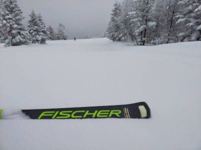
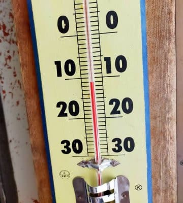
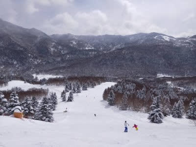
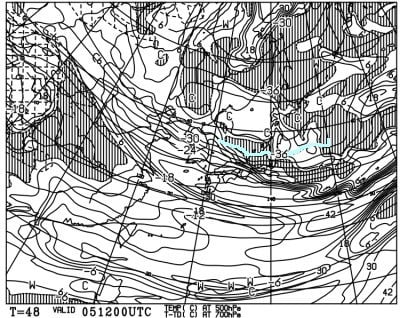
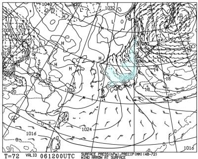
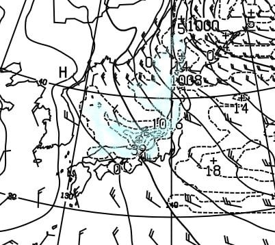

# 今週末は積もる！土曜より日曜がすごい感じ…6日（日）は太もも～腰パフ，エンドレスパウダーデーかも…！！

📅 投稿日時: 2022-02-04 01:46:08

🏷️ カテゴリ: [日記](cc4b5682fb7b8b144980957a978653fb0.md)

えー．

本日の志賀高原特派員のレポートによれば．

本日朝は，10cm程度の積雪があったようで…

圧雪コースの上にも数cmの軽い雪が

積もっていたようです！

で，気温は-11℃と，-8℃の予想よりは

ちょっと冷えたようですが…

でも，天気は朝まで雪が残り，

その後は晴れたり曇ったり，

時折雪が降る…という，

私の予想が予言レベルで当たった一日

だったようで．

…そうです．

普通は私の予想は当たるんです！！

先週土日はわずかな風向きで晴れるか

雪かのギリギリ境界で難しかっただけで．

私の予想はすごいんです！！←当たった時はこれぞとばかりアピール

ってなことで．

昨日の記事の週末天気予想．

日曜はブーツ～脛パフと書きましたが…

本日，日曜の詳細天気図が出たので

見てみると…

うむ？？これは…

どうも，土曜より日曜の方が積もりそうです．

土曜も結構積もりますが，土曜の夜から

日曜にかけては，すごい降りそうです…！！

膝～腰パフくらい行くかも…？？

なんてったって．

土曜5日の夜の500hpa気温図を見ると．

ドカ雪の目安の-36℃線が志賀高原に

かかってます！！

500hpaの-36℃線は…めちゃくちゃ積もる

目安です！

土曜の夜から日曜の朝にかけて，

すごい降って積もりそう！！

さらに，日曜夜9時の地上天気図．

土曜夜9時からの24時間で，

日本海側にかなりの降水量が

予想されてます…！

拡大すると．

なんだか，雪雲が日本海側だけじゃなく，

山陽や近畿，東海まで伸びてるし．

福井県近辺で降水量39mm…

積雪量なら40cmくらいになりそうな予想に

なっています！！

これ，6日の日曜は，朝は志賀に登るのも

大変な大雪になって，

昼間もずっと雪が積もり続ける

エンドレスパウダーデーになりそう…！！

寒いし雪は降り続けるし，

すごい一日になりそうな予感…！！

とりあえず．

この週末は太板必須．

…そして，

除雪も間に合ってないような道の

雪道運転や，悪天候でも滑る根性が

あるスキーヤーだけが生き残れる，

選ばれし民のみが残る自然淘汰ゲレンデ

になりそうです…

## 💬 コメント一覧

### 💬 コメント by (レインボー74)
**タイトル**: Unknown
**投稿日**: 2022-02-04 14:50:29

金曜日の志賀高原情報

朝の上林-3℃　蓮池-8℃。天気はいい。

ニゴンからスーパーを見たら、と～ってもいい感じ。一目散に飛び込むと、未踏の新雪が40cm。下地のコブに当たっても硬くないので大丈夫。快楽を味わえました。

GSサイドも今日はいい。新雪が20はある。

ここで遊んでいたらオリンピックは賞味期限が切れたとか。朝一はすねパフェだったそうな。

三高からミドルもかなりの雪で気持ちいい。

だけどすぐに大好きなダイヤへ。

ダイヤは私らから見るとコース外に思える圧雪バーンには大勢いても、非圧雪をぐるぐる回すのは私らだけ。今日も夢中で十数回楽しめました。老人にはああいう短コースが向いているのかも。

### 💬 コメント by (アリス)
**タイトル**: Unknown
**投稿日**: 2022-02-04 19:25:03

S様

志賀高原やはりいいです🙆

午前は、中央部滑走してヤケビは午後の参戦でしたがシマシマこそありませんが、締まったバーンでフラットバーンを楽しめました🎵

オリンピックコースも一見ボコボコですが、滑ってみると雪が軽く足に抵抗なく快適です☀

雪が片栗粉に感じました🎵

### 💬 コメント by (Skier_S)
**タイトル**: 今週末はパウダー祭り！
**投稿日**: 2022-02-04 23:55:50

＞レインボー74さま

今日は晴天新雪で良かったみたいですね…

明日からは新雪でも吹雪です（涙）

土日ともすごい雪降りです…

＞アリスさま

今日は予想外して晴れだったようで，楽しめたのではないでしょうか．

雪も軽かったようで良かったですね…！

明日からもパフパフパウダーデーです！

