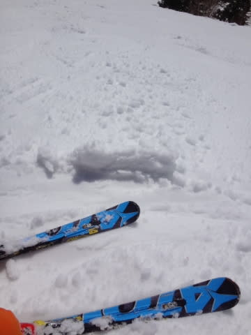

# 3月21日の志賀高原は…晴天なれど，雪は重く．典型的な春の一日…

📅 投稿日時: 2015-03-21 23:49:52

えー．

本日の志賀高原は．

春です．

春でした…

いや，朝が晴天で始まってくれたのはうれしいのですが…

そして，朝のうちは気温もマイナス3度近くで．

きれいなシマシマバーンでうれしかったのですが…

ただ，このシマシマバーンも．

気持ちよかったのは，2-3本程度．

それを過ぎると…

徐々に緩み始め…

スタート1時間ちょい後には…

あう？

なんだ？これは？

なんだ，この重い雪は？？

快適度，強烈ダウ～ンっ！！！！（涙）

春の強烈な日差しに照らされたゲレンデは，容赦なく緩んで行き…

そして，春休みだからか．

ゲレンデの人口密度も増えていき．

春雪＆人口密度のダブルパンチを食らっているのですが…（涙）

そして，昼間の気温はプラス5度と．

「暑いんですけど…」

というレベルまで上昇し．

強烈な日差しと気温で重くなった春の雪は．

当然，人が増えるとでこぼこして行き…

…そして出現する，小回りレーン（泣）

下地の硬い小回りレーンとボソボソ春雪のまだら模様攻撃で．

…スキーヤーの戦闘意欲は90％ダウン！！

だめだ…だめだよ．

戦闘意欲がわかないんだけど…←といいながら滑り続けている

せめてもの救いは．

天気がよくぽかぽか陽気というのと．

ゴンドラ待ちがほとんどなかったことか…

そしてさらに．

午後3時を過ぎると．

日差しが弱まり，ゲレンデは硬くなり始め…

ナンデスカ？コレハ？

と，いいたくなるほどに．

…この形のまま，固まり始めました（激烈涙）

だめだ．

超最高だった，先週と違いすぎる．

ぜんぜんダメだよ…

と，悲しみながらも．

リフトストップまですべり…

そして，ナイターに繰り出すわけですが．>←それでも行くのか！？？

…ナイターも，なんだかアイスバーンなんですが？？

それも．

ピステンのかけ方が荒く．

こんな凸凹のまま固まってるんですけど？？

ダメだ．

ダメだよ．

圧雪したてのぴかぴかナイターを楽しみたかったのに…（涙）

という感じで

ちょっと悲しみつつ，残す営業は来週のみとなった，

ダイヤモンドナイターを，リフトストップまで

滑ったのでした…←やっぱり最後まで滑るのね（ツッコミどころ）

という感じで．

朝の一瞬はシマシマバーンを滑れたけど．

その後は，重い春の荒れ荒れ雪＆夕方～ナイターの

アイスバーンに打ちのめされるという．

見事に天気予想通りのゲレンデ状況にやられたのでした…

うーむ．

焼額で今日から営業開始の，早朝営業はよかったのかな～．

でも，今日はナイター行っちゃったので，明日早朝に

行くパワーはないなぁ…

## 💬 コメント一覧

### 💬 コメント by (はなげ親分)
**タイトル**: 寺子屋
**投稿日**: 2015-03-22 11:36:41

昨日と今日の早朝スキー、ご機嫌でした。しまった雪と、空いてるゲレンデは、極楽気分を味わいました。

今は、早朝スキーで燃え尽きてしまったもので、寺子屋にてビールをやってます。

先程妻が、S様足が相当痛いらく、

「リフト待ちの時つま先を持ち上げてたよ。普通の人なんだ!」

っていってました。

### 💬 コメント by (Skier_S)
**タイトル**: はなげ親分さま
**投稿日**: 2015-03-23 01:48:40

今朝はご一緒できなくて残念です…

ちょいとブーツが痛すぎて…（涙）．

早朝スキーは良かったんですね…

アイスバーンでは無かったですか？？

うーーーん．

私も来週は早朝を狙おうかなぁ…

でも，ナイターやって次の朝に早朝から滑ったら

死んじゃうから，悩むところ…

…いや，ホントに死んじゃうんです．

国家機密レベルのトップシークレットなので

隠してましたが，実は私も普通の人間だったので…（笑）．

決して，20000mクラブの方々のような

スキー専用に改造された体をもつ

サイボーグではないので（＾＾；

