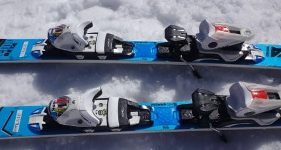

# 2018シーズンモデル，スキー試乗レポート第13回…ROSSIGNOL編その２

📅 投稿日時: 2017-06-03 01:18:14

🏷️ カテゴリ: [スキー板試乗](c0bd8048615710cee890e403a36cc9a2b.md)

ということで．

今週末はスキーに行かない週末です．

ええ．

行きませんよ．

月山には…（涙）．

だもんで．

本日はスキー試乗レポートへ，Go!

----

○ROSSIGNOL DEMO Beta 167cm

基礎小回り．

サイドカーブもビンディングも，DEMO Alpha SOFTと同じ板ですが…

フレックスをちょいと柔らかくして，扱いやすくしたのが

この板で．

ビンディングはDEMO Alpha SOFTと同じ，KONECTが乗ってます

履いてみた感じ，かなりDEMO Alphaより優しくなってます．

というか，かなり柔らかいです．

DEMO Alphaだと，角づけをして滑っていくと，

エッジに乗ってするするとエッジ方向に進んでいきますが．

この板は，エッジ方向に進んでいく中でも，

簡単にずらすことができます．

板のグリップがおとなしめで，

エッジが頑張りすぎません．

低速からかなり柔らかくたわみ．

そこから楽に，実に軽快に板を動かしていけます．

体力や力を使わず，かなりイージーに

コントロールできる板．

あんまり攻める板ではない．

スピードを出すと，板はネットリとたわんでいきますが，

トップスピードを出すとずれていく．

ただ，ずれのコントロールはかなりいい感じなので．

「ずれてしまう」というより，「ずれの中で楽に

コントロールできる」という感じの板です．

それほど体力のない人・力を使いたくない人が，

楽に乗れる小回りベースの板だなぁ…

という印象でした．
