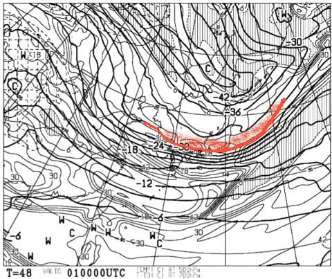
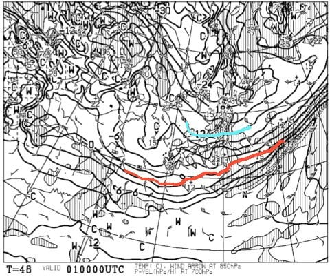
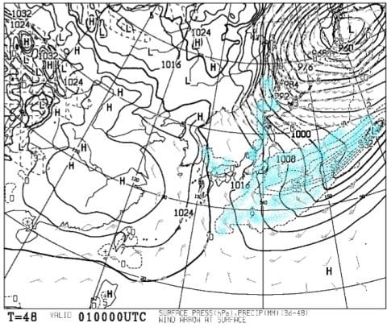
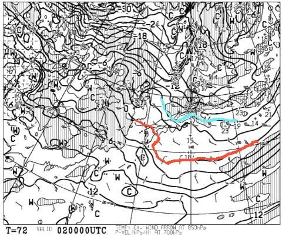
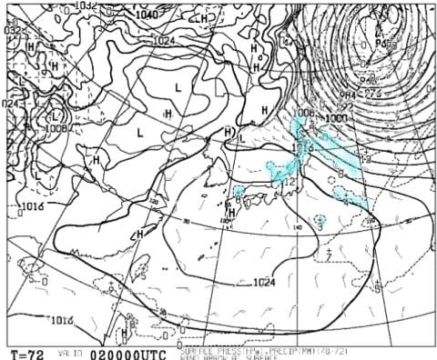
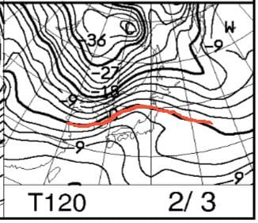
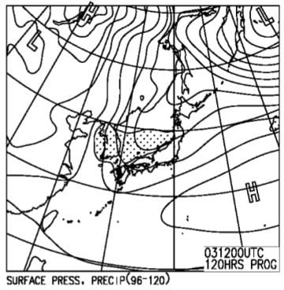

# 2月2，3日の週末の志賀高原スキー場の天気予想…土曜は雪のち晴れ，日曜は生暖かい南風が吹く，晴れ～曇りの天気かな

📅 投稿日時: 2019-01-31 00:24:41

🏷️ カテゴリ: [スキー天気予想](c6554f5c3c106093b511a8daae23757e8.md)

ということで．

今週末から，早くも2月ですね．

…スキーシーズンも折り返し地点に

差し掛かってきました…

残されたトップシーズンも，あと1か月ちょい．

…スキーシーズンとは，なんと短い

ものよ…（涙）←年間8か月以上滑っているあなたが言うべきセリフか？？

ってなわけで．

トップシーズンど真ん中，今週末の

志賀高原の天気予想をしてみるわけですが．

まず，週末の前日．

2月1日の金曜日の500hpa気温を見てみると…

うむ？？

赤く記したそこそこの雪の目安，

-30℃の寒気が，関東近辺まで下がってますよ！？？

そして，850hpaの気温を見てみると．

…志賀高原には，水色で塗った-12℃線が

近づいてますね…

これは，金曜の朝は，志賀の山頂では-15℃を

下回る可能性が！

そして，関東にも-9℃線が近づくという．

これは，ものすごい冷え方ですよ…

で．

地上天気図は．

関東近辺に狙ったように降水域がかかっているので．

うーむ．

31日の夜から1日の朝にかけて．

関東でも数㎝雪が積もる可能性がありますね…！

…でも．

なぜかこれだけ気合の入った寒気がおりて

来ているにもかかわらず．

日本海側の降水量はそれ程でもないので．

金曜朝の志賀高原の積雪は，ブーツパフ程度

なのかな…

そして．

肝心な週末．

土曜日の850hpa気温を見てみると…

ふむ．この日の志賀高原には，水色の-6℃線

がかかっている程度なので．

金曜の-12度線から比べると，かなり気温が

上がりますね…

とはいえ，朝は-8～9℃程度の冷え込みなので．

トップシーズンらしい冷え込みですね．

で土曜の地上天気図は…

うーん．日本海側にわずかに降水が

予想されてますね…

土曜朝まで，雪が降ってそうですが

高気圧が近づいているので．

どこかのタイミングで晴れていきそうですね…

おそらく，午前中からちらちら太陽が顔を出し．

午後に晴れていくパターンかな…

で．

明けて日曜ですが．

850hpa気温を見ると…

なんじゃこりゃ！！

やっぱり，昨日の予想からそれほど変わらず．

赤く塗った0℃線は，東北地方まで北上

してしまう予想です…（涙）

これは．

降れば雨

という，危険な気温ですが．

地上天気図を見たところ．

網掛けの降水域が，志賀高原に

かかっていないので…

きわどいところ，日曜は

雨は降らずに済むかな～…

ってな感じで．

まとめると．

2日土曜：朝は金曜夜から降り続けた雪がまだちらちら

　舞っている，雪降りでスタート．

　朝の気温は-8～-9℃程度．

　圧雪バーンは，圧雪の上にうっすら新雪が乗った，

　トップシーズンらしい柔らかめのバーンコンディション．

　朝のうちに雪は止み，時折日が差すようになり．

　午後には雲が残るかもしれないけど，晴れ間が

　広がっていき．

　柔らかいゲレンデに日が差す，いい感じのトップシーズン

　らしい一日になりそう．

　ただ，雪が柔らかいので，人が多いコースは

　夕方はちょっと荒れ気味のゲレンデになるかな．

3日日曜：おそらく，朝は晴れてるかな…

　朝の気温はまだ正確に予想できないけど…

　たぶん，-3℃～-5℃程度とこの時期にしては

　かなり高め．

　でも，朝イチはピカピカ圧雪が楽しめそう！

　…しかし．この日は生ぬるい南風が吹き，

　気温はぐんぐん上がり，

　山頂でもプラス気温まで上がりそう…

　でも，下地はしっかり冷えてるので，

　気温が上がっても雪が緩むことはないかな．

　昼頃から雲が増えていき，午後は完全曇り空．

　夕方に雨がぱらつかなければ…

　終日，比較的締まったいいコンディションで

　滑れるかな．

ってな感じで．

日曜の天気が，まだ微妙なので．

また直前に最終予想しますが．

とりあえず，私がこれから週末にかけて，

必至に踊り続けておきますので．

日曜も雨になることなく．

わりと穏やかな週末になってくれるはず…

## 💬 コメント一覧

### 💬 コメント by (ふく)
**タイトル**: 天気占い
**投稿日**: 2019-01-31 08:11:54

今週末ヤケビに行こうと思っています。

天気が気になるので、よく当たると噂の占いを見に来ました。踊りを頑張ってください！

### 💬 コメント by (Skier_S)
**タイトル**: ふくさま
**投稿日**: 2019-01-31 23:20:13

この占いが当たるも当たらないも，あなたの日々の

信心次第です…

と，天気予想が外れた場合も，人のせいにしてしまう私(笑)．

ときどき予想が外れますので，その際はご容赦を．

私も今週末ヤケビで滑ってますので，見かけたら声を

かけてやってください~！

