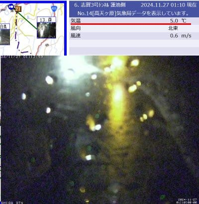
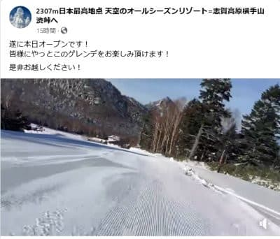
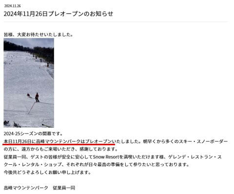
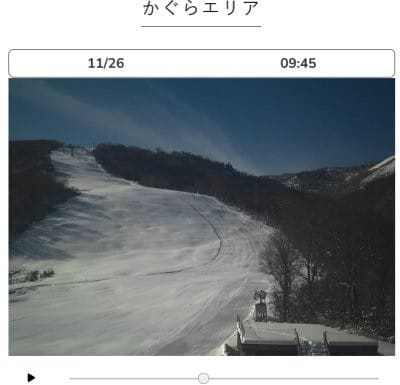
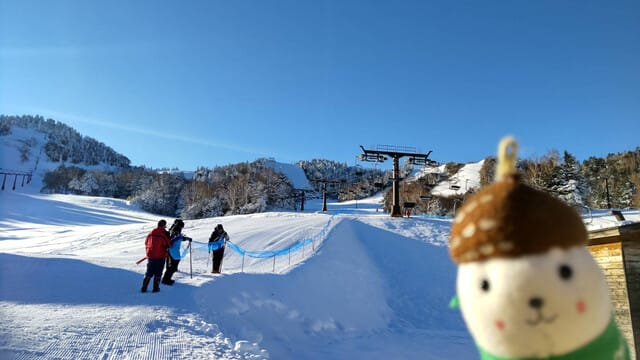
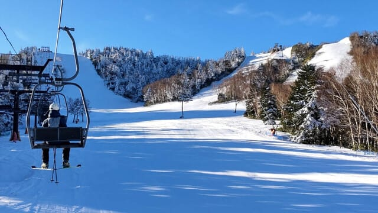
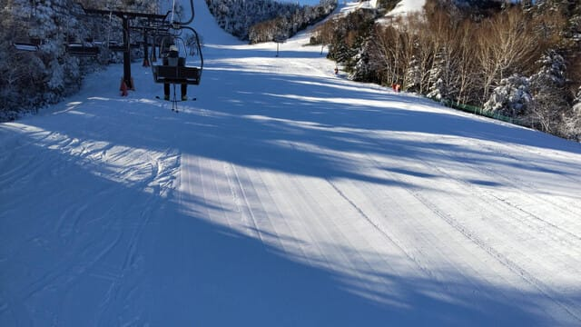

# 11月26日(火)，横手山スキー場と高峰マウンテンパークオープン！そしてかぐらスキー場は予定通り明日オープン！そして今日の熊の湯特派員写真

📅 投稿日時: 2024-11-27 01:27:00

なんだか．

Garminさんがこの1週間の平均睡眠時間

3時間だと言っていてます（泣）

週末を含めてこれはヤバい…

ホントに眠いので．

今日こそ短め更新…

えー．

まず．今日は昼間は天気は良かったけど，

予想通り夜から雨になり…

27日1時AM時点の志賀高原のライブカメラを

見てもプラス5℃と気温が高く，さらに

雨の水滴がカメラについてます…

結構な量の高温の雨が降り注いでいる

ようですね…（泣）

（[北信建設事務道路気象状況カメラ](http://hokushin.pref-nagano-roadcamera.jp/)より）

各スキー場の雪が明日までもつのか，

ちょっと心配…

でも．そんな中でも．

本日…というか，いつもの表記で，

日付が変わった昨日は．何とか夜まで天気が

崩れずもってくれたようで．

予定通り，横手山が本日（というか，もう昨日）

26日にオープンしました～！！

（横手山スキー場ホームページより）

そして…

なんと．

こんな中にもかかわらず，旧アサマ2000，

つまり現高峰マウンテンパークは，当初

の予定を早めて26日プレオープン！！

それも，旧ステージ2，現ダイビングコース

があ滑れるようです…

コース幅もありそうだし，斜度もあるから…

うをーー！！行きたいぞっ！！

（[高峰高原マウンテンリゾート](https://asama2000.com/2024/11/26/24-2025-11%e6%9c%8826%e6%97%a5%e7%84%a1%e4%ba%8b%e3%83%97%e3%83%ac%e3%82%aa%e3%83%bc%e3%83%97%e3%83%b3%e8%87%b4%e3%81%97%e3%81%be%e3%81%97%e3%81%9f%ef%bc%81/)ホームページ）

…まさか，こんな状況で予定を前倒しで

入れてくるとは…

でも，一面の雪景色っぽく見えたりするものの

ちょっと幅が狭いかな…

ちなみに．

かぐらは前回の予告通り，明日からの営業開始予定です！

滑れるのはかぐら山頂のクワッドのみ．

でも，ライブカメラを見ると…

ゲレンデの雪は結構多く，26日でも十分

オープンできた感じですね…

そして．

オープン翌日の熊倉には，もおこみん特派員が

行ってくれたのですが．

今日は気温が高かったようですが…

でも，平日はリフト待ちも少なかったし．

すぐに雲が出てきたものの，朝のうちは

天気も良かったし．

結構いいコンディションで滑れたようです…！

うーん．

いいなぁ…

ってなことで．

ここ数日の冷え込みで，25，26日でぼちぼち

スキー場がオープンしてきたわけですが．

やっぱり今晩からの明日が勝負…

…今晩の雨＆高温でやられなければ，

今週末は期待できそうですが．

そうじゃなかったら…（恐怖）

今週末までアサマ2000…じゃなかった，

高峰マウンテンパークの雪が残るなら．

今週末は高峰が一番コンディションがいいかも…？
