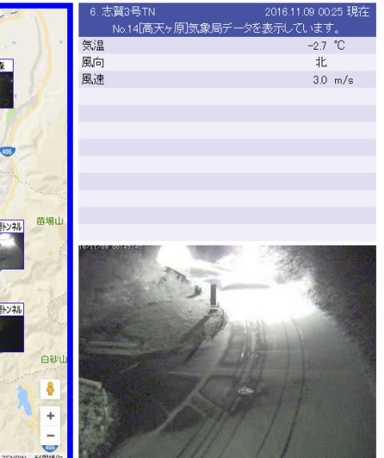
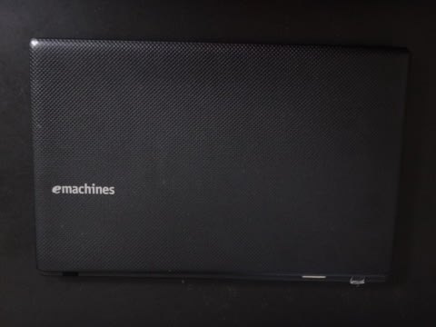
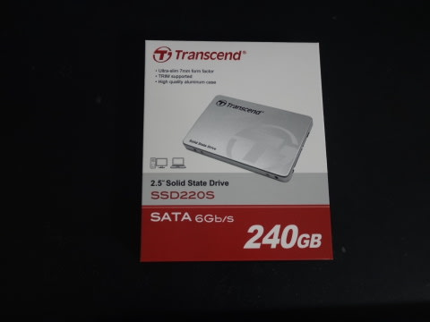
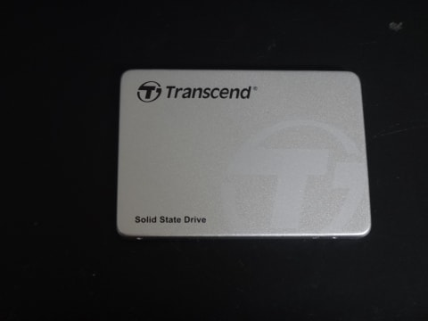

# 5年前のeMachinesのPC，E732-F32CをいまさらSSD化してみた　その１

📅 投稿日時: 2016-11-09 02:07:06

🏷️ カテゴリ: [PC,カメラ&小物](c0d8caed13e597efe97b661a8ae56bed0.md)

…来ました．

来ましたよ～！！！

どうやら，山では予想通り，

しっかり冷え込んでいるようで．

志賀の道路状況カメラで見てみると…

をを！

志賀高原の道路，雪が積もってますっ！！！

気温も-2.7℃と，しっかり冷え込んでいるようですね～．

うむ．

これが，しっかり根雪になると嬉しいんですが…

でも．

11日から15日くらいまでは，

昼間の気温はプラスに上がっちゃいそうな感じで．

…うーむ．

冷えは長続きしなさそう…（残念）．

15日以降，ガッツリ冷えることを期待っ！！

…って感じで，

本題へ．

えー．

先日．

私の妻の，5年モノになるノートPC．

eMachinesのE732という，激安パソコン．

ちょっと用事があって，これを使ってみたとき…

「な，なんだ？？この遅さはっ！？？」

PCが起動し終わるまで5分近く待たされ．

その後もブラウザが立ち上がるまで1分近くかかり，

起動後も，アンチウイルスの起動後チェックが

終わるまでの結構な時間，動作が異常に重い状態が続き…

キーを押してもすぐに反応しないレベル（涙）．

これは…耐えられない遅さ！

ディスクのクリーンアップやらデフラグやらを

試してみたものの，全く効果無く（涙）．

うーむ．

このノートPC．

新品購入時に3万円台だった激安パソコンだし．

もう5年半も使っているし…

まぁ，そろそろ買い替え時かな～？

でも．

また激安パソコンを買っても，それほど

速度は上がらないだろうし，

自分が職場で使っているSSDのノートPCが

激烈に速いので．

SSD搭載のノートでも買ってあげようか…

と，思っていたけど．

調べてみると．

やっぱり，SSD搭載のノートPCは，高い（涙）．

うーむ．

安いHDD搭載のノートPCで，自分でSSDに乗せ換えられそうな

やつを買おうか…

と，つらつら考えていたところ．

ちょっと待て．

新しいノートPC買って，SSDに乗せ換えるくらいなら．

…だったら，PCを買い替えなくても．

今のPCをSSDに換装すればいいんじゃね？

PCが遅いのは，間違いなくHDDアクセスの

遅さに原因があると思うので．

今のPCでも，SSDに換装すれば速くなるんじゃね？

…ってことで．

いろいろ調べてみたけど

こんな5年熟成済みの激安PCの

SSD化に取り組んだ先人がいなかったので．

うーむ．

自らが人柱になって，やってみるか…

まぁ．

元々，PCを買い替えようかと思ってたくらいだし．

このPCのSSD化に失敗しても，このSSDが使えるような

Lenovoとかの激安PCを買えば，SSDは

無駄にならないよな…

と．

まず，SSDを購入してきたのでした…

購入したのは，Transendの240G，SSD220S.

税込み5930円なり．

…240GのSSDが，6000円でおつりがくる時代に

なったんだなぁ…

（続く）
