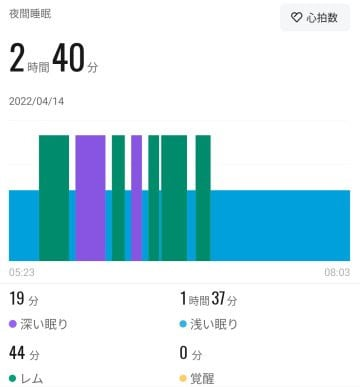
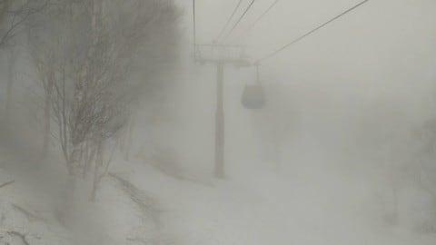
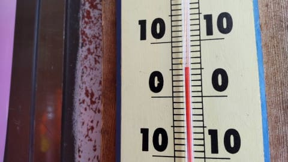
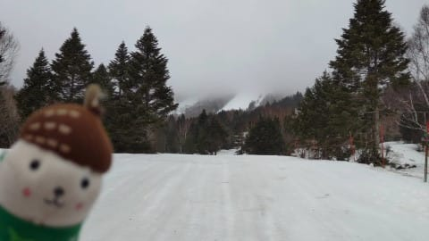

# 昨日，14日（木）の志賀高原はガス＆午前小雨，今日15日（金）は高温で終日雨（涙）

📅 投稿日時: 2022-04-15 06:43:42

🏷️ カテゴリ: [日記](cc4b5682fb7b8b144980957a978653fb0.md)

私の記憶が確かなら．

昨日も睡眠時間3時間を切っている

はずなのに…

（記憶があいまいでもスマートウォッチはちゃんと記録しているよ…）

今日も完全徹夜しているのはなぜだろう…

るるる～

そして，朝9時からの打ち合わせに必要な

資料がまだできてないのはなぜだろう…

ららら～

そして，今日は朝9時から夜8時まで，

途中30分休みがある以外ずっとWeb会議が

入っているのはなぜだろう…

るるる～

と，寂しく歌ってみたものの．

とりあえずコーヒードーピングで

必死に起きてます．

とりあえず．

いつものおこみん特派員によると…

昨日の志賀高原，あさからガス＆霧雨．

午前11時頃は小雨も降ったようですが…

気温は朝から+5℃．

昼間もほぼ気温は変わらなかったようです．

で．

雪はかなり解けて，表面がかなり茶色い

雪になっているようですね…（涙）

…昨日はそれほどひどく降らなかったようですが．

今日は時折強く降ります（涙）

そして，気温も昼間はそれほど冷えません（泣）

…でも．

暖かいのは今日まで．

明日はちょっと冷えそう…！！

ってなことで．

まだ朝の資料ができてないので，

これにて！←Blog記事書いてる場合じゃないだろ

## 💬 コメント一覧

### 💬 コメント by (レインボー74)
**タイトル**: Unknown
**投稿日**: 2022-04-15 14:17:10

金曜日の志賀高原情報

上林から深すぎる霧。見慣れた温度計の位置さえわからない。でもこれは雲海なんだと思い込んでひるまず進んでいくと、なんとこれが現実に！

結局、霧は海抜700~1100mまでだけでした。ラッキー！

GS、オリンピックをゆっくり11本楽しんで、今シーズン終了です。オリンピックはまだまだいけそうですよ。

気になる妖怪ですが、緩斜面では10時頃から徐々に増殖していきました。でも、GSメイン、オリンピックメインでは、見かけませんでした。

また、昨日の真っ黒な雪面に恥じてか懲りてか、今日は朝圧雪をしてくれたので、真っ白(？)を楽しめましたよ。係員さんに感謝です。

私はこれにて本業の釣りに移るんですが、皆様はまだまだお楽しみくださいませ。

私は夏は夏で夢中になるため、エス様のblogも時々「まだ生きてるな」の生存確認程度くらいで、大活用させていただく所存でございます。ありがとうございました。来シーズンは75歳に成長した姿をお見せしたいです、

### 💬 コメント by (かず)
**タイトル**: Unknown
**投稿日**: 2022-04-15 19:17:48

若杉さんお疲れ様でした  来年こそコロナ収束してくれるといいですね…Sさん月曜の雨ってどうでしょうか？

### 💬 コメント by (Skier_S)
**タイトル**: 明日のスキーは諦めた
**投稿日**: 2022-04-16 03:16:36

＞レインボー74さま

土曜は滑らないんですね！！？？

シーズン終了お疲れ様でした．

また夏に山小屋でお会いしましょう！！！

＞かずさま

月曜は曇り．

ごくたまにパラパラ降るくらいでしょうか…

