# うぎゃーー！志賀高原，1月27日朝3時現在，雨が降ってます！朝9時くらいまでポツポツ降り続けるか…そして，29日の金曜は吹雪になりそう

📅 投稿日時: 2021-01-27 03:39:16

えー．

今日も，いつもの志賀高原ご近所在住の

特派員からの写真が送られてきているわけですが．

本日は，朝イチの奥志賀の温度計は-10℃と，

結構冷え込んだみたいですね…！

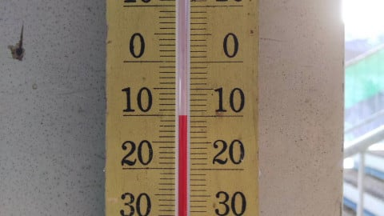

今日は朝から天気は良く…

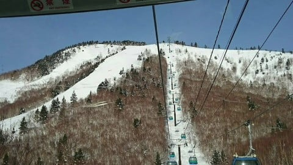

一の瀬方面も，朝イチは硬めに締まった

ハイスピードバーンで，

スピード派にはたまらなかったようです！

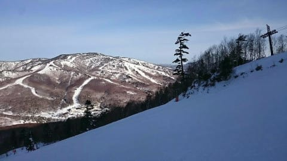

いや…誰も滑ってませんね…

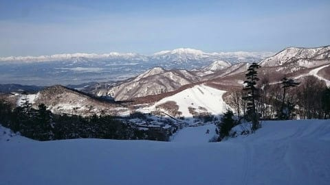

奥志賀もフラットバーン！

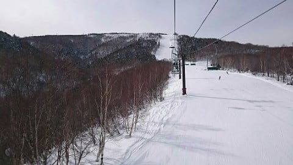

奥志賀ダウンヒルも，真っ平らで気持ちよさそう…

滑りたい！！

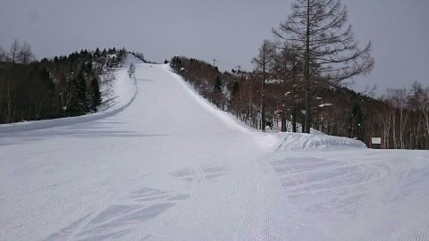

昼間も，気温はマイナスをキープしてくれたようですが．

風が強く，奥志賀は午後に入るとゴンドラ運休，

焼額も減速運転だったようです…

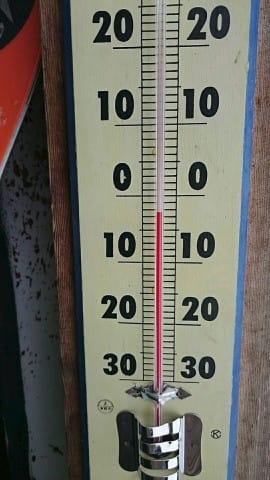

さらに，標高が低めの西舘は，昨日の

高温＆日差しで雪が緩んだので．

それがかたまった，ちょっと硬めの

コロコロが散らばったバーンだったようです…

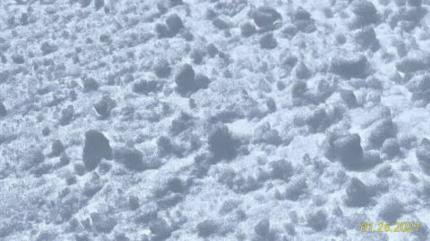

とはいえ．

日も射して景色も良く．

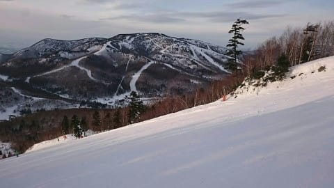

奥志賀や焼額，一の瀬などの標高が高いところは

終日雪質もよく．

結構いい一日だったようです…！

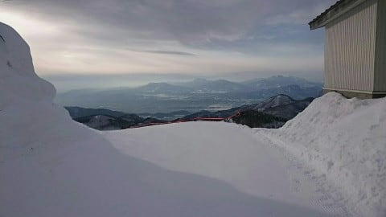

標高が高いところは，まだかなりいいバーンを

キープしている志賀高原．

さて，この好コンディションは，いつまで続くのかな…

…

…と思ったら．

え！！？？

えええ！？

27日午前3時現在，志賀高原は気温が+2℃を超えて，

雨になっているようです…！！！（涙）

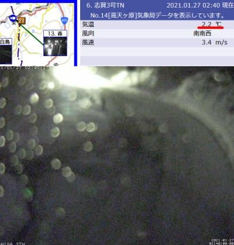

([北信建設事務所道路気象状況ページ](http://hokushin.pref-nagano-roadcamera.jp/)より）

がががーーーん．

なんということだ…

一昨日の記事に，

　25，26日は晴天になりそうで．

　27日朝の降り始めがちょいと危険な感じ…

とは書いたものの．

うーん．ギリギリ液体にならずに済むかな…

と，楽観視していたところ．

…なんだか，ダメだったようです．

ついに，志賀高原にも液体が…（泣）

ただ，この気温だったら．

一の瀬や奥志賀，焼額の山頂付近はギリギリ

雪かも…

うーん．でも，かなり重い湿った雪で．

冷えたらバリバリになりそうな感じ(涙）

とりあえず．

この雨は，27日(水)の朝まで続き．

午前中には止みそうですが…

27日の午後9時の850hpa図を見ると．

赤い0℃線は志賀の南まで下がり．

志賀高原には-6℃線が近づくくらいに

なっているので．

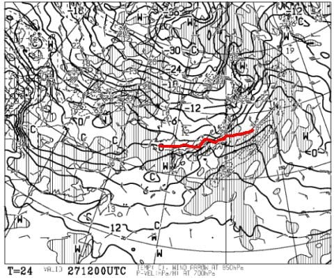

27日の水曜日は，雨が止むと同時にぐっと冷え込み，

標高が低いところは雨で湿ったバーンが

冷えて凍って，カリカリになっていきそう…

でも．

続く28日の木曜は．

気温はマイナスをキープして，

地上天気図を見ても，雨も雪も

降らなさそう．

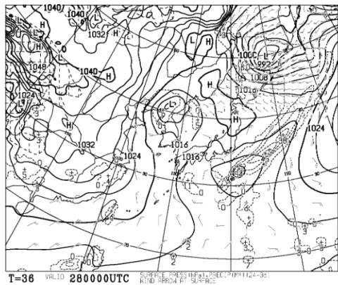

28日の木曜は，標高が低いところはざらざらした

硬めのバーンコンディション，所によって

急斜面がアイスバーン化する可能性があるけど．

曇~晴れで，日も射しそうなので．

標高が高い一の瀬・奥志賀方面は硬め

ながらも，むしろ硬いのが好きな人に

とってはいいバーンに仕上がっていて，

楽しめるかも…！

で，29日の金曜は…

ええ？？850hpa図では，水色の-9℃線が

志賀高原にかかってますよ！

これは…かなり冷えそう…

というより，風がかなり強そうなので，

荒れ気味の天気ですね．

ゴンドラが止まらなければいいんだけど…

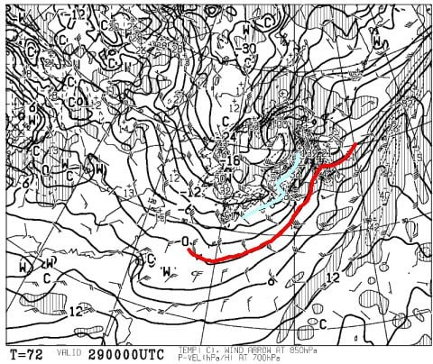

そして．地上天気図を見ると…

降水域が本州中部をすっぽり覆ってるし．

たちの悪そうな二つ目玉低気圧が

本州を挟んでるし．

これは，28日夜から雪が降り始め．

29日は一日荒れ荒れ吹雪になりそうな

天気ですね…

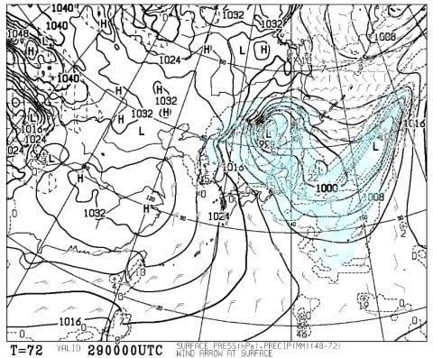

でも．

この29日の積雪で，硬いバーンは隠れてくれそう！

そのあとも30日の午前中くらいまで雪が

降り続けるかもしれないけど．

30日の午後から31日にかけては晴れて，

気温もそこそこ冷えてくれそうなので…

この雨でもそれほどコンディションは悪くならず，

週末はいいコンディションで滑れそうです！！

また，週末の天気は明日詳細予想します～！

…ということで．

一部，平日も滑る特派員の方に，この週末までの

天気をお送りしました…

PS.私が滑らない日の予想は，ちょっと天気図の読み込みが甘くなってる可能性あり．外れたらゴメンナサイ…

## 💬 コメント一覧

### 💬 コメント by (Unknown)
**タイトル**: Unknown
**投稿日**: 2021-01-27 11:30:12

若Sさん  木曜日のカチカチ状況よろしくお願いします

### 💬 コメント by (かず)
**タイトル**: Unknown
**投稿日**: 2021-01-27 11:31:22

かずです

### 💬 コメント by (レインボー73)
**タイトル**: Unknown
**投稿日**: 2021-01-27 13:04:25

水曜日の志賀高原情報

湯田中も山も夜に雨が降り、道路の雪は驚くほど解けました。ヤケビは朝から霧の中。ひと滑りで水滴が衣服やゴーグルに。一人の隊員はそれでリタイア。雪質は、雨がしみ込んだ重ーい雪。滑るには全く支障ないけれど、とにかく見えない。鉛直方向がわからなくなる感じ。

こんな日は危ないので遠征はやめて、熟知したヤケビに限ります。しばらくすると小雪に変わり、一瞬霧が収まったので隊員も復帰。するとまた霧が。彼は霧隠才蔵なのか。

そして霧の薄い二高を回したのですが、そこも！

昼少し前に終了してしまいました。エス様に怒られそうです。帰るとき、従業員『ニゴン故障で4ロマに切り替わります』。いい時にやめました。

二高リフトの支柱の滑車から油が落ちて、大切なウエアが汚れることごあります。危ない日には、右から２番目は避けた方が賢明かと思います。もし汚れたら、ホームセンターにあるパーツクリーナーで油を吸い出しては拭き取る方法で、私は対処しています。ただ、やりすぎると染料まで落ちることがあるので、ご注意ください。

それから私達は来る日も来る日もスキーをしていますが、決して何も考えずにしているわけではありません。地元在住の我々がどうしたらよいか。ない知恵を絞って出した答えが現状なのです。みんなが引いてしまったら、スキー場、従業員、ホテル、食堂、スキー業界がどうなるか。その結果、自分たちはどうなるのか。

結論は、スキーエンゲル係数を高くすることで、私達のコロナ対策としよう。昨年までは弁当持参が主だったのに、今はスキー場でほぼ外食してお金を落とす努力をしています。板などの用具も皆んなで買いました。ウエアも今年３着目を物色中です。まあ大局かろ見れば微々たることではありますが。

### 💬 コメント by (Northfox)
**タイトル**: Unknown
**投稿日**: 2021-01-27 15:14:20

精度が甘くなりがちでも天気予報ありがとうございます。それとレインボーさんの現地レポートもとても参考になります。

今週末も志賀高原に馳せ参じます。今回は西館、東館、サンバレーまで遠征しようと思います。

しかし、、S様のいない焼額なんてクリープを入れないコーヒーと同じです。（古くてすみません　^ ^；）

早く復帰出来ることを祈ります。

### 💬 コメント by (レインボー73)
**タイトル**: Unknown
**投稿日**: 2021-01-27 19:52:07

かずさん、明日は今日より冷えるので、多分今日よりはずっと固めかと思います。今までずっとパウダー三昧でしたので、アイスバーン？との初対面も楽しんでください。　　

でも、大して固くならないかも？

まあ、かずさんならノープロブレムですよ。

お会いできたら、またよろしくね。

### 💬 コメント by (かず)
**タイトル**: Unknown
**投稿日**: 2021-01-27 20:08:44

土曜のパウダー検討してます  その下がカチカチツルツルだと厳しいかな？と

### 💬 コメント by (Skier_S)
**タイトル**: 今週末は好コンディションになりそう…！！
**投稿日**: 2021-01-28 03:06:06

＞かずさま

土曜はパウダー積もりそうですが，下地が硬いよりも

積もったパウダーが風でウインドクラストっぽい感じに

ならないかちょい心配です…

土曜は午後は晴れそうなので，かなりイケるいい感じになると思いますよ！

＞レインボー73さま

今日もレポート＆写真ありがとうございます～！

そして，スキー業界への貢献ありがとうございます(感謝）

志賀高原の存続は，志賀の麓に住んでいらっしゃるレインボーさんのような

人に貢献していただくしかないので，引き続きよろしくお願いします！

＞Northfoxさま

クリープを入れないコーヒーって…世代がばれますね(笑)．

