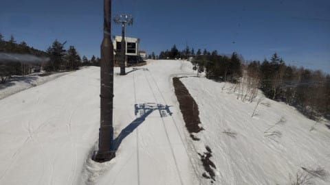
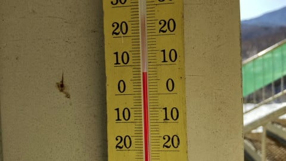
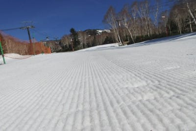
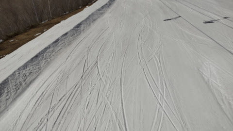
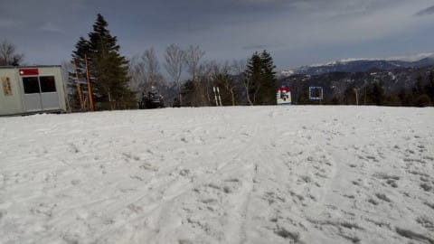
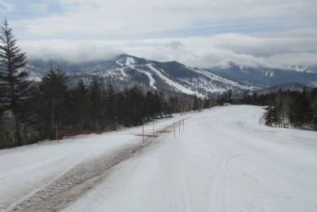
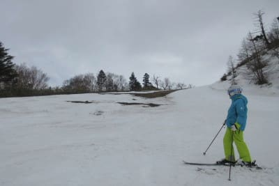

# 明日17日土曜の志賀高原は終日壊滅的な雨（涙）．18日朝から雪に変わる？昼はみぞれっぽく，昼前後ぎには止みそう

📅 投稿日時: 2021-04-17 00:11:53

えー．

本日4月16日(金)も，志賀高原特派員の

レポートからお送りします！

まず，朝からいい感じの晴れだった

みたいで．

今日のおこみんは晴天シマシマの上に

鎮座しています！

…なぜ，土曜に雨になるというのに．

金曜はいい天気なのか…(涙）

でも，気温は朝から結構高くて．

奥志賀の麓は+8℃！

ゲレンデは，朝はわずかに硬い部分が

ある，シマシマだったものの，

高温と強い日差しで，

朝からかなり緩めの雪になってしまい…

さらには．

午前10時過ぎになると，ところどころ

板にはりつく雪になっていき．

奥志賀も焼額も，妖怪板掴みが

大量発生していたようです…(涙）

焼額はコース上や脇の部分，穴が

開き始めたところもありますね…（泣）

そして．

昼ごろまでは晴天だったのに．

なぜか昼過ぎににわかに搔き曇り…

午後2時過ぎには，雪交じりの雨に

なってきたようです．

まさか，金曜午後から降り始めるとは！

でも，この写真の一の瀬パーフェクター，

とりつき部分は雪が無くなり，

もう終わりげな感じですね…（涙）

で．

今日は，雨が降っていた時間はそんなに長く

無かったようですが．

…明日は，

来ます．

大変残念なことに，これから

数時間後から雨が降り始めます．

17日土曜は，リフト営業時間中はずっと

雨が降り続けそうです(激涙)

気温も高く，雪はかなりのダメージを

受けそうです(激泣）

風は思ったほど強くなさそうなので，

ゴンドラは運休にはならなさそうなのが

救いか…

雨が避けられるゴンドラが動いてくれ

そうってが，せめてもの救済

ポイントですね（泣）

そして．

雨は18日日曜朝まで降り続け…

日曜早朝に，雨は雪に変わり．

午前中はみぞれっぽい雪．

昼ごろに止んできそうかな

という感じで．

ちょっとこの週末，残念な感じに

あふれています(泣）

多分，土曜は滑るのが馬鹿らしいほどの

一日雨になるのかも…

あぁ…

何だか今シーズン．

冷え冷え晴天

で滑った思い出が，

あんまりないんですが(涙）

ってか．

私がゲレンデに復活してから，

冷え冷えパウダーに一度も当たってないん

ですが(泣)

なぜ…

なぜ，毎日こんなにいい子にしているのに，

今シーズンこんなに報われないのか？？←いい子って…いいおっさんの間違いでは？

とりあえず．

こんな天気にもかかわらず．

今週末も志賀高原に登場予定です．

あと4時間後に出発です！

また3時間ちょいしか寝れない(泣）

## 💬 コメント一覧

### 💬 コメント by (ikkun)
**タイトル**: Unknown
**投稿日**: 2021-04-17 10:28:49

おはようございます❗……残念ながら新潟のこちらは雨です(泣)しかも大がつきそうですが……実は…予想して一昨日 90年程滑って来ました。準指導員試験の時に安く購入出来たチケットにて(笑)うっすら雪も🎵しかし私しと一緒??で結構剥げておりました(・・;)あやつのせいもありリフト待ちが…で第三者して仕事に参りました❗ お仲間の一回り上講師仲間様とは一緒出来ず残念でしたが ちなみに欲しかったスキーヘルメットゲットしましたよ   到着が楽しみです 来シーズンに向けて頑張って参ります❗……仕事もなかなか………ですが

### 💬 コメント by (ikkun)
**タイトル**: Unknown
**投稿日**: 2021-04-17 13:33:51

90分   退散 と 変更違いですm(__)m(笑)

### 💬 コメント by (Skier_S)
**タイトル**: ＞ikkunさま
**投稿日**: 2021-04-17 21:31:59

ご安心ください．志賀も雨です…(涙）

90年の滑走お疲れさまでした(笑)

これでシーズン終了ですか？

来シーズンに向けて頑張ってください…

