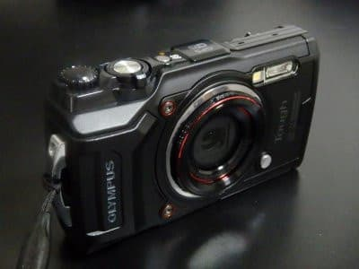
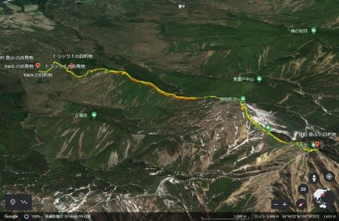
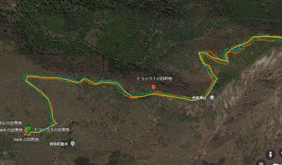
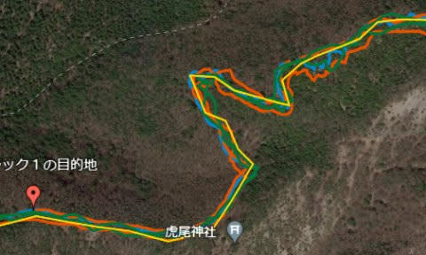
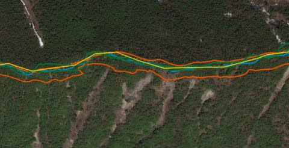
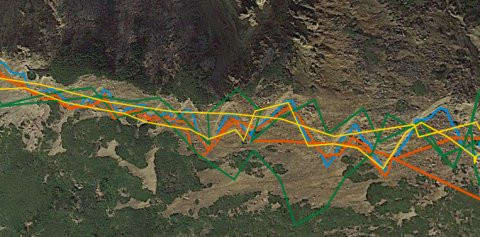
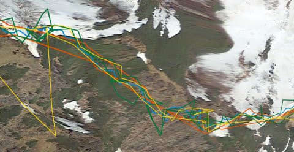
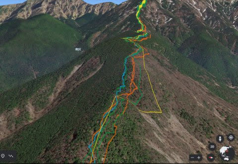
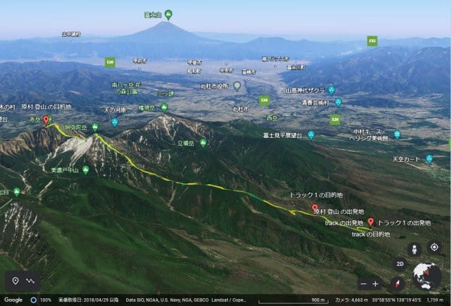

# 山歩きでのGPS精度…スマートウォッチGarmin Fenix7X，Amazfit PACE，スマホOppo RENO 3Aに加え，デジカメOlympus TG-6を入れて比較！

📅 投稿日時: 2022-08-07 02:14:11

🏷️ カテゴリ: [PC,カメラ&小物](c0d8caed13e597efe97b661a8ae56bed0.md)

えー．

金曜の夜は，12時ごろに職場から帰宅した

直後．

睡眠不足がたたったのか，そのまま倒れた

ように寝てました…(涙)

そして，今日も昼近くまで11時間ほど

そのまま寝ていたという…

いや．寝ていろと言われたら，何時間でも

寝ていられる自信があるな←自慢にならない自信だ…

あまりの眠さに，いっそこのまま

一生目が覚めなくてもいいんじゃないか？

という，何か間違った気分になりますが．

それは既に死んでいるのと何も変わらないので，

とりあえず，何とか昼前に起き出しました…

ってなことで，昨晩は更新できません

でしたが…

とりあえず，今日の本題へ．

[前回の記事](e4682e29137bf68d801a654e89418b70c.md)で，スマートウォッチ2台と

スマホで，山歩きをした際の

GPS記録の精度比較をしましたが．

これも物欲選手権に敗れ購入した

デジカメ，Olympus TG-6．

こいつもGPSログ機能をもっているので．

新たにこのGPSの精度を見てみました～！！

前回同様，Google EarthでGPS記録を

見てみるわけですが…

この軌跡の，

水色がGarmin Fenix7X

オレンジがAmazfit PACE

緑がスマホ，Oppo RENO 3A

そして，黄色がデジカメ，TG-6

です…

拡大してみてみると…

なんだか，黄色のTG-6の軌跡だけ，

えらく記録間隔が長いような感じで．

他の軌跡に比べ，角ばった感じに

なってます…

だもんで．

GPXファイルを読んで，記録間隔が

どのくらいか見てみると．

Garmin Fenix7Xは，短いときは1秒，

長い時は20秒ほどの間隔で記録してます．

移動速度が遅いと，記録間隔を広げている

ようです．

Amazfit PACEは，だいたい5秒間隔くらいで

記録していて．

スマホ，Oppo RENO 3Aは…こいつも不等間隔．

短いときは5秒．長い時は1分以上の間隔で

記録していて．

…これも移動速度で記録間隔を変えてるのかな？

そして，Olympus TG-6は…

速度に関わらず，コンスタントに30秒に1回

位置を記録しています．

…なるほど．

30秒に1回だと，こんなカクカクな記録に

なっちゃうわけだ…

ただ，TG-6は記録間隔が広くてカクカクに

なってしまっているものの．

精度自体はそこまで低くなく，

GPS電波の感度も悪くないようで，

Amazfit PACEはちょっとずれちゃったような

木立の間の道でも，TG-6の黄色の線は

Garmin Fenix7Xの水色の線からそれほど

大きくずれてはいないし…

例のジグザグな踏み跡の部分も．

記録間隔が広いので，ジグザグには

追随できてないものの．

ジグザグの間から外れることは

ないですね…

意外と精度は高そうかな？

ただ，山陰に入るのか，GPS電波が

弱いっぽいこの部分．

スマホの緑線がかなり乱れて，

Amazfit PACE君のオレンジ線はGPSが

受信できなかったのであろう，

とびとびの記録になってカクカクに

なっちゃったこの部分．

…黄色のTG-6も，残念ながら，

途中ぐるっと回ったような軌跡になってたり，

画面の左端には，大きく記録が飛んだ場所も

あります…

いや．

でも，これを見ると．

Garmin Fenix7Xの水色の記録の異常なほどの

正確さが怖いくらいですね…

とりあえず．

結果から言えば，

精度は，

Garmin Fenix7Xの圧勝

それに続くのは，

OPPO RENO3AとTG-6が同レベル．

ただTG-6は記録間隔が広いので，

記録の正確さではOPPO RENO 3Aが上かな．

そして，Amazfit PACE君は，

結構頑張ってるけど，ちょいと精度は

低め…

という結果でした！

まぁ，Amazfit PACE君はGPSとGLONASSだけで，

Garmin Fenix7XとOPPO RENO3A，TG-6は

日本の準天頂衛星みちびき（QZSS)にも

対応しているので．

Amazfit PACE君が負けるのは当然と言えば

当然…

ただ，

今回もっていかなかったけど，

Amazfit GTR君の精度は…

Amazfit PACE君と比較できなくらい悪いので．

むしろAmazfit PACE君は，みちびきが無くても

この精度を出してるので，頑張っている方かな．

しかし．

みちびき，すごいな…

準天頂衛星なので，GPSだと苦手な

ビルや木立が周りに迫り，空の見晴らしが

天頂付近のわずかだけしかないような場所でも

かなり正確な位置をつかめるし．

精度も高い！

…でも．

同じみちびき対応でも，

Garmin Fenix7Xの測位精度は群を抜いていい

ってのがよく分かりました…

って感じで，いろいろ遊べる登山ルートの

振り返りですが．

全く同じルートを通っているのに．

それぞれのデバイスで，これだけ違う

軌跡を残しているのが面白い…

（この画像からも，水色のFenix7Xの精度が高いのがよく分かる）

…そして．

Google Earth，面白いわ…やっぱり．

（こんなのをグルグル動かして，好きな角度から楽しめます！）

（Garmin Fenix7Xの使い方・使ってみたレポートは[こちら](e516b23a4874189de2e9208be87fa5184.md)）
