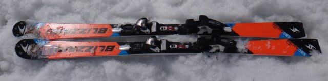
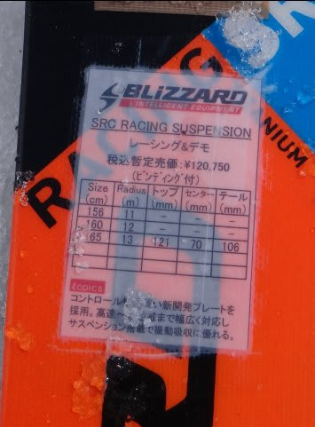
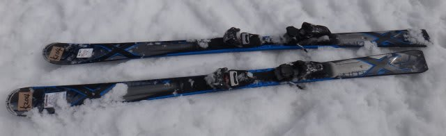
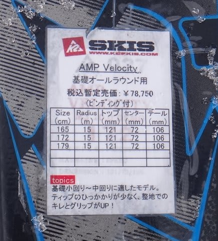

# 2014シーズンモデルのスキー試乗レポートその14…BLIZZARD&K2編

📅 投稿日時: 2013-05-22 03:08:40

🏷️ カテゴリ: [スキー板試乗](c0bd8048615710cee890e403a36cc9a2b.md)

えー．

そろそろ，このブログの読者も順調に減っている今日この頃，

いかがお過ごしでしょうか．

…スキーシーズンが終わると.

このBlogの読者数はピークの半分以下に減ってしまうんですが．

でも，まだ続くスキーネタ．

＃私はまだスキーシーズン終わってないし(笑)

試乗レポートは，今回の後に，まだVolklのPlatinum SD,Platinum UVO，

ATOMICのBLUESTER DEMO SC，HARTのCircuit9.2STが続きます～．

ということで，今回はブリザードとK2の，それぞれ1機種ずつです．

では，どうぞ～

---

BLIZZARD

SRC RACING SUSPENSION 165cm

SL競技用．

メタルが強く効いたサンドイッチ板の感じです…

コア材がこらえる感じのフレックスの強さというより，

メタルが効いたばね感のある張りの強さ，って感じ．

結構バネっぽい張りが強く，早い反応が返ってきます．

トップの先からテールの最後まで，板の長さ分のエッジがしっかり利いて，

トップがしっかり回りこんでくる小回り板ですね～．

張りが強いので，スピード耐性は十分高いです．

レベルは高いけど，かなり攻撃的な小回りができる板です．

攻める板なので，体力は多少必要とするかもしれませんが…

コアが突っ張る感じではなく，メタルが効いたばねのような強さなので，

凸凹に突き刺さる感じも少なく，ばねが雪面の凸凹に沿って曲がって行く

感じで，荒れた斜面でも，意外と行けました．

競技用ですけど，ATOMICのDEMO SXが履きこなせるくらいの体力がある人なら，

ゲレンデ小回り用としていけるか？

なんだー．BLIZZARD，いい板作るじゃないか！←なんて上から目線なんだ…

K2 

AMP Velocity 172cm

小回りベース基礎板．

基礎小回り～中回りの板って書いてあるけど…

板の返りもゆったりしてるし，サイドカーブも緩めだし，

どちらかというと，中回りベースオールラウンドって感じですかね…．

エッジグリップが強く，キンキン切れていく板ではなく，

センター幅のそこそこの太さとしなやかなフレックスとあいまって，

春雪とかやわらかい雪を蹴散らして滑っていくのに適した，

オールマウンテン的な板に感じたんですが…．

オールマウンテン板と思えば，軽快で悪雪走破性も高く，

やわらかい板をたわませていけば比較的小回りに近いところまで

いけるし．

ずらして行こうと思えば簡単にずらしていけるので．

どんな雪質でもコンディションでも，これ一本で滑るってのには

疲れない板で．

オールマウンテンと捕らえればいい板かと．

どんなシチュエーションでもいけるし，体力も必要としないし，

お気楽な板だと思います．

## 💬 コメント一覧

### 💬 コメント by (千春)
**タイトル**: 分かります！
**投稿日**: 2013-05-22 12:52:03

この日記の出だし、とっても気に入りました。

「そろそろ，このブログの読者も順調に減っている今日この頃，」って、よく分かります！

ボード以外に趣味がない私なんて、余計にそうです。

そのうち、何かの日記を書くときにキャプチャを使わせてもらいます♪

ところで、21日の、マツダCX-5ディーゼルの記事、

興味深く読ませてもらいました。

見た目よし、性能もいいらしい、

うちの車もこれに買い替えか？と思ったら、

トランクが狭いのですね。

致命的です。

### 💬 コメント by (Skier_S)
**タイトル**: 千春さま
**投稿日**: 2013-05-22 22:45:02

いや～、GW過ぎると、本当に一気に減るんですよねー。

このblogの読者…

そういった中で、なぜかプロジェクトXネタは人気なんですよね～

えーと。

で。

CX-5ですが。

トランクが狭いってのは、あくまでレガシィツーリングワゴンや

アテンザワゴンに比べてで、普通に使うには十分広いかと思います…

大丈夫ですよ！

