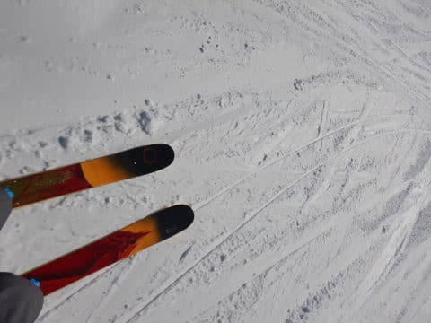

# 2022/1/22(土)の志賀高原焼額山スキー場は…朝は一瞬曇ったけど，晴天冷え冷え！雪はやわらかめだけど最高のスキー日和

📅 投稿日時: 2022-01-23 00:16:06

えー．

本日の志賀高原ですが．

良かったです．

以上．

…

…いや．ホントに今日の志賀高原．

これで終わりってもいいくらい，

晴天で雪質も良くて，混まなくて

荒れなくて…

いい一日でした…

とりあえず．

予想通りの曇り空で始まった志賀高原．

…というより，一の瀬まで晴れてて，

焼額のみ曇ってたんですが(涙)

朝イチゴンドラで山頂に上がると…

気温は-12℃と，おおむね予想通り！！

そして…

あさイチの天気は…

微妙．

山頂付近は雲の上なんだけど…

滑っていくと雲の下になる，

微妙な天気…(涙)

早く晴れてほしい…（祈）

と思っていたら．

うむ？

2本目のゴンドラで山頂に着いたころには，

さっきより明るくなってきましたよ？

そして…GSコース方面はまだ雲がかかってたけど．

パノラマコース方面をみると，なんだか

すっきり晴れているように見えます…！

これは，パノラマコース側に行くべし！！

と，行ってみると．

うはー！！

晴天っ！！

そして…晴天の良く見えるシマシマっ！！！

1本目は曇りでバーンが見にくかったけど…

2本目からはすっきりくっきり見える

最高シマシマバーン！！

素晴らしい！

これで3週間連続，晴天のピカピカやわらか

ヤケビ最高クオリティの圧雪バーンを

満喫できてます！

なんて今シーズンは雪に恵まれた

シーズンだろうか…

ただ，朝早いうちはまだ雲も多めで，

ところどころバーンが日に陰るときも

あったけど…

だんだんゲレンデが雲の上に出てきて．

午前中9時過ぎにはもう，すっきり晴天の

ガラガラバーンを思う存分楽しめます！！

ただ…

朝10時ごろには，ちょっとゴンドラに待ち

時間が（涙）

でも．

これで待ち5分くらいかな…このくらいの

待ち時間ならまだ待てる．

そして．

今日は午前10時に，旧エキスパートコース，

今シーズンからヤケビウォールと呼ばれるコースが，

ついにオープンの案内が…！！

だもんで，太板に履き替えて…

いざ，オープン直後のヤケビウォールへ！！

コース上部は膝パフですね．

もう少し深いと思ったけど…

意外と板が潜らない，ちょっと湿った雪で．

そして…

オープン5分後に行ったら，もう遅かったのか．

中盤の美味しいところはもう終わってました（涙）

中盤のおいしいところを下から見上げると

こんな感じ．

オープン5分も経つと，もうダメでしたね…

出遅れたか…（涙）

でも．

コース脇にはまだところどころ

パフパフが残ってたから，良しとしよう…

でも，今日はやっぱり，圧雪コースが

楽しいのだ！！

柔らかめの圧雪だけど，冷え冷えで軽くて

滑りいいのだ！！

そして，昼になるとゴンドラは

ガラガラになり…

このまま午後もほとんど混まず，

ゲート外に出ることはほとんど

なかった感じ！

だもんで，ゲレンデもガラガラ！

晴天で，ガラガラ！！

午後になっても，今日も大回り板で

大回りしたい放題という．

これはシアワセな一日だ…（感動）

晴天なのに，昼間の最高気温はしっかり

マイナスをキープしてくれて．

雪質は終日冷え冷えのいい雪質をキープ！

午後になって，こんな晴天で最高雪質の

GSコースが，これだけ無人でフラット

だったことがあっただろうか…！？

雲一つない晴天で，これだけ無人の

フラットバーンを滑れるなんて…

あぁ．シアワセ．

これをシアワセと言わず，何をシアワセと

いうんだろうか…（恍惚）

ってなことで．

今日は夕方に雲海が広がったりもして．

雪良し，天気よし，混雑無しの三拍子に

景色良しも加わった，最高コンディションの

一日を過ごせたのでした…

ちょっといろいろ事情があり，ナイターに

行けなかったのが残念ですが．

いい一日だった…

明日も朝は晴れて最高だと思います～！！

## 💬 コメント一覧

### 💬 コメント by (油漏れ@プロリンク以外もあちこち)
**タイトル**: Unknown
**投稿日**: 2022-01-23 12:45:49

コメント失礼します。

今日も１ゴン飛び乗り状態の幸せな焼額山を楽しんでいます。

### 💬 コメント by (カトウ)
**タイトル**: Unknown
**投稿日**: 2022-01-23 16:18:29

なんて日だ！笑

### 💬 コメント by (Skier_S)
**タイトル**: 今日もいい一日だった…
**投稿日**: 2022-01-24 01:44:34

＞油漏れ@プロリンク以外もあちこちさま

あれ？？焼額滑ってましたか！？？

私もイチゴングルグルしてましたが…

お会いできませんでしたね(涙）

＞カトウさま

朝から滑っていた私にとっては，「なんて（いい）日だ！」

って感じでした…

