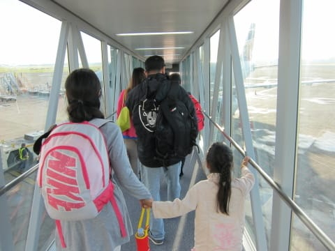

# 2013年11月　フィリピン・オスロブ　子連れでジンベエを見るぞっ！　その24

📅 投稿日時: 2014-08-07 02:36:01

🏷️ カテゴリ: [ダイビング日記](ce3a7a8d424d112fce83ee85c81a0e344.md)

ってことで．

帰国の日．

この日は，朝2時半（朝じゃなく，深夜か？？）にピックアップという

かなり無謀なプランで．

2時ごろ起きて，出発準備…

てか，ほとんど寝てませんね．

真っ暗な雨が降る中，車に乗り込んで，

車で3時間の空港まで向かうわけですが…

…なぜ，こんな早朝発になったかというと．

行きはセブ直行便だったんですけど．

帰りは直行便が取れず，マニラ経由になってしまい．

さらに，セブ～マニラの飛行機．

いい時間の飛行機があいてなくて，朝6時55分発という，

早朝発の便しか取れなかったという…

で，泊まったホテル，ルビリゾートから

空港までは，車で3時間…

となると．

2時半ごろにはホテルを出ないと間に合わない，と．

ってことで．

車で3時間熟睡していると，

朝5時過ぎに空港へ到着．

時計は5:11を指してます…

…はぁ，眠い…

セブの空港は，地方空港の割に結構にぎやかで．

お店も多く，早朝からちゃんとお店が開いてますね～

そして，早朝眠い中，1時間ちょい待つと…

出発時間の6時55分が近づき，搭乗！

飛行機大好きな娘．

ちゃんと緊急時の

説明パンフレットを読んでますね…

で，離陸しますが…

台風が近づいて晴れたり曇ったりの天気でしたが，

この瞬間は晴れてますね～

で．

セブ～マニラ間は，わずか1時間20分．

でも，こんな感じのスナックがちゃんと出ます．

前回のタイと言い，アジア線はまだ

国内線でも，いろんなものが出ますな…

ってことで．

うちの娘にとっては短い1時間20分で…

マニラ空港へ到着です…

マニラ空港は，台風が近づいてきている影響で，

雨が降ってましたが…

まだ風はそんなに強くなく，

何とか，飛行機は無事に飛びそうですね～．

一安心…

でも．

今回の旅行．

出発前に一番心配していたのは．

ここからなのだ…
