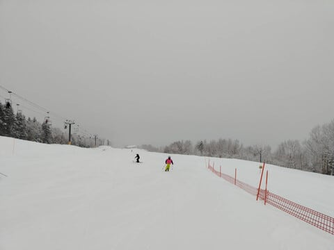
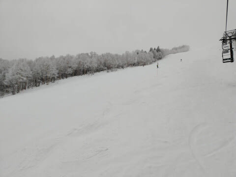
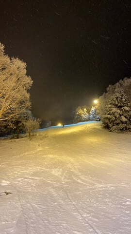

# 明日から1泊2日で志賀高原へ復活！…だけど，今日の午後の志賀高原は全面春のアイスバーン祭りだったみたい…

📅 投稿日時: 2024-02-24 00:26:36

えー．

本日から3連休だったわけで．

多数の特派員が志賀高原に行っていた

ようですが…

私がスキーに行けない日だったので，

いろいろ念波を送っていたために，

コンディションが良くなかったようで…

全然うらやましくなかったですね．

ええ．

うらやましくなかったです…

あさイチの積雪はわずか2-3cmほどで．

まぁ，この積雪があったおかげで，

あさイチは下地が硬かったものの

比較的まだマシだったようですが…

天気は終日曇り空でバーンも見にくく，

表面の柔らかい雪が削られた午後は，

コース全体が

志賀高原 春の全面アイスバーン祭り

になったようで．

全面的にボコボコガリガリに

なっていったようです…

まぁ，ナイターはまだ圧雪がかけなおされて

マシだったみたいですが…

でも，ところどころ硬めの下地が出ていて．

昼間よりマシとはいえ，2月のナイターと

考えるとちょっと残念な感じ…

ということで．

3連休の初日の本日は滑れませんでしたが．

…そして，1日スキーに行かずに仕事をして

いたというのに，仕事が全く終わって

いませんが．

明日から1泊2日で志賀高原に復活です！！！

明日の土曜は曇りのち晴れ．

明後日の日曜は朝のうち晴れ，のち曇り．

どちらも積雪は全くなく，

かつ気温は低めのままなので…

アイスバーン祭りが続きそうです（涙）

かなり盛大な祭りが続きます．

とりあえず．

アイスバーン祭りに参加してきます～！

…またいつも通り，あと3時間半後に出発．

3時間しか寝れない…（泣）

## 💬 コメント一覧

### 💬 コメント by (大阪のK)
**タイトル**: Unknown
**投稿日**: 2024-02-24 05:49:03

アイスバーン祭は盛大でした。

特にファミリー正面は、立ってられない位で処置なし(涙)

エッヂを研いで臨んだのですが、午後は歯が立ちませんでした😭

どうやって滑れば良いの？

教えて！

### 💬 コメント by (Skier_S)
**タイトル**: ＞大阪のKさま
**投稿日**: 2024-02-25 00:17:42

昨日はアイスバーン祭りだったみたいですが，

今日は結構楽しめましたね～！

やっぱり私が来たから雪がよくなったんですよ…！←違うから

### 💬 コメント by (カンタロス)
**タイトル**: Unknown
**投稿日**: 2024-02-25 07:51:07

Sさまこんにちは。

やはり、Sさまの呪いでアイスバーンだったのですね(笑)いい状態で滑れたようでなによりです。きっと仕事を頑張ったご褒美ですよ！

大坂のKさま

横合いから失礼します。アイスバーンの滑りかたに悩んでらっしゃるようですので…。

個人的に心がけている今年を。

・板を常にオシリの下におく（正確にはビンディングのヒールピース、内径角をとらないという意味ではありません）

・力をターンの内に使う。

・トップ荷重を強くする

・某国内メーカーではなく、海外メーカーの板を使う（可能なら基礎ではなく、競技ベースの板）

プライズはおろか指導資格も一切待っていない、いちレジャースキーヤーの戯言ですが、参考になれば…。

### 💬 コメント by (Skier_S)
**タイトル**: ＞カンタロスさま
**投稿日**: 2024-02-26 00:52:16

金曜はかなりひどかったようですが，土曜に回復したのは私のおかげです（笑）．

でも，日曜は最悪でした…（泣）

土曜1日だけ，奇跡のコンディションでした…

