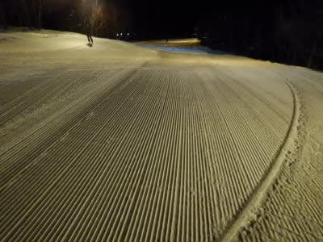

# 2021/2/27(土)の志賀高原スキー場，特派員情報！…冷え冷え朝10㎝新雪，昼からすっきり晴れのいいコンディションだったようで…

📅 投稿日時: 2021-02-28 00:22:35

🏷️ カテゴリ: [日記](cc4b5682fb7b8b144980957a978653fb0.md)

昨日は，志賀高原に特派員が誰もいないかも…！？

というところ，何とか1組の特派員が

午後の西館レポートをしてくれた…

という危機的状態だったわけですが．

本日は土曜なだけあり，大量の特派員から

数多くの写真＆レポートが生中継のように

次々LINEに送られてきました…！！

ってなことで．

本日も志賀高原の特派員レポートです！

まず，本日朝の長野は雪だったようで．

朝7時過ぎに，

「信州中野ICのチェーン規制で

渋滞が2㎞以上．20分くらいハマった」

という生報告が2組から立て続けに送られてきた

ところから始まった本日．

意外と朝は積もったようで…

朝の積雪は，駐車場で10㎝！

…あれ？

今日は積もらない予想だった

はずなんだけど…(涙)

そして，朝イチの気温は-12℃と．

-10℃以下の冷え冷えの予想が当たり…

朝は曇り～雪降りの天気で，

硬く締まった圧雪の上に超軽い新雪が

10㎝ほど乗ったバーンだったようで…

結構いいコンディションだったようです！

ただ，さすがに土曜だけあって，

9時過ぎには焼額第1ゴンドラも…

奥志賀ゴンドラもかなりの列に

なってしまったようで…

やっぱり，乗車定員が絞られていて，

相乗りも原則禁止になっているゴンドラ．

かなり待つようで…

焼額は，掲示では最高30分待ちと

なってたみたいです．

でも，朝の冷え冷え雪のおかげで．

奥志賀・焼額方面はゲレンデの雪質は

かなり良かったようです！

下地がガチガチなのかな？

と思ったら，そうでもないようで．

締まった圧雪の上に冷え冷え

トップシーズンの軽い雪という．

それでいて，朝はときどき強く降っていた雪が…

昼前には晴れていったようで．

昼からは私の予想通り，すっきり晴れに

なったようです…！！

すっきり晴れなのに，昼間でも気温は-3℃と

そこそこ冷えてくれたので．

午後までいい雪質をキープして．

かつ，荒れずに夕方までフラットバーン

だった…というのは，うらやましいところですが．

ゴンドラは，昼休みに一瞬人が減った以外は

ゴンドラ混雑も夕方までキープされたようで．

焼額は午後になっても1ゴンも…

2ゴンも，終日5～15分程度の

待ちがあったようです…

でも．

午後は天気も良く，雪も良く．

これでいて冷えていたってのは，

うらやましい限り…

あ，でも．

一の瀬方面は，寺子屋と高天はマシだったものの．

一の瀬ファミリーは正面バーンもパーフェクターも

ツルツルの上にモサモサ雪で，ちょっと楽しく

なかった…というレポートも入ってました．

…で．

そして．

本日．

なんと．

ナイターに行った特派員も多かったようで…

飯テロ写真ならぬ，

シマシマテロ写真が…！！！

朝に積もった冷え冷え雪が圧雪された，

極上のシマシマナイターだったようで．

…今日で焼額ナイターは今シーズン終了の

はずですが．

最高のコンディションでシーズンを締めくくった

ようですね…

ってなことで．

今日も，特派員の皆様ありがとうございました～！！

ってな感じで．

この特派員レポート．

緊急事態宣言でネタがないための緊急避難的に

始めたわけだったんですが．

数多くの写真が特派員から送られてくるように

なった最近．

…来シーズン以降も，平日は特派員レポート

書いた方が，

休日だけじゃない毎日の志賀高原情報を

見れて，読者的にはうれしいんじゃないかな…？

という表向きのもと．

来シーズンも特派員ネタ乗せ続ければ，

平日のネタに困らなくて済むから，楽かも…

…と，黒い心で思い始めてきた，

Skier_Sだったのでした…

## 💬 コメント一覧

### 💬 コメント by (ダウンヒル)
**タイトル**: Unknown
**投稿日**: 2021-02-28 01:18:37

ブログ主のS様、特派員の皆さま。日々のレポートお疲れ様です。

１ゴン長蛇の列で奥志賀に回避後、特派員さんらとのセッションを期待して回帰したら...嬉しいことに即、合流できセッション開始。あー、めっちゃ楽しい!!!

そして、私にはこんな声が聞こえた...

"頑張ったおぬしにはご褒美を授けよう..."

(*・・)σ ⌒・ ﾎﾟｲｯ=====★ｷﾗｰﾝ

ダウンヒルのクレイジー度が１コ増え、２になった。

### 💬 コメント by (ヒータロゥ)
**タイトル**: Unknown
**投稿日**: 2021-02-28 20:43:39

ヤケビ、奥志賀方面は激混みと予想し、熊の湯、横手山に参戦。素晴らしい天気、バーンにもかかわらず空いてました。午後からは山の駅に車を移動し、新設ゴンドラに乗って、ジャイアント〜一の瀬まで遠足。ここも混雑なし。充分に楽しみジャイアントからゴンドラで山の駅に帰ろうとしたらなんとゴンドラ故障！蓮池経由で帰ることを余儀なくされ疲れました。

ところでヤケビゴンドラは個人的には仲間でなくても４人乗りしてもいいと思います。みんなマスクしてるし大丈夫じゃないですかね？現状では待ちが長すぎかと。ゲレンデはすいているのに。

### 💬 コメント by (いか)
**タイトル**: Unknown
**投稿日**: 2021-02-28 22:28:25

今週末はやっと白馬にも風のない穏やかな週末が訪れました(2月に入ってから、ずっと週末だけ爆風で上部運休…)。

そんな私は本日夕方、黄色いお店で来シーズン用のブーツを引き取りに行きましたが(この時点で負けています)、気付いたらSalomonのGS Pro 183を持って帰っていました。魔界です…

### 💬 コメント by (Skier_S)
**タイトル**: 今週は一週間ダメっぽい
**投稿日**: 2021-03-01 01:28:18

＞ダウンヒルさま

特派員との交流，楽しまれたようで何よりです…

クレイジーなメンバーに囲まれてクレイジー度が上がりましたか（笑）．

あのメンバーと話していると，だんだんいろんな基準がおかしくなっていきますよ…

＞ヒータロゥさま

あれ！パルスゴンドラ故障だったんですか…

まだ新しいのに．

ヤケビゴンドラ，相乗り原則禁止で列が伸びているようですが．

うーん．この状況だた仕方ないのかもしれません．

今は早くコロナウイルスの感染が一刻も早く収まることを祈るばかり…

＞いかさま

ずっと八方参戦されてるんですね．

そして，八方は悪天候なんですか…今年は雪は十分あるんですか？

そして，SALOMONのGS Pro 183ですか…

人がいるゲレンデでは，なかなか使いにくい板なんじゃないでしょうか（笑）

### 💬 コメント by (いか)
**タイトル**: Unknown
**投稿日**: 2021-03-01 18:46:48

>Sさま

今年は1月の貯金で、白馬・小谷エリアは下まで全面滑走可能ですが、下は3月の暖気を乗り越えられるか、、、？といった状態です。ちなみに、今年は八方だけでなく、白馬・小谷エリアの色々なゲレンデに行っています、普段行かないところにもたくさん魅力がありますね。

ちなみにロング板はもともと人の少ない場所、時間帯限定なので、問題ないです（笑) 17Atomic GS GSはなんとか4シーズン持ちましたが、アイスバーンで乗ったら板が帰ってこない、久しぶりの感覚を味わいました。これでRush SLに続き、Salomon板にAtomicビンディングが2セットになりましたw

### 💬 コメント by (Skier_S)
**タイトル**: ＞いかさま
**投稿日**: 2021-03-02 01:27:29

去年は悲惨だったけど，今シーズンはまともに下まで降りられるんですね…！

ロングの板，17ATOMICだったんですか．

あの滑りで4シーズンもったなら長持ちした方かと（笑）．

これで，ロング＆ショートがATOMIC/ATOMICだったのが，

どちらもSALOMONになっちゃったんですね．

でも，ビンディング使いまわせるからいいですよね

