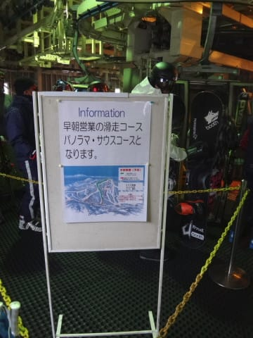
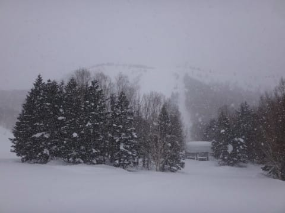
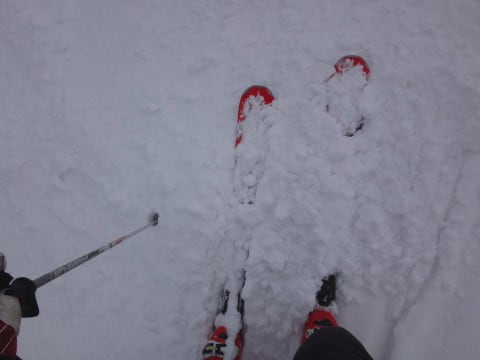
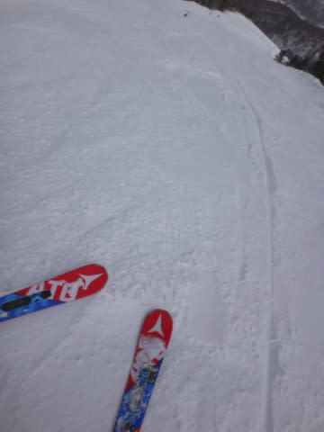
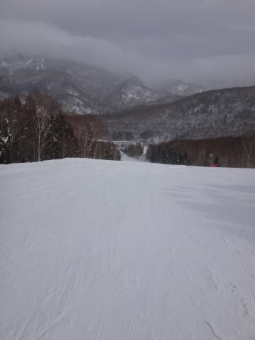
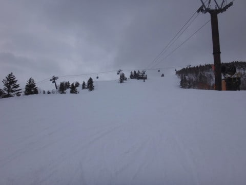

# 3月26日，日曜の志賀高原速報モード…雪降り，真冬の一日．すごいいい雪だったよ！

📅 投稿日時: 2017-03-27 03:47:25

ということで．

今日は（も？）最終ゴンドラまで滑ったあと．

のんびり温泉に寄って，夕食を食べての

帰宅だったのですが．

帰宅途中に襲う睡魔に勝てず．

高速のPAで1時間ほど熟睡してしまい．

帰宅したら，深夜2時…（涙）．

だもんで．

今日も日曜深夜恒例の速報モードで！

日曜朝．

目が覚めて，気が付くと…

あれれ？

なぜか焼額第2ゴンドラ乗り場に

立っている自分．

…あれ？

なんだ，これは…！？？

確か，昨日はナイターラストまで

滑ったはずなんだけど…

なぜ気づいたら早朝の営業開始に

並んでいるのだ？？

どうやら，寝ぼけているうちに，

無意識に早朝営業に来てしまったようですっ！←違うから…そんなわけないから

でも．

おかげで．

最高の冷え冷えハイスピードシマシマバーンを

たらふくいただきました～！！

そして．

本日は，朝から雪がぱらつき．

時折激しく降るという，

予想が概ね当たった感じの天気でしたが…

なんと．降っている雪は，湿った雪ではなく．

トップシーズンに近いかなり冷えた雪！

おかげで，ゲレンデコンディションは

3月末と思えないくらい最高なんですが！

トップシーズン並みなんですけどっ！

さらに．

人が少なかった焼額．

夕方のゴンドラストップまで，

超フラットバーンなんですけど！？？？

…ってことで．

天気はすっきり晴れとはいかなかったものの．

3月末ではありえないレベルの最高雪質の

冷え冷えフラットバーン＆ガラガラの一日で．

今日も最高でしたよ～！！！

…また明日，詳細レポートしますので．

しばしお待ちください…

そうそう，

今日は．

かねてよりお会いしたいと思っていた．

[キレキレターン少女＆そのお父さん](https://www.youtube.com/channel/UCdeK4rOu5gO_jbO2IJDyhtQ)とご一緒させて

もらいました～！

今日はありがとうございました＞Bathurstdreamさま

いやーーーー．

クローチングを組み直滑降し続けたうちの娘が

全然追いつけないという，謎のスピードで

深回りし続ける娘さん．

…これで，うちの娘と1歳しか違わないとはっ！！！（驚愕）

もう，娘さんの滑りも衝撃的でしたが．

ゴンドラの中でのお話も衝撃的で（笑）．

Bathurstdreamさん「奥志賀第3高速ペアだけで，1日滑走標高差12000m滑ったことあります」

私　「…え？ぇえっ！？？」

…これ．

分かる人には分かる．

標高差がほとんど稼げない第3ペアで，12000mって…

ありえない…！！

志賀高原には．

やっぱりすごい人が集まるんだなぁ…（感動）

…と，思ったSkier_Sだったのでした．

## 💬 コメント一覧

### 💬 コメント by (まいる)
**タイトル**: 昨日はお疲れ様でした
**投稿日**: 2017-03-27 06:37:51

Sさん、待たしても会えず残念です。

昨日はずっとスキー履いてて、1ゴンを５、６回乗ってキョロキョロしてましたが・・

オリンピックコースあたりでとても上手な娘さんを連れたお父さんをみましたがマテリアルがちがかったし

たぶん、ゲレンデですれ違いはあったのでは？

昼食を西館で食べて帰宅しました。

志賀高原は来シーズンですね・・

### 💬 コメント by (michi)
**タイトル**: お疲れ様でした
**投稿日**: 2017-03-27 08:15:33

昨日はご家族の方やお知り合いの方がたくさんいらっしゃったみたいであまり会話出来ませんでしたね。

板は物色していましたが来シーズンまで我慢の予定です(^^)

私ごとですが転勤になったのでたぶん今シーズンは昨日で最後になりそうです。

### 💬 コメント by (はなげ親分)
**タイトル**: まさかの…
**投稿日**: 2017-03-27 14:39:20

昼・晩・朝・昼の4連投、お疲れ様でした

さすがS様、神セブンの名にふさわしいご活躍ですね!!

また、朝の部はご一緒頂きありがとうございました。

昨日はカミさんのご機嫌取りの為、昼に切り上げたのですけど、これが体に優しいのがわかってしまいチョット怖いです(笑)

### 💬 コメント by (megalith)
**タイトル**: Unknown
**投稿日**: 2017-03-27 14:42:17

>>どうやら，寝ぼけているうちに，

>>無意識に早朝営業に来てしまったようですっ！

Skier_Sなら平常運転じゃないかと・・・・

とあえて突っ込んでみたりする(笑)

自分のところも雪がほとんど溶けましたが、まだ寒く時折雪が舞っています。

そのため、念のためでスタッドレスが外せません。(^_^;)

今年はけっこう遅くまで雪が残りそうです。

### 💬 コメント by (megalith)
**タイトル**: Unknown
**投稿日**: 2017-03-27 14:43:41

失礼、Skier_Sさんの敬称が抜けていました。m(__)m

### 💬 コメント by (Goku)
**タイトル**: お世話様でした
**投稿日**: 2017-03-27 18:58:03

二日間お世話様でした～♪

大勢で滑れて楽しかったです。

キレキレ少女を追いかける娘さんのスピードも凄かったですね。

しかも、ＧＳコースをノンストップで何本も！

将来はダウンヒラー決定！

### 💬 コメント by (まうちゅう)
**タイトル**: Unknown
**投稿日**: 2017-03-27 20:36:41

やっと会うことができて良かったですね！

同じ年頃の娘さんを持つお父さん同士、悩み事など話が合いそうですね。

### 💬 コメント by (Skier_S)
**タイトル**: 恵まれた週末でした…
**投稿日**: 2017-03-28 07:11:42

＞まいるさま

あ，今回はスキーだったんですね．

私も日曜は終日1ゴンを回し続けてましたが…

すれ違いだったようで，残念．

そのすごい上手い娘さんとお父さんは，

おそらく記事に書いた天才少女親子かと．

うちの娘はそこまで上手くないですから…（笑）

＞michiさま

日曜午後は，私としては珍しく8人という大所帯で滑ってました（笑）

しかし，転勤ですか？

お引越しされるのでしょうか…大変ですね．

スキー場が近くなるなら，ちょっと救いかもしれませんが（笑）．

＞はなげ親分さま

本人も想定外の4連投でした．

いや，ホントにたまたま6時前に目が覚めたので，

これは神が「早朝スキーに行け！」と言っているに

違いない，と思いまして…←違うから

＞megalithさま

いや…

私もそうそう滅多にはナイター⇒早朝はやりませんから（笑）．

といっても，5-6回はやったことがある気がしますが…

しかし，この3月は冷え冷えですね～．

帰り道も，軽井沢を超えるまでかなりの雪が降っていて，

まだまだハイシーズンのような錯覚に陥ってます．

＞Gokuさま

日曜はお世話になりました！！！

天才少女親子にご紹介いただいて

ありがとうございます～！！

いやーー．

まさか焼額でみんなでコラボできるとは

思ってませんでした…

しかし，わが娘の鍛え方がまだ足りないかな？

という感じでしたが．

GSコースをノンストップでクローチングで直滑降し続けた娘を見て．

お友達がいるとやる気を出すんだなぁ…

と思いました．

娘と一緒に滑ってもらってありがとうございました～！！

＞まうちゅうさま

いやーーー．

念願のスーパー少女親子さんにやっとお会いできましたよ～！

先週まで，かなりの頻度で奥志賀に行ってなかなか会えなかったのに，

たまたま子連れの週に，焼額でお会いできるとは…

お話はいろいろ盛り上がりました．

同じ子連れとして，すごい参考になることばかり…

刺激的な時間を過ごせました！

