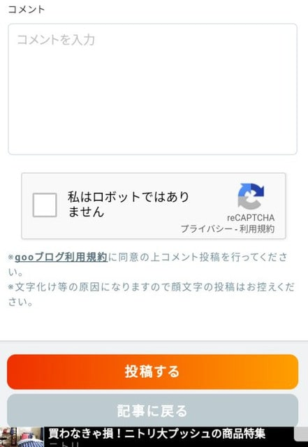
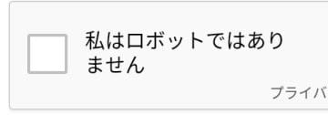

# 3連休は太陽拝めず，パウダーも無し（涙）．でも，吹雪いたりせず穏やかな冷え冷え3日間．明日から志賀高原で滑ってます～！

📅 投稿日時: 2019-02-08 22:49:34

🏷️ カテゴリ: [日記](cc4b5682fb7b8b144980957a978653fb0.md)

ってなわけで．

このBlogのスマホ版．

昨日も書いたように，かなり見た目が変わり．

んで．

コメント記入欄も，こんな感じで

ちょいと変わったようですが…

（こんな感じになりました↓）

…うむ？

なんだ，これは？？？

なんだか，謎のチェックボックスがありますね…

このボックスにチェックをしないと，コメントが

投稿できなくなったんですか…

…ただ，読者のうちのかなりの方が．

サイボーグやスキー特化マシーンである，

このBlog．

スキーに最適化された機械の体をもつ，

このBlog常連の皆さんの中には．

「あ，俺スキーロボットだわ．ここにチェックできないわ…」

と思って，コメントが投稿できなくなった人も

いるのではないでしょうか．

おそらく．

このBlog．

そういう，朝から晩まで休まず止まらず滑るような，

人間離れした特殊な人がコメントを残せないように，

このチェックボックスを作ったのです…（嘘）

ってことで．

「私は人間だ！」と信じている，普通の皆様に

おかれましては．

安心してこのチェックボックスをチェックして

コメントしてやってください…

で．

この3連休ですが．

天気はおおむね水曜の予想通り．

…ただ，最終日はちょっと変わりました．

明日の3連休初日は，

　朝から曇り空．

　-10℃以下と寒く，いい感じの圧雪で朝はスタート．

　昼間も曇り～雪がぱらつく天気で，

　気温は-5℃を上回らない．

　前日までの積雪で，朝のうちはアイスバーンは

　隠れているものの，急斜面や人が多い斜面では，

　じきに上の柔らかい雪がはがれて，下地の

　ツルツルが出てくる．

明後日中日は，

　朝は10cm弱，うっすら新雪が積もっている．

　朝の気温は-15℃クラスの激冷え．

　あさイチの圧雪コースは柔らかめで，いい感じ！

　朝は雪が降っていて，じきに止んで

　曇り空が続く一日．

　昼間も-10℃近い，冷え冷えデー．

　人が多い3連休中日なので，昼ごろには

　斜度のあるところはツルツルな下地が出てきそう…

　午後は底がツルツルの凸凹斜面になっちゃうかな．

最終日は，

　朝はパラパラ雪降り．

　うっすら積もる程度で，ほぼ積雪なし．

　朝イチの気温は-11～-12℃くらい．

　この日は終日，曇り～雪がちらつく感じ．

　昼間の気温も-5℃程度と冷え冷え．

　でも，最終日は人も少なく，午後まで

　そんなにゲレンデも荒れず，そこそこ

　いいコンディションで滑れるかも…

ってな感じで．

もしかしたら晴れるかも…という最終日も，

曇り～小雪という予想になりました（涙）

でも．

この3日間．

吹雪いたり荒れたりすることもなく．

割と穏やかな3連休になりそうです…

では，あと4時間後に出発です．

また志賀高原でお会いしましょう～！

## 💬 コメント一覧

### 💬 コメント by (若杉勲71)
**タイトル**: Unknown
**投稿日**: 2019-02-09 12:49:04

またもやニアミス

朝一番奥志賀ダウンヒル4本41分でしたよ。久々にあの頃のペースが・・・。その後のエキスパートがまさにベストコンディション。ウハウハ滑っていたけれど、今日こそご尊顔を拝見しようとヤケビへ。ゆみりんさんによると、sご尊師は奥志賀を二本滑ったあと自宅のあるヤケビにお帰りになられたとか。ゴンドラからご尊師を発見。でも待てど暮らせど・・。その後3高リフトから、オリンピックを恍惚の表情で(推測）まるで大鷲のように自然と同化して幸せの絶頂期にいるであろうご尊師を拝見。今度こそはと待ったけど、神は楽しみをあとにとっておいてくださいました。

### 💬 コメント by (ゆうこ)
**タイトル**: Unknown
**投稿日**: 2019-02-09 18:02:18

志賀高原満喫されてますか？

私は、ついに子供用のスキーセットを買ってしまいました。しかも、Sさんと同じ黄色いステッカー付きです。

明日は日帰りで、昔おススメいただいたブランシュたかやまに行ってこようと思います！

子供を早くスキーヤーにしたいです。

### 💬 コメント by (Skier_S)
**タイトル**: 今日はアイスバーン…
**投稿日**: 2019-02-09 23:11:07

＞若杉さま

今日もニアミスでしたね…

朝イチ，奥ゴンの上から何度も見てたんですが．

そして，焼額でも．

特に待っていたわけではない，某M先生には何度もお会いしたのに．

待っていただいていた若杉さんに会えないとは…

また明日も焼額をグルグルしていると思います．

（状況によっては奥志賀に逃げるかもしれませんが…）

またお会いしましょう！

＞ゆうこさま

久しぶりのコメント，うれしいです～．

志賀にいらっしゃらないので，いつも気になっていました．

ついにお子さんスキーデビューですか！！

ブランシュの子連れ専用休憩所はいいですよ．

スキーの先端を止めてプルーク姿勢を簡単に作れる，

トライスキーを準備することをお勧めします．

滑れるようになったら，ぜひ志賀へお越しください…

！！

### 💬 コメント by (ゆうこ)
**タイトル**: Unknown
**投稿日**: 2019-02-11 10:20:31

ブランシュたかやま、激烈に混んでましたが楽しかったです。小さなスキー場でもあんなに混むんだと、これからのスキー人口に希望が持てました。

うちの子は、トライスキーを装着して、下のなだらかなコースはまぁまぁ楽しく滑れてました。半分くらいは私の足の間にいましたが。かなりの初心者向けコースで子供にはちょうど良かったので、また行きたいなと思いました。もはや、ほとんど傾斜がないところもありましたし。（上部の中上級コースは硬くツルツルバーンでした。連れて行ったらうちの子は号泣してました。）

志賀高原には、今年も1月の三連休に行き、その時レンタルで子供をスキーデビューさせたらもっとやりたいと言うので、マイスキー買ってあげました。まだ、志賀高原で滑っても一ノ瀬ばかりで、なかなか他までちねやいです。次の志賀高原は、決まってるのはGW前半です。来週末は、草津温泉で温泉とスキーを満喫してきます。

### 💬 コメント by (Skier_S)
**タイトル**: ゆうこさま
**投稿日**: 2019-02-15 02:49:24

このコメントへの回答の長文を書いて投稿したはずなのに…

反映されてませんでした（涙）

コメント回答遅れてすいません．

ブランシュたかやま，混んでたんですね…

でも，子供も楽しめる初心者コースもあるし，

楽しめて良かったですね！

トライスキーを着けて，

「足を広げたら止まる」

ことを教えて．

完全に自力で止まれるようになったら，

だんだん斜度が急な所でも止まれるように

練習をしていけば，すぐにどんな斜面でも

滑れるようになりますよ…

志賀は，一の瀬ファミリーの天狗コースが

滑れるようになれば楽しめるかと…

GW前半，志賀高原でお会いできるといいですね～！

草津，楽しんできてください．

