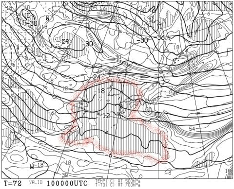

# え？10日の日曜は，降らなさそうな予感っ！！？？…私の踊りが効いたのかっ！？？？

📅 投稿日時: 2019-03-08 02:12:39

えー．

現在の志賀高原．

降ってます．

積もってます！！

それも．

蓮池で気温は-8℃近くと．

いい感じで冷えてるので．

冷え冷えのいい感じの雪が

積もってます！

…そして．

麓の上林チェーンベースまで，雪ですよ！

かなり積もってますよ！

（[北信建設事務所HP](http://hokushin-camera.org/)より）

本日，木曜の昼間に降った雪は，

かなり重い雪だったようですが．

明日の朝は，トップシーズンの雪で

滑れますよ～！！

焼額も．

夜10時半の段階で，すでに

積雪20cmのようです…っ！！

（[焼額山FB](https://www.facebook.com/yakebitaiyama/posts/2074024789359523)より）

昨日の予想で．

　8日金曜は．

　朝までに冷えた雪が20cmほど積もり．

　昼ごろには晴れてきそうなので…

　かなりいいコンディションに

　なるんじゃないかな！

と，書きましたが．

すでに20cmなら．

明日の朝は，冷え冷えの20cm以上の積雪に

なりそうです…！

そして，明日金曜は．

昼間でも-5℃程度までしか上がらず．

朝は雪がぱらついてるかもしれないけど．

遅くとも昼．

早ければ，リフト営業開始後

しばらくくらいで晴れてくるので．

おそらく最高の一日になりそう…！！

あぁ…

金曜に滑れる人がうらやましい…っ！！！

そして，土曜は．

こんな感じですっぽりと高気圧に覆われて

いるので…

一日すっきり晴れの，スキー日和で．

…昼間に気温がプラスまで

上がって，日差しが当たる

東～南斜面は雪が緩んじゃいそうだけど．

朝イチは冷え冷えのいい感じの

バーンで楽しめそう…！

北斜面の奥志賀，西斜面の一の瀬

ファミリーは，昼間もそれほど雪が

緩まないんじゃないかな．

さらに．

強烈にいいニュースっ！！！

昨日の予想で．

日曜の午後はダメっぽい

と，書いた日曜日．

…なんと．

なんと．

なんとっ！

夜9時の地上天気図を見ると…

降水域が志賀高原に達していませんっ！！

低気圧の移動が，予想より遅くなりましたっ！！

これは…日曜の夜9時になっても，

志賀高原に降水は無いということなので．

日曜はリフト営業終了まで，

天気はもちます！！

それどころか，日曜朝9時の，

700hpa湿数を見ると…

赤く囲った湿数0の領域．

…低気圧の接近時には，大体この領域が，

雲がかかる領域なんですが．

これが，志賀高原にかかってないので…

…これすなわち．

日曜の朝は，晴天でスタートかも？？

だとすると．

日曜朝も，気持ちいい晴れの締まった圧雪で

スタートしそう！！

…850hpa気温を見ると．

0℃線は志賀高原の北まで上がっているので．

残念ながら，気温は上がりそうだけど…

でも，昼近くまで晴れていて．

昼から雲が増えていく感じかな…

とりあえず．

リフト営業終了まで，降らずにもちます！

気温は上がりそうだけど．

昼から曇って，強烈な日差しが和らぐ

ことを考えれば…

この日も，日が当たる東～南斜面以外は，

雪質はそれほど悪化せずに済みそうな

予感…っ！！

ということで．

この週末の，修正予想です．

基本的に，土曜はほとんど変わってませんが．

日曜が大きく変わりました～！

9日土曜：朝，通常営業開始の8時半は-2～3℃程度．

　放射冷却が入るので，早朝はもっと冷えそう．

　朝から晴天！この日は終日晴れるよ！

　雪は前日までの雪が圧雪された，

　いい感じに締まった圧雪．

　朝イチは最高！！

　…ってか，この日から営業開始の

　焼額第1ゴンドラの6:30からの

　早朝営業．激烈に楽しいんじゃ

　なかろうか…

　ただ，昼に向かって気温は上がり．

　最高気温は+2～+3℃程度まで上がりそう．

　西館や東館，焼額なんかのちょいと南に

　向いた斜面と，標高の低い丸池，蓮池，

　サンバレーは雪が緩みそうだけど．

　北斜面の奥志賀，西斜面の

　一の瀬ファミリーは，午後まで

　わりといい雪質をキープするかな．

　まぁいい感じの一日．

10日日曜：朝は晴れそう！

　朝はそこそこ冷え込むので，

　締まった圧雪．前日に雪が緩んじゃった

　コースは，すぐにコロコロが

　出てきそうだけど，

　それ以外は朝イチはいい感じで滑れそう！

　午前中から雲が増えていき．

　昼過ぎには完全曇り空になっちゃうかな．

　昼間の気温は+3℃くらいまで

　上がりそうなので，

　午前中に日が射す，東側の斜面は

　雪が緩みそうだけど…

　午後は日差しが緩むので，朝日を

　浴びるバーン以外は，雪はそれほど

　ひどくならないかな…

　リフト営業終了まで，液体が

　降ってくる心配はありませんよ～！！！

ということで．

いや～．

この，日曜の予想．

かなりいい方にずれて行ってくれてますっ！

…ふはははははは．

そうです．

今さら言うまでもありません．

これはみんな，

私の全身全霊の冷え冷え踊りのおかげです！！

皆の衆，私に感謝…（ドスっ）←読者に刺殺された音

## 💬 コメント一覧

### 💬 コメント by (若杉勲71)
**タイトル**: Unknown
**投稿日**: 2019-03-08 06:53:03

恵みの雪ですよ。湯田中は30積雪です。雪かきに疲れました。

### 💬 コメント by (はなげ親分)
**タイトル**: Unknown
**投稿日**: 2019-03-08 10:38:13

業務連絡～

現在、雪は小降りになってきましたが、風はいまだ止まず奥ゴンは運休、2ゴンは減速運転、1ゴンのみ頑張っている状況です。山頂付近は視界不良で滑りにくいです(泣)

### 💬 コメント by (ホンダ)
**タイトル**: Unknown
**投稿日**: 2019-03-08 16:00:19

今日のヤケビは？朝イチオリンピックは積もっていました。串刺しになりホイホイ状態になりました。まだまだ修業が足りません。奥志賀のエキスパートを回しバスに乗りを繰り返して5本滑りましたよ。さすがに疲れたので今日もレインボーになりました。辞めた途端に晴れてきました☀️。明日は晴れてくれますかね？明日早朝皆さまお待ちしていますよー。

### 💬 コメント by (いさ)
**タイトル**: Unknown
**投稿日**: 2019-03-08 18:05:41

現地レポでーす。

ずっと降り続いてましたが、最後数本、晴れてきました〜。まるで明日の為に降っていたかのよう。天候まで変えてしまうとは恐るべし。

今日は、少し重めのパフパフ、おなかいっぱいいただきました〜。

明日朝イチのお天気もお願いしまーす。

### 💬 コメント by (かず)
**タイトル**: Unknown
**投稿日**: 2019-03-08 20:17:56

まだ膝が痛く階段まともに降りれませんがラストチャンスと思い本日きました　想像より雪かなり良かったです　埋まると立つ時毎回激痛でしたけど…　奥志賀が13時からオープンがさらに良かったです　明日は圧雪期待できます　しかし火曜にはカタカチなんて悲しいですね

### 💬 コメント by (Skier_S)
**タイトル**: なぜ平日なのに，こんなにたくさんの人が焼額にいるんだろう…
**投稿日**: 2019-03-08 21:57:14

＞若杉さま

湯田中も結構積もったんですね！

これで，今週末のコンディションは良くなってくれそう…

＞はなげ親分さま

まさか金曜からいらっしゃってるとは…

午前中はちょっと視界が悪かったようですね．

でも，新雪は楽しめましたか？

たぶん，冷え冷え踊りを踊った人が明日滑るので，

今日も一日雪にしてくれたんですよ！←違うから

＞ホンダさま

今日も滑ってらしたんですね…

さすが40泊する人は違う…

雪は結構重かったんですか～．

そこそこ冷えたんですけど，風でウインドパックされちゃった

感じでしょうか…．

明日の早朝に行きたいところですが，

前泊無しの朝入りで早朝を滑ると死んじゃいます(笑)．

明日の通常営業でお会いしましょう～！

＞いささま

なんでみなさん金曜から滑ってらっしゃるんでしょうか(笑)

そうです．

金曜一日，土曜から滑る，冷え冷え踊りを踊っていた

人のために，ずっと雪が降り続けたんです！（嘘）

明日早朝はピカピカ圧雪の晴天で，最高だと思いますよ～！！

＞かずさま

あら．

膝，結構重傷だったんですね…

でも，今シーズンはこれがラストの可能性が高いので，

来て正解だったのではないでしょうか．

一応，来週火曜遅くから水曜にかけては降りそうですが，

今回ほど冷えなさそうだし，量もそれほど積もらなさそうです．

