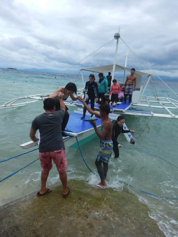
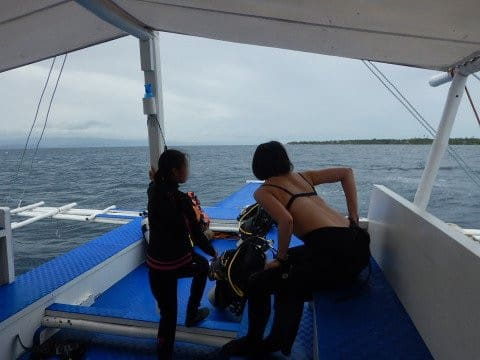

# 2018年8月，モアルボアルで小5の娘をダイバー化！その14…ダイビング2日目のお昼休み

📅 投稿日時: 2019-07-27 04:23:29

先週末は，娘が熱を出してしまい，

どこにも行けなかったので．

今週末は遊びに出かけるぞ！！！

…と，思っていたら．

週末を狙ったかのように台風ですか（泣）

うーん．

2週連続で，どこにも行かない

週末になりそう…（涙）

土曜はちょっと娘の用事があって，

電車で30分ほどのところまで

出かけるけど，K奈川県は脱出せず．

で，日曜は何も予定なし．

…もし，2週連続でK奈川県内を脱出

しない週末を過ごすとなれば．

新居の契約がらみでドタバタしていた，

昨年9月以来の出来事です…っ！！

た，耐えられないっ！！

どこかに行きたい…

…あ．でも．

あと1週間で今年のダイビング旅行に出発だった…

ってなことで．

急ぎ終わらせてしまわなくてはならない，

昨年のモアルボアル旅行記，続きますっ！

--

ってな感じで．

午前中の2本目を終えて，

ボートに上がると．

海洋実習の娘は，先にボートに

上がってました…

ボートはショップに戻りますが，

波が高めで，ボートがわりと揺れるので．

…帰り着くまで，波乗りごっこ（？）を

やっていた娘（笑）

で．

10分ちょっとで，ショップ前へ到着！

ボートを降りると，ちょうど

お昼の時間です．

だもんで，またショップに戻って，

ウェットスーツを脱いで，

シャワーを浴びた後は…

お昼ご飯タイム！

今日は，一緒に潜った皆さんと

揃ってお昼ご飯へ行きましたが．

行ったお店は，昨日と同じ

「Makan」

この写真の，道路の両側に並んでいる

テーブルがそのお店になります．

昨日食べたものと別に，

まだ食べてみたいメニューが

あったので，リベンジ！

これが，

「Chikin Sisig」

とかいう，お肉を甘辛いソースで

炒めたもの．

で，こいつが，

スペアリブ．

どちらも200ペソ，400円弱．

コストパフォーマンスが高い！

ってな感じで．

ダイビングの皆さんと一緒に

お昼ご飯を食べて，いろいろダベッていると，

あっという間に集合時間．

午後のダイビングへ，Go!

うーむ．

午後も，天気は良くないですね…（涙）

波も相変わらず高く．

潜れるポイントは限られてきます．

ボートはポイントへ向かって移動しますが…

…娘は，一緒にお昼ご飯を食べた

お姉さんと仲良くしてもらって

ますね…

ってなことで．

ボートは本日午後のポイント，

「ドルフィンハウス」

にやってきました…

さぁ．

娘にとっては，これが海洋実習

ラストの1本になります！
