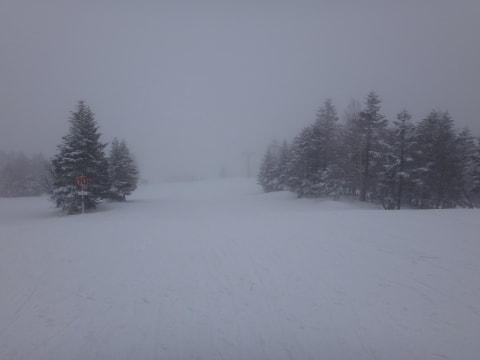
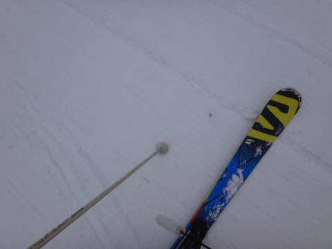
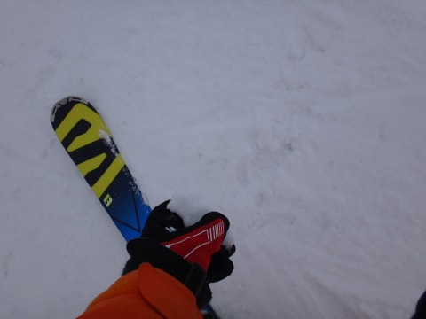
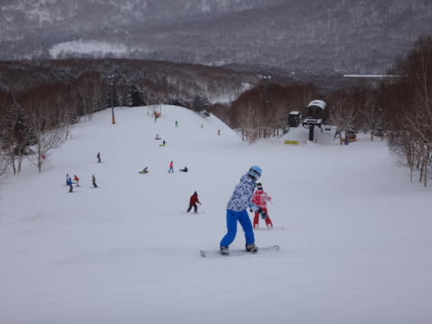
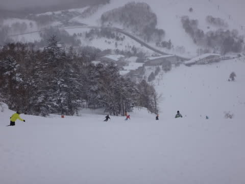
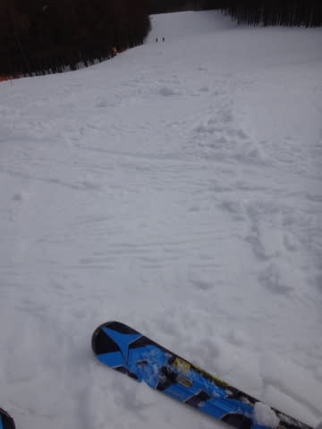

# 3月8日の志賀高原，速報モード…天気も良くなかったし．ああ．春だ．春の雪だよ…（涙）

📅 投稿日時: 2015-03-09 00:46:13

えー．

今日も帰宅が遅かったので，

今日も，いつもの速報モードで…

今日は朝から曇り空で始まった一日でしたが…

山頂に上がると．

…微妙にガスがかかった天気（涙）．

そして．

朝から気温も高く．

雪質は…

しっとりウェットな，重めの雪．

…春だなぁ…（泣）．

でも．

ゲレンデは，重い雪が圧雪された，

締まったきれいな圧雪バーンのはずだ！

行くのだ！

…と，滑ったところ…

気持ちいい大回りバーンのはずが．

…ところどころ，「氷コロコロばらまき妖怪」によって，

大量にばらまかれた氷のコロコロで，

ジャガイモ畑状態…（激涙）．

午前中はゲレンデ人口密度も高く．

そして．

天気は一日中あまりよろしくなく．

午後になっても，湿った雪がちらつくような天気で…

午後の雪は完全，春の重い雪になってしまって．

それが荒れて凸凹に…（悲）．

…あー．

春です．

春だ．

春がやってきました…

もう，シーズンは終盤です．

トップシーズンの雪は，もう

戻ってこないのか…（遠くを見る目）

とりあえず．

詳細レポートは，また明日…（過ぎ去った冬を懐かしむ遠い目で）

## 💬 コメント一覧

### 💬 コメント by (Goku)
**タイトル**: 春でしたね
**投稿日**: 2015-03-09 13:53:41

昨日はカミさんがようやくＳさんとお話できたと感激しておりました。

こんなスキーバカ夫婦ですが、これからも宜しくお願いします～♪

それにしても春の雪でしたね・・・

### 💬 コメント by (Skier_S)
**タイトル**: Gokuさま
**投稿日**: 2015-03-10 00:25:45

日曜はお世話になりました～．

奥さんの滑り，さすがのうまさに

驚きました…

夫婦そろってすごい滑りでうらやましいです…

奥さんによろしくお伝えください．

しかし…雪質，強烈にイマイチでしたね…（涙）

