# 3連休中日，2月10日の志賀高原は…グッドコンディション！(混んでたけど）

📅 投稿日時: 2013-02-10 17:38:18

🏷️ カテゴリ: [2013スキー滑走日記](c91dbe557f9a69230b1600e48622fdd61.md)

というわけで．

3連休初日はスキーに行けずもんもんとしていたSkier_Sでしたが．

本日は．

ちゃんといつものホームゲレンデ，焼額へ復活です．

あー．

スキーをしない昨日，

ぐおおおお～！スキーさせろっ！

って感じで，禁断症状を発症してましたが．

雪面に立って，何とか禁断症状が緩和されました…

さてさてさて．

本日の焼額．

朝から…晴天っ！！！

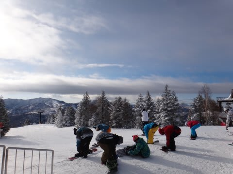

朝はマイナス15度と冷え込み…

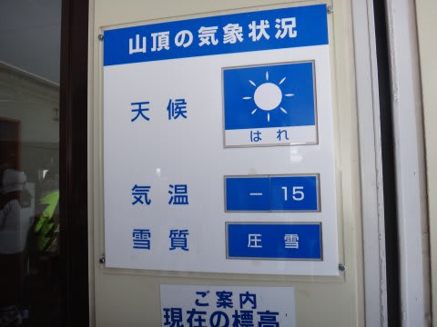

きれいなシマシマバーン！！

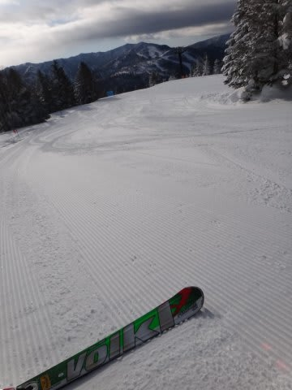

最高っ！！

朝は，しっかり圧雪された，もうよだれじゅるじゅる流れて止まらないような，

うひょひょひょひょっ！！！

ってな大回りバーン．

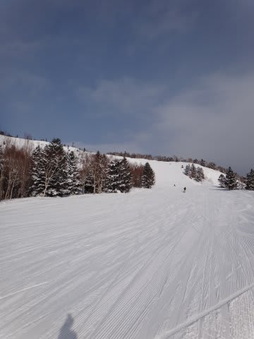

…しかし．

幸せな時間というのは，長くは続かないもの．

10時前には…

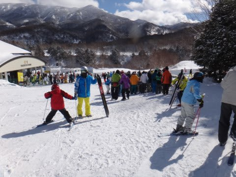

焼額第1ゴンドラ15分待ち(涙)

第2ゴンドラは，30分待ちって出てました…

さすが，3連休の中日．

9時半を過ぎると，ゲレンデの人口密度も高まり…

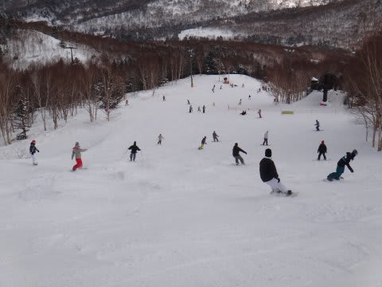

ちょいと快適度が落ちてきました．

ゴンドラ待ちの方は，11時半を過ぎるとほぼ待ちがなくなりましたが…

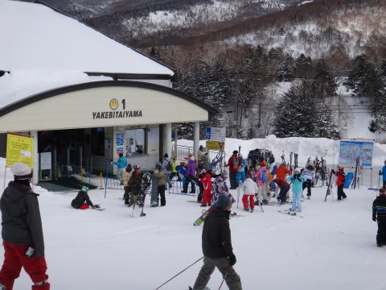

ゲレンデの人口密度は，終日こんな感じで．

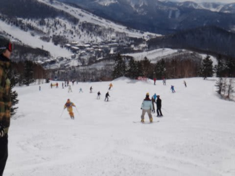

うーむ．

まぁ，これまで．

「ガラガラ！経営大丈夫かっ！？」

って心配していたくらいだから，活気があるのはいいことだけど．

…物事は，何事もほどほどがよいかな～．

んで．

午後になると，時折曇ったり，雪がちらついたりと，

昨日の予想通りの天気となりましたが…雪質は終日

緩まず，いい感じ．

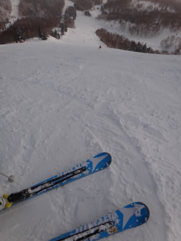

…ただ．

当然午後になるとコブが出てくるし…

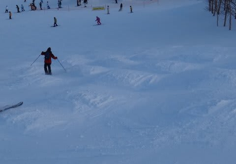

人が多かったので，金曜に積もった雪がはげて，アイスバーンが

出てきたところもわずかにあったし…

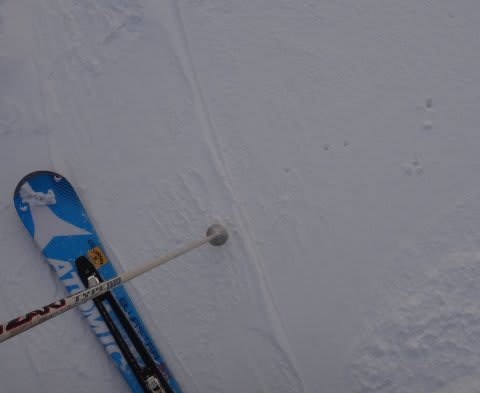

午後3時～3時半の30分くらい，ゴンドラ5分待ちになったりしたけど．

とりあえず，今日は．

基本的には，終日晴れ間の多い天気で．

雪質もよく．

先週のコンディションを考えれば，結構楽しめた一日でした．

…混んでたのを除けば．

＃まぁ，2月3連休の中日にがらがらだったら，それは

＃それで心配なので，まぁよしとしておきましょう．

PS.もしかすると，禁断症状明けなので評価が甘くなってるのかも…

## 💬 コメント一覧

### 💬 コメント by (いか)
**タイトル**: Unknown
**投稿日**: 2013-02-10 22:32:49

晴れてると気持ちよさそうですねー！

ゴンドラ待ちはすごいですが…。

小さい頃は週末に行くと小さいスキー場でも結構並んでいたかと思うのですが、最近はほとんど並んでいないので、ノンストップでないとイライラするようになってしまいました…(笑)

明日も晴れているといいですね！

金曜に八方に行ってきましたが、風で上部リフトが止まっていました^^;　月末には志賀高原に行く予定です～。焼額グルグル楽しみですね。

### 💬 コメント by (Skier_S)
**タイトル**: コメント，早っ！
**投稿日**: 2013-02-10 22:42:07

まだ推敲中で，最終版アップロード前だったのに，

早くもコメントを…

いやー．

私も子供のころは，20分やら30分やらは当たり前に

待っていた気がしますが…

今はだめですね（笑）．

気が短くなったのかな～．

金曜は猛吹雪ですよね．

でも，ぱふぱふ楽しめたのではないですか？

月末，土日なら私も焼額滑ってます～．

探してみてください．

ではでは～

### 💬 コメント by (aqura)
**タイトル**: Unknown
**投稿日**: 2013-02-11 06:51:22

おはようございます(^o^)

昨日は、ビックリするくらい混んでいましたねぇ。

志賀高原に通い始めて、一番のリフト待ちだったかも…。私もゴンドラ待ちの列にいました(T^T)

### 💬 コメント by (gokuraku skier)
**タイトル**: Unknown
**投稿日**: 2013-02-11 09:21:03

はじめまして

いつも楽しく拝見させていただいています。

実は私も週末はほぼ焼額山１ゴンで朝一から滑っているので、天気予報はとても参考になっていて助かっています。

２月１０日も朝一からオリンピックコースを滑っていたのですれ違っているかもしれませんね。

でも９時半には混み始めたので移動しちゃいました。

それではまたゲレンデレポート楽しみにしています。

それと試乗スキーのインプレッション素晴らしいです。

次回板を買う時は是非参考にしたいと思います。

### 💬 コメント by (Skier_S)
**タイトル**: aquraさま
**投稿日**: 2013-02-12 00:29:53

いやーーーー．

さすが3連休中日，混みましたね～．

宿の人いわく，2月3連休のほうが，正月より混むようで…

ゴンドラ待ちは第1ゴンドラですか？

私もひたすら第1ゴンドラぐるぐるしていたので，どこかで

お見かけしている可能性が高いですね…（汗）．

### 💬 コメント by (Skier_S)
**タイトル**: gokuraku skierさま
**投稿日**: 2013-02-12 00:38:53

gokuraku skierさま，はじめまして．

…のっけから謝っちゃいます．

月曜の天気予報，外しました…ごめんなさい．

で．

ほぼ毎週焼額1ゴン朝イチからですか…

…

おそらく，私のことを見ると「あ，あいつか…」って，

分かっちゃうかもしれません…（汗）．

朝イチって，もしかするとファーストトラックからですか？？

私はファーストトラックは滑らないのですが…

スキー試乗レポートは，私の独断と偏見ですので，

「自分の印象とはぜんぜん違う！」

ってこともあるかもしれません…

所詮シロートの駄文なので，話半分に読んでやってください（笑）．

では，引き続きこのBlogをご愛顧よろしくお願いします…

### 💬 コメント by (gokuraku skier)
**タイトル**: Unknown
**投稿日**: 2013-02-13 20:56:56

実は今シーズン何回か「もしかしてこの人って…」って思ったことが。

それと朝一は通常営業からです。

なのでファーストトラックが終わるのを１ゴン前に並んで待っています。

### 💬 コメント by (Skier_S)
**タイトル**: gokuraku skierさま
**投稿日**: 2013-02-14 01:36:26

あー．やっぱり，

だいたい分かっちゃってますか…（笑）．

…でも，ファーストトラックは参加していないんですね．

私は，大体毎日1ゴン営業開始5分後くらいに

ゴンドラに乗ってますので，

あんまり営業前に並んでいることは無かったりします…

でも，私も何人か，「いつも見かけるなぁ」って人がいるんですが…

うーん．その中に，gokuraku skierさんがいらっしゃったりして…

