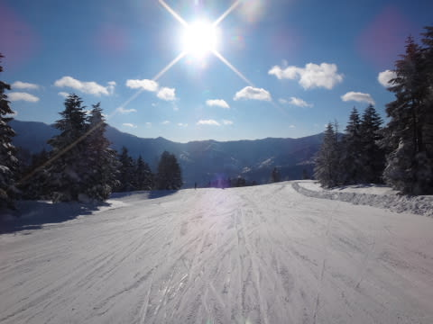
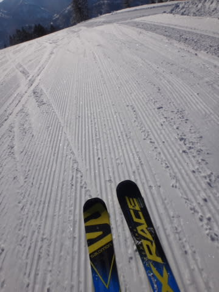
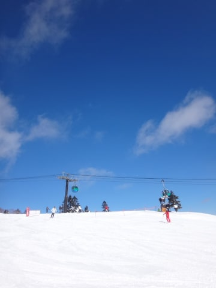
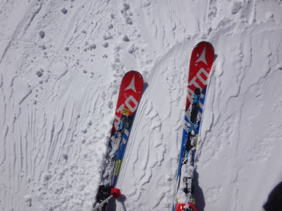
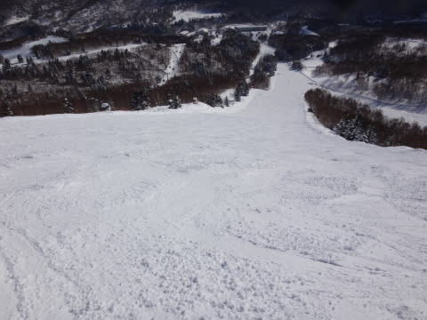
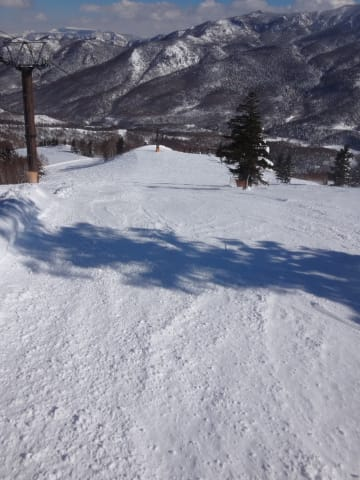
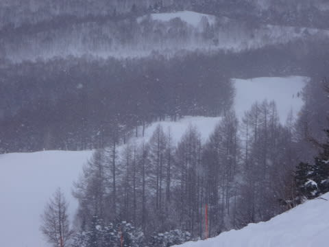

# 1月22日，日曜の志賀高原速報モード…晴天ピカピカ冷え冷え最高雪質ガラガラ．もう，シアワセ…

📅 投稿日時: 2017-01-23 01:55:04

🏷️ カテゴリ: [2017スキー滑走日記](c7d777cecfc91bdf0fa464ad62c6d49ab.md)

いつもの週末のパターンですが．

本日の帰宅は，日付が変わってからという

激遅帰宅になってしまったので（涙）

…そうです．

今日も速報モードにて…

えー．

本日．

朝からすっきり晴れました！

そして…

雪は最高級シマシマバーン！！

適度に柔らかく，適度にエッジが噛む．

超高級プレミアムグレードのシマシマ圧雪です！

天気は，午後になってもすっきり晴れ！

だのに，気温は冷え冷えで，

終日激烈にいい雪質をキープ．

…さらに，今日は人が少なく．

午後になると，無人バーン化してるんですが…

ってことで．

夕方になっても，コースは荒らされず．

かなりフラットなまま！

（しかし，ホントに人が写ってない…）

午後3時頃からは，ぱらぱら雪が舞ってきましたが…

でも．

今日はおおむね天気が良く．

そして人も少なく．

雪質最高という…

すごく恵まれた一日でした～！！！！

いやーー．

一年中，毎日こんなだったらいいのになぁ…←一年中冬というのはいろいろマズいのでは？？

そもそも毎日こんなガラガラだったらスキー場つぶれちゃうし…

また明日，詳細レポートしますので，お楽しみに～

## 💬 コメント一覧

### 💬 コメント by (かず)
**タイトル**: すねから膝ありましたが
**投稿日**: 2017-01-23 19:42:17

やはり降りましたね　しかし重すぎ　先週の週末ほど量は無いですが　オリンピックコース同じ感じでした

2本でお隣りに移動です

### 💬 コメント by (Skier_S)
**タイトル**: かずさま
**投稿日**: 2017-01-24 02:34:22

やっぱり，今日はかなりのパウダーになったんですね…

＃ブーツからスネくらいかと思いましたが…

＃意外とスネ～膝だったんですね

天気図的には，ちょいと重そうな雪に

なりそうでしたが．

残念ながら，その予想は当たっちゃいましたか…

明日の朝は，かなり軽めの雪だと思います．

明日も滑られるようなら，どんな雪だったか

レポートお願いします…！

PS.

昨日はワックスお試しのご提案ありがとうございました．

ただ，あまりにもあの日はコンディションが良すぎて，

一本でも多く滑りたかったので…

また今度，ワックス試させてください！

