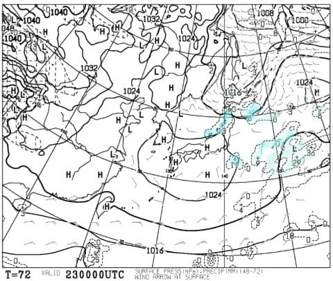

# 12月23，24日の週末の志賀高原スキー場の天気は？…基本的に晴れ．でも，気温はちょいと高め

📅 投稿日時: 2017-12-21 00:47:29

🏷️ カテゴリ: [スキー天気予想](c6554f5c3c106093b511a8daae23757e8.md)

えー．

大量のSXに囲まれて暮らす，Skier_Sです．

ということで．

本日は水曜定番．

今週末の志賀高原の天気予想です～！

…まず初めに．

850hpa気温偏差予想を見ると…

うーむ．

赤丸で囲った23，24日．

ちょうど週末にかかるこの2日間，気温が上がりそうですね…

で．

土曜の850hpa気温を見ると…

うーーむ．

やっぱり，赤く印した0℃線は

ここ数日なかったほど北に上がってます…

信州に近づいてますね．

でも，まだ0℃線が志賀高原より北に

行ってないだけ，マシかな～．

志賀高原は，何とか昼間も0℃を上回らずに済みそう．

で．

土曜の地上天気図は．

わずかに日本海付近に水色の降水域がありますが．

志賀にはかかってないし．

本州はすっぽり高気圧に覆われてます．

だもんで…土曜は終日晴れそうかな～．

そして．

日曜の850hpa気温を見ると．

ああ…

0℃線が志賀高原より北に行ってしまってます…（涙）

この12月は冷え冷えだったので，久しぶりに0℃線が

志賀より北まで上がったのを見た気がします…

で，日曜の地上天気図を見ると…

うーむ．

本州は低気圧に覆われてますね…

でも．志賀高原には降水が予測される

網掛けがぎりぎりかかってないので．

このままの天気図なら．

志賀高原では降らずに済みそう…

午前中は晴れるくらいかな？

ってことで．

まとめると．

土曜：朝からすっきり晴れ！

　朝は放射冷却で多少冷え気味かな…山頂で-5℃程度．

　木，金と積雪はなさそうなので，この日の朝は

　結構締まった，スピードが乗るけどそこそこ柔らかい，

　最高級圧雪が楽しめそう…

　最高気温は0℃を超えない程度だけど．

　日差しが強く，暖かく感じるくらいかも．

　ゲレンデの雪はそれほど緩まず．

　午後まで比較的フラットのいいコンディションじゃないかな～．

　終日晴れてピカピカ圧雪で，おそらく最高の

　スキー日和の一日．

日曜：朝は晴れ．

　この日はちょっと気温が高く…

　朝は山頂でも-2～-3度程度と高め．

　でも，朝は晴れていい感じの圧雪が滑れそう．

　昼間はぐんぐん気温が上がり，+3℃くらいまで上がるか…

　日差しもあるので，南斜面はわずかに湿った感じの

　雪になりそう．

　ただ，この日も南の直射日光が直撃する斜面を

　例外にすれば，雪は終日良く．

　まぁ楽しめるな…

　午後はちょっと雲が増えていき，

　夕方は完全曇り空に．

　ゲレンデは午後までそれほどひどく荒れないけど，

　夕方になると，日が当たる南斜面は雪が融けた凸凹のまま

　凍ってしまうので，かなり手ごわくなるか…？

…って感じで．

この週末．

晴れるものの，気温が上がりそう…（涙）

でも．ゲレンデコンディションはそれほど荒れず，

いい感じかな～．

そして．

うむ？？？

来週はなんだか，すごい冷えそうな予感…

## 💬 コメント一覧

### 💬 コメント by (かず)
**タイトル**: 先週ありがとうございました
**投稿日**: 2017-12-21 12:10:54

予報確認して今週末は土日仕事にしました　その分年末年始恒例の7泊山篭りにするので　お暇な時27日以降のバウター予報　宜しくお願いします

### 💬 コメント by (Skier_S)
**タイトル**: かずさま
**投稿日**: 2017-12-22 01:41:46

年末年始，7泊ですか！

それも27日からですか…

すごいですね．

来週に，年末年始の予想しますので，

それまでお待ちを～！

