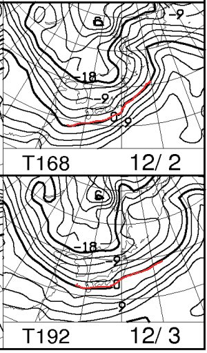

# うーーーーむ．これからしばらく，雪が降らない…っつーか，雨ですよ（涙）．

📅 投稿日時: 2014-11-27 00:15:05

🏷️ カテゴリ: [スキー天気予想](c6554f5c3c106093b511a8daae23757e8.md)

えー．

この3連休の直前一週間．

かなり絶妙なタイミングでいい感じで冷えてくれて．

上手いこと，多くのスキー場がオープンしましたが…

…この2日間．

見事に雨が降り続き．

かなり雪が溶けちゃってるようで…

真っ白だったかぐらも，ちょっと危険な状況に

なってきているみたいです…（涙）．

標高が高い，[アサマ2000](https://www.facebook.com/asama2000park/photos/a.544794985545947.144515.544741572217955/1006166736075434/?type=1)や志賀高原は

ぎりぎり雪も積もったようで…

まぁ，昼間は雨だったと思いますが．

とりあえず，ここは．

また，強烈な冷え込みを期待したいところですが…

でも．

なんだか．

こんな感じで．

これからしばらく，850hpaの0度線は北海道くらいの

はるか北に上がってしまった状態です（涙）

気温も，これからは平年より高い日々が続きそう…

特に．

29，30，1日は，平年より4度～8度くらい高くなりそう…

だもんで．

12月1日までの気温の様子を見ると．

スキー場でも，降れば確実に「雨」という感じなんですが…（激泣）．

そして．

あまり冷え込まないので．

人工降雪機も，ほとんど動かせません（涙）．

で．

27，28日は降らなさそうなんですが…

地上天気図を見ると…

あうーー．

29日の土曜，降水が予想される網掛けは，

見事に本州を覆ってますので．

29日の土曜は，雨です．

…繰り返します．

29日の土曜は，雨です（涙）．

…これは，残念ながら．

祈ってもダメです．

祈っても，雨です．

運が良ければ，それほど本降りにならないで済むかな，

という感じ．

あー．

30日日曜は，降水域の網掛けがかかってなかったので．

おそらく，雨は降らないでしょう．

ただし．

昨日，今日の2日間の雨で雪が溶けてしまっており．

さらに今日27日，明日28日もそれほど強く冷え込まず，

ほとんど人工降雪機が動かせず．

さらに，29日の雨でとどめが刺されるので．

日曜日のゲレンデの雪は．

かな～り，かな～～～り，厳しい状況になっているでしょう…（超涙）．

ということで．

今週土曜は，雨．

雪は解け，ザブザブな感じで．

先週に比べ，かなり雪が減っているでしょう…

日曜は…

天気は回復し，日が射すものの．

土曜の雨で壊滅的ゲレンデ状態になっているでしょう…

おそらく．

きっと．

誰か，日ごろの行いが悪い人がいたのでしょう（涙）．

でも．

でも．

ちょっと救いなのは．

ふむ？？

うむむむむ！！

見事な西高東低！

12月の2，3日．

冷えますッ！！！！

んで，降りますッ！！！

雪ですよっ！！！！

このままの天気図なら，

2日は，新潟も長野も雪．

結構積もってくれそう．

…3日は，海沿いは降るけど，

信州は降らないかな～．

でも．

人工降雪機はがんがん動かせますっ！！！

なので．

12月6，7日の週末は．

予定通り，焼額が動き出すかな～．

でも．

オープンするのは，人工降雪があるコースだけでしょうけど…

とりあえず．

今週はあまり期待できないけど．

来週に期待するのだっ！！

## 💬 コメント一覧

### 💬 コメント by (フナ)
**タイトル**: 雨
**投稿日**: 2014-11-28 21:07:23

いつも見させて頂いています！

最近気温高いですもんね(泣)

早く白馬がオープンしてほしいです(泣)！！

週末はどこか行かれるのですか？

自分はイエティかなぁ、、でも明日は雨みたいだし微妙だなぁ(^-^;汗

### 💬 コメント by (miya)
**タイトル**: 予報が…
**投稿日**: 2014-11-28 23:01:52

当初よりもずいぶん遅れましたが、

28日に休みをとって初すべり。

丸沼に行こうかと思いましたが、

疲れが溜まってたのでK奈川県から近い

イエティへ。

土曜日は雨でも金曜は大丈夫の予報！

…だったはずでしたが、ほぼ雨でした。

しかも心が折れてしまうくらいの雨…。

今度はSさんのおすすめの日に行こうと思います…（泣）

### 💬 コメント by (Skier_S)
**タイトル**: フナさま
**投稿日**: 2014-11-28 23:08:19

コメントありがとうございます～

白馬オープン，遅れてますが…

ご安心を！

1日の夜から，週末まで冷えますっ！

来週は一週間，雪がガンガン降ります！

積もります！

現在，5日までの天気図が出てますが，

2日から5日まで，ひたすら冷えますよ～！

で．

私は．

明日もアサマ2000ですが．

…雨，ですね（涙）．

ザーザー降りにならないことを

祈るばかり…

### 💬 コメント by (SKier_S)
**タイトル**: miyaさま
**投稿日**: 2014-11-28 23:11:19

あ，お久しぶりです！

そうですか…

今日は，雨でしたか…

イエローコースはもうかなりひどいようでしたが，

バイオレットはまだましだったのでしょうか？

私がお勧めなのは…来週末でしょうか．

冷えますよ～！来週一週間．

週末はばっちりのはず！

…ただ，まだ土日がどんな天気か，

天気図が出てないのでわかりませんが…

少なくとも，雪は今週よりは128倍くらい

マシなはずっ！

