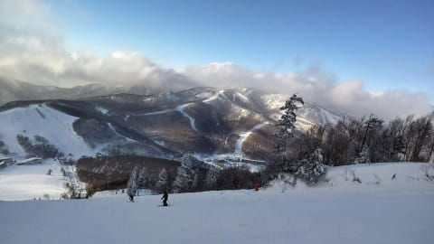

# 1月31日(日)の志賀高原スキー場特派員レポート＆2月1日夜～2日朝にかけて，また液体が降る危機！？？

📅 投稿日時: 2021-02-01 02:52:44

今回，仕事が結構やばくて，

土日の2日間，ほぼ自宅のPCの前に

座りっぱなしだった，Skier_Sです…

ここ数日のこのBlogの更新時間を見て

うっすら分かるかと思いますが，

緊急事態宣言が出てなくても，今週末は

スキーに行けなかったかも（泣）

食事もPCの前で作業しながら

食べているこの状況で，毎日更新

している自分，偉い…偉いよ←みんなに褒めて，とプレッシャーをかけている

…とりあえず，休みたい…

と言いながらも，本日も特派員から写真を

いっぱい送っていただいたので，更新っ！！

えー．

本日の朝は…

10cm以上の積雪があったようです！

(積雪量より，おこみん人形に目が行ってしまう…）

そして，山頂の気温は-11℃とかなりの

冷え込み！

あさイチのゲレンデは，雪が降り続けており．

圧雪コースもブーツパフの新雪に

覆われていたようで…

たしか，どこかの誰かが

　朝から晴れ．晴天．

　朝の気温は-5℃以下まで冷える．

　あさイチは最高トップシーズンの冷え冷え

　雪が圧雪された，柔らかめの気持ちいい

　最高シマシマバーン！

とかいう適当な予想をしていたようだけど…？？

どこが晴れのシマシマバーンなのかな？

（水曜時点の天気図に基づく予想なので…日曜の低気圧の移動が水曜時点での

　予想より数時間遅くなったので外しました(涙)←言い訳)

朝のうちは雪の降りも強く…

コースはいたるところパフパフだった

ようですが．

しばらく経って，新雪が荒らされてくると，

一部の急斜面では，下地の硬いのがところ

どころ出てきて，硬い下地と柔らかい

モサモサが入り乱れた，難し目のバーンに

なったところもあったようです…

うーん．

全然晴天シマシマの圧雪じゃなかった

ですね（ごめんなさい）

午前中，一瞬ゴンドラに待ち時間があった

ようですが．

この待ちはすぐに解消したようで，

リフト・ゴンドラ待ちはそんなになかったようです．

朝のうちはすごく降っていた雪も，だんだん

弱まり，昼ごろには空が明るくなってきて…

昼を過ぎると，ゲレンデに日が射してきた

ようです！

でも，昼間も-7℃程度までしか上がらず．

ゲレンデ自体はかなり荒れて

モサモサした感じに見えますが…

雪質は冷え冷えをキープ！

夕方には青空も見え始め．

最後はいい天気で終わったようです…！

…うーむ．

もう数時間早く雪が止んで，

晴れる予想だったんだけど…

ってなことで，ゲレンデの上に

乗っている雪は，冷え冷え

トップシーズンの雪になったものの．

　ただ，急斜面は一部硬い下地が

　出てくるかも…

という良くない予想は当たったみたいで．

27日の雨のせいで，固まっちゃった下地が

一部出てきてるのがちょっと残念な感じかな…

これが，またこれからドサドサ雪が

降ってくれて，隠れてくれると

いいんですが…

はたして，これから積雪はありそうかな？？

2月1日(月)の，朝9時の850hpa図を見ると．

うむ？赤い0℃線，志賀高原に

近づいてますね…

まぁ，この程度なら大丈夫か…

…と，1日月曜の夜9時の850hpa図を見ると．

うぎゃーーーー！0℃線，津軽海峡まで

上がってますよ！？？

この時の地上天気図は…

ギリギリ志賀高原には降水域が

かかってないので，1日の月曜は

液体に降られることは無さそうですが…

続く2日(火)の朝9時の850hpa図は…

うーむ．これだと分かりにくいですね．

拡大してみると…

赤い0℃線は，ギリギリ志賀高原に

かかるかどうか．

そして，水色で囲った部分．

風速50ノット…25mですね（涙）

おそらく，朝になってやっと0℃線が

志賀に下りてくる感じで．夜中は

0℃線はもっと北にあるだろうから…

これで，降水域がかかっているとアウトですが…

と，地上天気図を見ると．

アウト

ですね（涙）

これは，1日の深夜から，2日の朝まで．

空から落ちてきます．

液体が…

これは，2日の天気．

1月27日と全く同じ感じですね．

標高が高い山頂付近はギリギリ湿った雪で，

それ以外は液体が夜通し，朝まで降る感じ．

そして，営業開始しばらくしてから雪になり，

パラパラ降り続けるという天気ですかね…

終日ガスっぽい感じで，風も強く．

ゴンドラが止まる可能性も…（涙）

ただ．ほんのちょっとでも，この予想から

気温が落ちてくれれば．

志賀高原の一の瀬・ヤケビ・奥志賀エリアは，

麓までギリギリ湿った雪程度で

済んでくれそうなんですが…

うーん．

期待薄かな…

そして，2日のその後の天気を見ると…

夜9時では，850hpaの赤い0℃線は

かなり南下し，水色の-9℃線が！

これは…2日の朝は液体が降るけど，

夜は-10℃クラスの，かなりの

冷え冷えになります！！

一応，降水量もなくはないので…

2日(火)の夜から3日(水)にかけて，

ドサドサ降らないまでも，硬い雪を

薄っすら覆ってくれるほどには

降ってくれそう…

そして，3日（水）も水色の-9℃線がかかるほど

冷え冷えなので．

うーむ．

3日には冷え冷え雪が積もって，緩斜面は

バーン状況復活するかな？

ただ，急斜面は下地の硬いのが出ますね…

今シーズン，ラニーニャで冷えるのかと思ったら，

一番冷えるはずの1月末から2月頭にかけて，

まさか週に1回のペースで液体にやられることに

なろうとは…（涙）

…これは決して，スキーに行けない私の呪いじゃないはず…

無いはず…

…ないはずですので…

## 💬 コメント一覧

### 💬 コメント by (yumi)
**タイトル**: Unknown
**投稿日**: 2021-02-01 06:24:13

Ｓさぁ～ん😁😱😢

私の呪いじゃ～無いはず・・・

ないはず・・・

・・・無いはず・・・

って😱

かけましたねぇ～～～😏

### 💬 コメント by (レインボー73)
**タイトル**: Unknown
**投稿日**: 2021-02-01 12:02:00

月曜日の志賀高原情報

朝の上林マイナス5℃、蓮池はマイナス4℃。夜に冷え込んだせいで、クルマのパリパリは最悪。でも雪はがっつり食い込みバーン。非圧雪もふかふか快適とか。

風は強いものの天気は最高ヤケビ晴れ。オリンピックもエキスパートも、まさにおかわり連発バーン。通りすがりのファミリーもなんと快適なことか。

そうして目的地の銀嶺へ。あまりの満足感に、剣士の隊員は『もう十分だ』と、横で出来上がってる。彼が早退するに100万両賭けたい。

奥志賀ゴンドラの間引き運転が顕著で、ダウンヒルは二本行く気がしない。エキスパートには黒装束五人組の滑りが圧巻！

それから、トンネル以外では最も危険なループの下で、私達の少し後ろで、軽が横転していたそうな。登り車線で横たわっていたそうだけど、詳細は？？？

風で奥志賀ゴンドラが昼少し前にストップとか。

朝の出勤中の我らボケ老人の会話。

『人間は夜の寝ている時間に痩せるんだって』

『ふーん、そうか、ミイラはずっと寝ているから痩せてるんかぁ』

『なるほど』『んだんだ』

みんな気づくのが遅すぎる。完全にボケてる。

### 💬 コメント by (いさ)
**タイトル**: Unknown
**投稿日**: 2021-02-01 16:19:34

おひさしぶりです。

今週は某20000m先輩から赤い御札をいただきましたのでご報告＆この場をかりてお礼申し上げます。

今シーズン週末になると天気が悪く、一日中スッキリ晴れなんて日にあたりませんね。S様の呪いではないかと疑っていたのですがやはり！！！

おかげで毎週パフパフ滑れるので、それはそれで最高ですけどね。そろそろ晴天お願いします。（晴れ予想だけでもテンション上がります）

### 💬 コメント by (レインボー73)
**タイトル**: Unknown
**投稿日**: 2021-02-01 19:23:16

今日は午後になって、１コン、2ゴンと、相次いでストップ。あまりの雪の良さに夢中で踏みすぎて、足が売り切れになった隊員の早退に付き合って、正解だったのかも。

### 💬 コメント by (レインボー73)
**タイトル**: Unknown
**投稿日**: 2021-02-01 20:17:53

通りすがり様

残念ながら、私の板ではなかったようです。新しい板（フィッシャーRC4ＲＣなど）には、かならず鍵をかけており、20000シールは貼ってなかったような。今お気に入りのシールは、志賀高原20000ml倶楽部　we are crazy drunkers

です。お会いできましたらよろしくお願い申し上げます。

ありがとうございました。

### 💬 コメント by (かず)
**タイトル**: Unknown
**投稿日**: 2021-02-01 20:50:25

今日久々の圧雪で楽しみにしてましたが向かい風が強すぎて…超失速  若Sさん1回も見かけませんでした

### 💬 コメント by (ほっぽ)
**タイトル**: Unknown
**投稿日**: 2021-02-01 22:37:39

今日午後の志賀高原。

奥ゴンは11:45運休、ヤケビ１ゴン、2ゴンは減速運転。

午後はゴーストタウンの１ゴン沿いを時間まで滑り、ラストは一の瀬ファミリー正面。

ラスリフで上がったら山頂には20000m四天王が揃ってました。

昼前から強風にやられた志賀高原ですが、そんな今日もリフト20000円分滑れて大満足でした。

### 💬 コメント by (Skier_S)
**タイトル**: 志賀高原は雨（涙）
**投稿日**: 2021-02-02 02:24:13

＞yumiさま

見事に雨になりました（涙）

この雨は私の呪いの雨ではなく，スキーに行けない私の涙かもしれません…

＞レインボーさま

午前中はすごい良かったようですね！！

午後はすごい風だったようなので，早上りが正解だったのかと…

＞いささま

お久しぶりです～！

ここしばらく，週末は確かに朝から太陽が出ている日は

ほとんどなさそうですね…

夕方に晴れる日が多いみたいですが（笑）．

今週末，今のところ日曜は晴れそうです！

＞かずさま

今日はすごい南風だったみたいですね…

＞ほっぽさま

奥ゴンはやっぱり運休でしたか…

むしろ，今日より明日が風がつよまるかと思いましたが，

風のピークは今日だったようですね．

ラスリフの山頂の四天王…

絵が目に浮かぶようです（笑）

みんな平日に滑っているところがすごすぎる．

