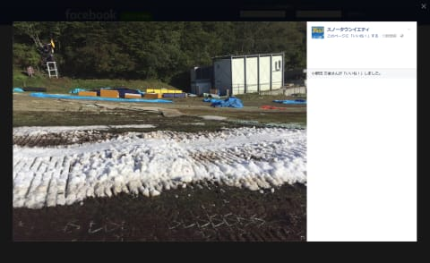

# やっぱり，イエティ12，13日は雪不足で営業中止（涙）…でも，14日から復活できるのかな？

📅 投稿日時: 2017-10-13 00:47:59

🏷️ カテゴリ: [日記](cc4b5682fb7b8b144980957a978653fb0.md)

ということで．

昨日の記事に，

「雪不足のため一旦クローズ」

とならないことを祈るばかり…

と書いたばかりというのに．

ええ．

書いたばかりなのに．

今朝…というか，12日の朝．

イエティのホームページを見ると．

「大変ご迷惑をお掛け致しますが

本日12日及び13日の営業を休止と

させて頂く判断となりました。」

（[スノータウンイエティホームページ](http://www.yeti-resort.com/)より）

…な，ななな！！！

なんですと～～～っ！！！！！！（涙）．

なんで，こんな悪いほうの予感は

当たるのか…（頬を伝う涙）．

そして，[イエティのFacebook](https://www.facebook.com/YetiSnowtown/posts/1462832827139422)を見ると…

なんだか，すごいことになってるようです．

Facebookに，10枚以上の写真がでてますが…

（[イエティFacebook](https://www.facebook.com/YetiSnowtown/posts/1462832827139422)より）

…

…

…これは…

…

…終わってますね…（涙）．

なんということだ…！！！

（雪が）腐ってやがる…早すぎたんだ．．．

とつぶやいた人が．

日本全国で5万人くらいいたんじゃないかと

思ってるんですが．

いや．

今シーズンの早いオープンは，

素直にうれしかったのですが…

やはり，10月第1週のオープンは早すぎたん

でしょうか…（涙）

とりあえず．

天気図を見ると．

少なくともこれから19日までは．

ほぼ毎日雨が降り続けそう．

雪を造っても，雨で解けちゃうでしょう…（激涙）．

さらに．

気温も，16，17，18日は下がりそうだけど．

それ以降の気温を，一か月長期予想図FCVX14から見てみると…

うむ．

このグラフを見ると．

3連休前に，かなり冷え冷えだった9/30～10/6は

左側の水色矢印区間のように平年比マイナス側で，

異常に暖かかった3連休以降の10/7～10/12は

左側の赤矢印のようにプラス側．

それも，平年比＋5℃近いところまで

気温が上がってるのが分かりますよね…

で．今後の予想を見てみると，

右側の水色矢印，10/14～16あたり，一瞬冷えますが．

そのあとは．

右側の赤矢印，10/18～28日ごろまでは…

この3連休並みの，かなりの高温になる予想です（泣）．

ダメだ～っ！！！

ダメだよ．

19日までは雨にやられて．

それ以降は高温にやられそうなので．

うーーーーむ．

かなり頑張ってもらわないと，

ゲレンデの復活は厳しいか…

たぶん．

今週末の営業は厳しいんじゃないかな～．

それ以降も，一週間ほどかけて．

完全にゼロから，いつものシーズンオープン並みに

ゲレンデを作っていかないと復活はきびしいか…

とりあえず．

今週は諦めた．

おそらく，今週末は滑れないと覚悟しておいた方が，

精神衛生上よろしそうです．

もし運よく滑れればラッキー，という感じで…

まぁ．

まだ10月だし．

いま，やたら冷えて，11月が高温になっちゃうより．

他のスキー場がオープンし始める11月中旬くらい

から冷えてくれた方が，いいよね！

…と，自分を慰めてみる，

Skier_Sなのだった…

## 💬 コメント一覧

### 💬 コメント by (小林です)
**タイトル**: Unknown
**投稿日**: 2017-10-13 06:34:43

野沢のサマースキーも面白いですよ。

イエテイで無理やりしてもストレスたまりそうだし。

レンタルスキーもありますよ。

恐ろしくスピードでるし

良く食いつくからカービングもいい感じです。

涼しく滑って温泉でぼんやりしてください。

### 💬 コメント by (megalith)
**タイトル**: Unknown
**投稿日**: 2017-10-13 09:12:18

ご無沙汰しています。

そんなSkier_Sさんに物欲選手権へのお誘いです。(笑)

アキバの二ッピン秋葉原本店が10月末で閉店するそうです。

http://www.gdm.or.jp/crew/2017/1013/239128/

15日12:00より閉店セールが行われるそうです。

### 💬 コメント by (Skier_S)
**タイトル**: 残念ながらYeti今週末営業せず（涙）
**投稿日**: 2017-10-14 10:29:04

＞小林さま

コメントありがとうございます～！

野沢のサマーゲレンデですか…

Pislabって，そんなにスピード出るのですね！

春のかぐらで，連絡用に滑りましたけど，

エッジが効かずちょいと怖かった思い出が

あるのですが…

野沢の温泉とセットってのは良さそうですね．

りんごの時期ですので，11月中旬か下旬にでも，

お邪魔させていただければ…とずうずうしくも

思っています．

yamaさんから連絡先をいただいたので，

また連絡させていただきます．

よろしくお願いします．．．

＞megalithさま

あら，アキバ店，閉店ですか！

来週末は都内に出る予定があるので，

その時にでも立ち寄ってみます…

＃そのころにはいいものは残ってないかな

だんだんスキー屋さんが減っていきますね（涙）．

