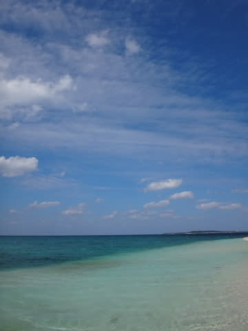
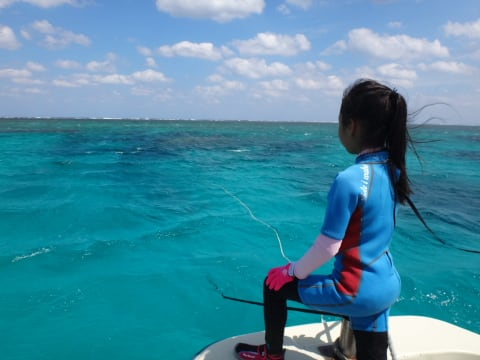
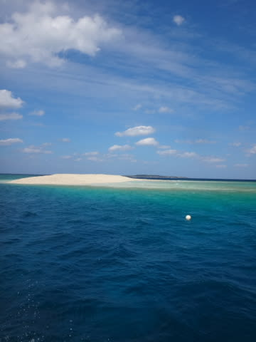
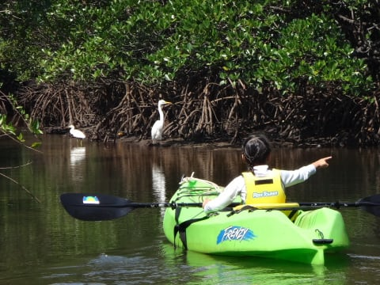
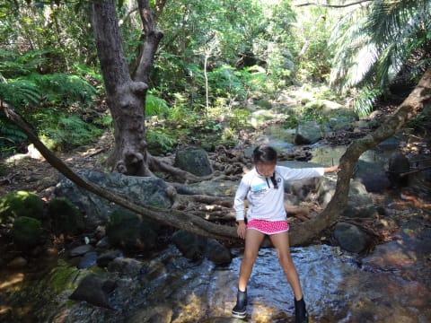
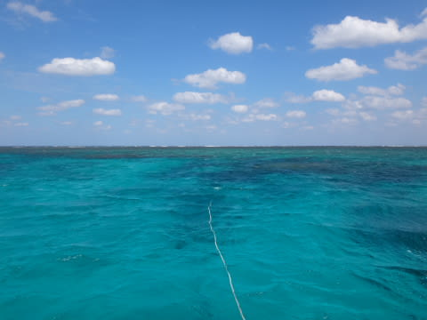

# 2015年10月　子連れで西表へダイビング旅行…プロローグ

📅 投稿日時: 2016-08-16 05:00:05

🏷️ カテゴリ: [ダイビング日記](ce3a7a8d424d112fce83ee85c81a0e344.md)

それは．

去年の10月のこと．

転校する前の小学校には．

「[秋休み](ec0604749e44cd1713bf0e99fe51109f4.md)」という素晴らしいものがあり．

さらに，また．

マイレージというステキなものも，

家族全員が沖縄の離島まで行ける分が

溜まっているじゃあーりませんか！

…これは．

今年も．

秋休みにダイビングへ行け…という．

神のお告げ

に違いないっ！←違う．断じて違う

…ならば．

[去年予約までして行けなかった](e6634c756cf96be04f2ce6dae3b62b2d9.md)，

西表島へのリターンマッチと行こうじゃないか！

…というわけで．

娘の5日間の秋休みに合わせて，4泊5日で西表へ…

…

と，行きたいところだけど．

いくら不良サラリーマンとはいえ，夏休みでも

何でもないこの時期．

3連休に無理やり1日の休みをくっつけるのが

精いっぱい（涙）

＃あの状況で5日間の休みを取ろうとした場合，5日間どころか

＃永久の休みを取ることになっていた．たぶん．

ということで．

行き1日，帰り1日かかる西表へ．

わずか中2日，3泊4日の日程で

行くことにしたのでした…

とりあえず．

子供が生まれてから初めての西表ダイビング．

ダイビングショップは，子連れ乗船可能という

ダイブワンロードさんを予約し．

13年ぶりとなる西表への訪問を決めたわけですが．

出発直前まで，

「休んでたら終わらないぞお仕事投げ込みアタック」

やら，

「休み明けに宿題仕上げてこいボンバー」

なんかを食らうのでは…と心配していたけど．

そのような攻撃を食らうこともなく．

＃いや…出発前日は徹夜に近かった気がするが

無事出発日を迎えたのでした…

## 💬 コメント一覧

### 💬 コメント by (マルハバ)
**タイトル**: ステキなマイレージを使って・・
**投稿日**: 2016-08-16 11:10:02

ウチも明後日から宮古島です。

何年ぶりのダイビングでしょうか？

先日、レギュをオーバーホールに出そうとしたら

「この機種はもう出来ません」だなんて・・（汗）

“最新モデルに無料交換！”

なんて期間もあったらしいのですが・・

気付いた時には、既に終了してました（涙）

「永久保障」を謳うなら

ダイレクトメールくらいはよこしなさい！Ｓ-ＰＲＯ

今回は子供の体験ダイビングの付き添いで

1日のみになりそうなので

もうフルレンタルでいこうと思っております。

### 💬 コメント by (Skier_S)
**タイトル**: マルハバさま
**投稿日**: 2016-08-17 06:20:02

宮古島ですか～

私も最後に行ったのは

10年以上前です…（遠い目）

しかし，もうオーバーホールすらできないような

古いレギュをお使いですか！

BCは大丈夫でしょうか…？？

セットの安い器材を買われた方が良いのかも

しれませんね（笑）

＃私は安いレギュやBCと高級品の

＃性能差があまり分からないので…

お子さんは体験ダイビングなのですね．

Cカード取得して，親子ダイバーを

目指すってのはいかがでしょうか？？

